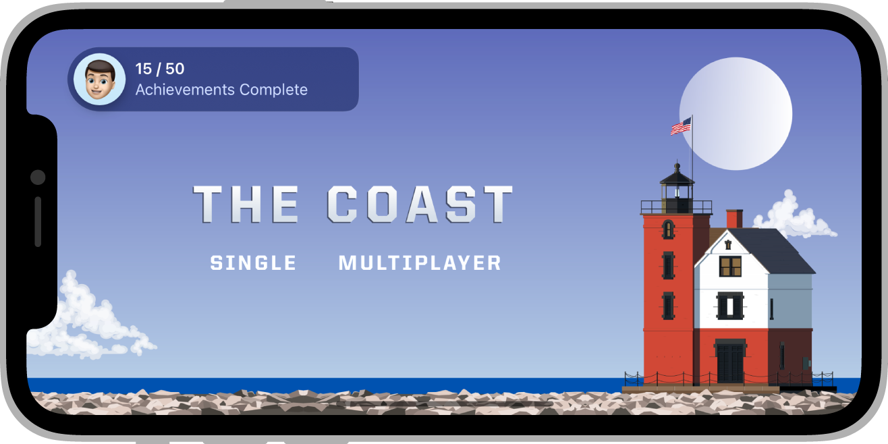

## Access Point

You can add an access point to your game that provides a way for players to manage their profile, and view leaderboards, and achievements.

The access point initially shows player highlights, like how many achievements they’ve earned and where they stand in leaderboards. Then the access point collapses into the player’s avatar and remains on your game’s screen. When the player taps or clicks the avatar, GameKit displays the dashboard so players can drill down into the details of their Game Center data, including more highlights and statistics. You can choose where to display the access point, and select the highlights to display.





### Support 

To check whether the access point is supported on the current service and device check the `isSupported` property:

```actionscript
if (GameServices.service.accessPoint.isSupported)
{
    //   Access point is available 
}
```

This will return `false` on unsupported situations such as iOS versions lower than 14. 


### Configure the Access Point

You can place the access point in a corner of the screen and choose whether to show highlights when the access point first appears, such as the number of achievements or the player’s rank on the default leaderboard.

Start by constructing an `AccessPointOptions` instance and setting the required `location` and whether to `showHighlights`:


```actionscript
var options:AccessPointOptions = new AccessPointOptions()
                .setLocation( AccessPointOptions.LOCATION_TOP_LEADING )
                .setShowHighlights( true )
;
```


Then when you are ready to display the access point, call `activate()`:


```actionscript
GameServices.service.accessPoint.activate( options );
```

You can hide the access point by calling `deactivate()`:

```actionscript
GameServices.service.accessPoint.deactivate();
```

This is useful during game intros or places where you don't want the screen obstructed.


:::info Game Center
To give your players a consistent experience, see [Access Point](https://developer.apple.com/design/human-interface-guidelines/game-center/overview/access-point/) in the Human Interface Guidelines.
:::


### Adapt Your Game to the Access Point

You can retrieve the frame occupied by the access point at any time using the `getFrame()` method:


```actionscript
var frame:Rectangle = GameServices.service.accessPoint.getFrame();
```

Additionally you can listen for the `AccessPointEvent.FRAME_CHANGED` event which will be dispatched any time the displayed area occupied by the access point changes.

```actionscript
GameServices.service.accessPoint.addEventListener( 
    AccessPointEvent.FRAME_CHANGED, 
    frameChangedHandler );
				
function frameChangedHandler( evnet:AccessPointEvent ):void 
{
    var frame:Rectangle = GameServices.service.accessPoint.getFrame();
    
    // make changes to your UI as required
}   
```


