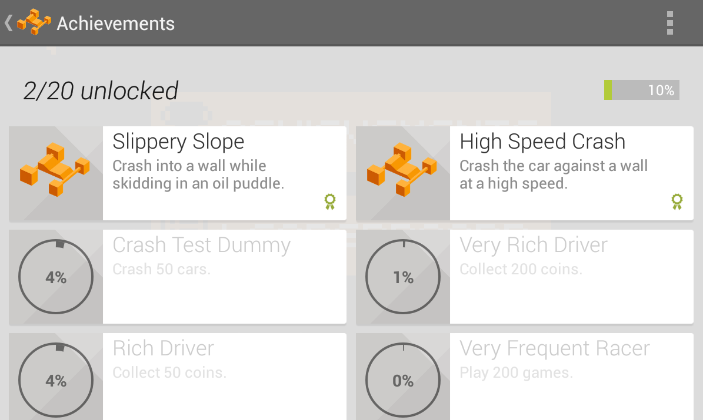
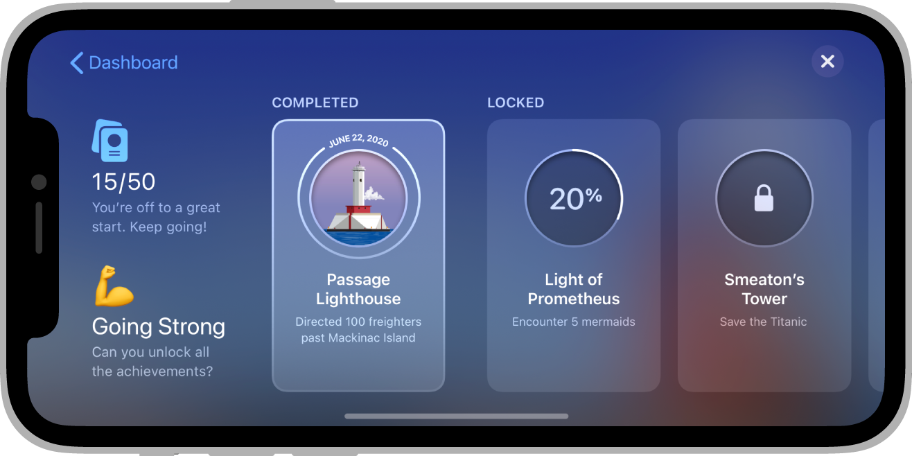

Achievements can be a great way to increase your users' engagement within your game. You can implement achievements in your game to encourage players to experiment with features they might not normally use, or to approach your game with entirely different play styles. Achievements can also be a fun way for players to compare their progress with each other and engage in light-hearted competition.


## An Achievement

An achievement is made up of a series of pieces of information that describe and identify the achievement. It is represented by the `Achievement` class and includes:

- `id`: A unique string that is generated by the game service. 
- `name`: A short name of the achievement (for example, "Master Pieman"). 
- `state`: The current state of the achievement for the current signed in player 
- `type`: The type of the achievement, generally either standard or incremental
- `points`: The number of points or XP the player earns by completing this achievement


## States

Achievements can be in one of three different states, defined in the `AchievementState` class:

- `STATE_UNLOCKED`: Unlocked state means that the achievement has been unlocked or earnt by the player
- `STATE_REVEALED`: Revealed state means that the achievement has been shown to the player but not yet unlocked
- `STATE_HIDDEN`: Hidden state means that the achievement is hidden from the player

The `state` variable on an `Achievement` object describes the state of the achievement for the current logged in user.


## Types

Achievements can be designated as standard or incremental, indicated by the `type` variable on an `Achievement` object. These types are defined in the `AchievementType` class:

- `TYPE_STANDARD`: A standard type achievement
- `TYPE_INCREMENTAL`: An incremental achievement, meaning that it requires  several steps to unlock the achievement. (All iOS achievements are of this type)

Generally, an incremental achievement involves a player making gradual progress towards earning the achievement over a longer period of time. As the player makes progress towards the incremental achievement, you can report the player's partial progress to the games services. The service keeps track of the progress information, alerts the game when the player has met the criteria necessary to unlock that achievement, and tells the player how far along they are towards meeting that goal.

Incremental achievements are cumulative across game sessions, and progress cannot be removed or reset from within the game. For example, "Win 50 games" would qualify as an incremental achievement. "Win 3 games in a row" would not, as the player's progress would be reset when they lose a game. "Have 5,000 poker chips" would not qualify either, as a player could gain and lose chips as they play. For the latter two achievements, it's up to you to track the player's "Wins in a row" state or chip total and to unlock standard achievements when the player earns them.


## Points

Achievements have a point value associated with them. The player's score must be a multiple of 5 and a game can never have a total of more than 1000 points for all of its achievements (although it can have less). In addition, no single achievement can have more than 200 points.


## Creating Achievements

- Google Play : https://developers.google.com/games/services/common/concepts/achievements#creating_an_achievement
- Apple Game Center: ...


## Usage

To access the achievements functionality you will be using the functionality defined in the `Achievements` interface accessed by `GameServices.service.achievements`.

You must have a [signed in player](sign-in.md) in order to access the achievements functionality.

Generally it is good practice to define the achievement IDs as static strings in your application. This reduces the requirement for you to load an achievement from the service. Most of the calls do not require usage of the `Achievement` object but just specify the ID. 


## Supported

Checking for support of achievements can be done via the `isSupported` flag on the `Achievements` interface:

```actionscript
if (GameServices.service.achievements.isSupported)
{
    // Achievements functionality is supported  
}
```

Some services may not implement achievements or may not support the user's current device (operating system or version). You should check this flag before attempting to use the achievements functionality.


## Unlocking Achievements

When your player has satisfied your game requirements for an achievement and you want the player to be rewarded for this achievement you will be **unlocking** the achievement for the player.

To unlock an achievement use the `achievementUnlock` function passing the achievement ID as the parameter:

```actionscript
GameServices.service.achievements.achievementUnlock( "my_achievement_id" );
```

If the achievement has already been unlocked, this will have no effect.


### Incremental Achievements

If the achievement is an incremental achievement you should update the number of steps instead of calling `achievementUnlock`.

To update the number of steps you can call either `achievementStepsIncrement()` or `achievementStepsSet()`. `achievementStepsIncrement` will increment the current number of steps by the specified amount and is useful if you aren't tracking the current number of steps in your game. `achievementStepsSet` sets an achievement to have at least the given number of steps completed (you cannot decrease the number of steps and any calls to this function with a smaller number of steps will have no effect).

Once the achievement reaches the maximum number of steps the achievement will be automatically unlocked, and any further operations will have no effect.


## Revealing Achievements

If you are using hidden achievements in your game you can reveal them to the player at the appropriate point in your application by calling the `achievementReveal()` function and passing the achievement id of interest:

```actionscript
GameServices.service.achievements.achievementReveal( "my_hidden_achievement_id" );
```

Revealing means that the achievement will now be shown to the player, once revealed an achievement cannot be hidden again.

If the achievement has already been revealed, this will have no effect.


## Load Achievements

If you need to load the information about the player's achievements, for example, you may wish to construct your own UI for the player you can load the achievements and their current state by calling `loadAchievements()`.

```actionscript
GameServices.service.achievements.loadAchievements();
```

This call is asynchronous and you will need to listen to the `AchievementEvent.ACHIEVEMENTS_LOADED` and `AchievementEvent.ACHIEVEMENTS_ERROR` events for the result of the call:

```actionscript
GameServices.service.achievements.addEventListener( AchievementEvent.ACHIEVEMENTS_LOADED, achievementsLoaded );
GameServices.service.achievements.addEventListener( AchievementEvent.ACHIEVEMENTS_ERROR, achievementsError );
GameServices.service.achievements.loadAchievements();


function achievementsLoaded( event:AchievementEvent ):void 
{
    // event.data will contain an Array of Achievement objects
}

function achievementsError( event:AchievementEvent ):void 
{
    // an error occurred loading the achievements
}
```


## Displaying Achievements UI

To show a player's achievements, call `displayAchievementsUI()`. 

```actionscript
GameServices.service.achievements.displayAchievementsUI();
```

Your game will then display the default achievements UI, for example, Google Play Games on Android: 




Game Center on iOS:




You can also listen for the `AchievementEvent.ACHIEVEMENTS_UI_CLOSED` event to be informed about the user closing the native achievements UI:

```actionscript
GameServices.service.achievements.addEventListener( AchievementEvent.ACHIEVEMENTS_UI_CLOSED, uiClosedHandler );
GameServices.service.achievements.displayAchievementsUI();

function uiClosedHandler( event:AchievementEvent ):void 
{
    // ui closed .. resume your game
}
```


