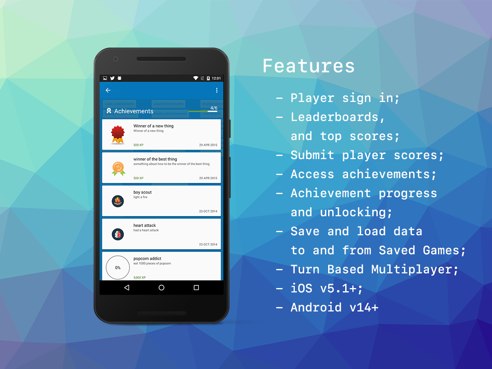

# Game Services

The [GameServices](https://airnativeextensions.com/extension/com.distriqt.GameServices) extension allows developers to use a single cross-platform API to interface with many different gaming platforms.

The single API allows you to quickly integrate leaderboards, achievements, saved games and more in your AIR application, and without having to worry about different APIs for each of the services you wish to use. This allows you to use an identical code base across multiple platforms allowing you to concentrate on your application rather than platform and gaming service specifics.

**Leaderboards** allow you to create score boards for your application allowing your players to compare their scores against other players. You can easily display the built in user interfaces for the leaderboards or build your own loading the scores for the leaderboards and displaying as you require.

**Achievements** can be a great way to increase your users' engagement within your game. You can implement achievements in your game to encourage players to experiment with features they might not normally use, or to approach your game with entirely different play styles. Achievements can also be a fun way for players to compare their progress with each other and engage in light-hearted competition.

The **Saved Games** service gives you a convenient way to save your players' game progression to the game service servers. Your game can retrieve the saved game data to allow returning players to continue a game at their last save point from any device.

We provide complete guides to get you up and running with the different game services quickly and easily.

Current Services

- Google Play on Android;
- Apple Game Center on iOS and tvOS

As with all our extensions you get access to a year of support and updates as we are continually improving and updating the extensions for OS updates and feature requests.

### Features

- Player sign in;
- Access to your leaderboards, and top scores;
- Submit new scores to your leaderboards;
- Access to your achievements;
- Achievement progress and unlocking;
- Save and load data to and from Saved Games;
- Turn Based Multiplayer;

## Documentation

The [documentation site](https://github.com/distriqt/ANE-GameServices/wiki) forms the best source of detailed documentation for the extension along with the [asdocs](https://docs.airnativeextensions.com/asdocs/gameservices).

More information here:

[com.distriqt.GameServices](https://airnativeextensions.com/extension/com.distriqt.GameServices)

## License

You can purchase a license for using this extension:

[airnativeextensions.com](https://airnativeextensions.com/)

distriqt retains all copyright.

