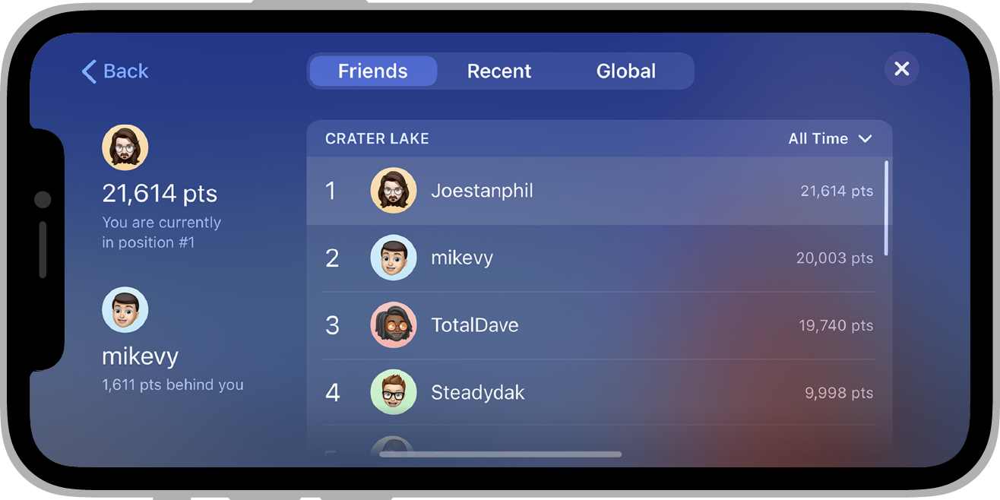

Leaderboards can be a fun way to drive competition among your players, both for your most hardcore fans (who will be fighting for the top spot in a public leaderboard) and for your more casual players (who will be interested in comparing their progress to their friends').

When you create a leaderboard, the games service will take care of managing most aspects of this leaderboard for you. The typical process works like this:

- At the end of a game (or at an appropriate moment that you've determined), the game submits the player's score to one or more leaderboards you've created for the game.
- The games service checks if this score is better than the player's current leaderboard entry for the daily, weekly, or all-time score. If it is, the games service updates the corresponding leaderboards with the new score.
- To retrieve a player's results for a leaderboard, you can requests a time frame (daily, weekly, or all-time), and specify whether or not the user wants to see a social or public leaderboard. The Games service performs all the necessary filtering, and then sends the results back to the client.

## A Leaderboard

A leaderboard is represented by the `Leaderboard` class and is made up of a series of pieces of information that describe and identify the leaderboard.

These basic elements are associated with every leaderboard:

- `id`: A unique string that identifies the leaderboard in the game service.
- `displayName`: A short display name of the leaderboard (for example, "High Scores" or "Level 3").
- `scoreOrder`: The order in which the scores are ordered in the leaderboard

## Score Order

The score order represents the order in which the scores are ordered in the leaderboard. Generally larger values are better however there are circumstances where smaller are better, such as lap times in a racing game.

These orders are defined in the Leaderboard class:

- `Leaderboard.SCORE_ORDER_LARGEST_FIRST`: Larger is better leaderboards are the default. This is typically what you would see in most games where players earn points.
- `Leaderboard.SCORE_ORDER_LARGEST_FIRST`: Smaller is better leaderboards are occasionally used in cases where a smaller score would be better. The most common examples of this type of leaderboard are in racing games, where the score represents the player's time to finish the race.

## Creating Leaderboards

- Google Play: https://developers.google.com/games/services/common/concepts/leaderboards#creating_a_leaderboard
- Apple Game Center: ...

## Usage

To access the leaderboards functionality you will be using the functionality defined in the `Leaderboards` interface accessed by `GameServices.service.leaderboards`.

You must have a [signed in player](sign-in) in order to access the leaderboards functionality.

Generally it is good practice to define the leaderboard IDs as static strings in your application. This reduces the requirement for you to load the leaderboards from the service. Most of the calls do not require usage of a `Leaderboard` object but just specify the ID.

### Supported

Checking for support of leaderboards can be done via the `isSupported` flag on the `Leaderboards` interface:

```actionscript
if (GameServices.service.leaderboards.isSupported)
{
    // Leaderboards functionality is supported
}
```

Some services may not implement leaderboards or may not support the user's current device (operating system or version). You should check this flag before attempting to use the leaderboards functionality.

### Submit Score

When the player's score changes (for example, when the player finishes the game), your game can update their score on the leaderboard by calling `submitScore()`, and passing in the leaderboard ID and the raw score value.

```actionscript
GameServices.service.leaderboards.submitScore( "leaderboard_id", score );
```

The score value must be an integer.

### Score Tags

You can associate a "tag" with a score to give the score some context within your application.

```actionscript
GameServices.service.leaderboards.submitScore( "leaderboard_id", score, "1" );
```

This "tag" value will then be returned when retrieving scores from a leaderboard and allows you to customise the appearance of the score in your application with this additional context information.

:::note
The `tag` is a string value here however certain services limit the type that can be used. So we suggest using only numeric characters for the tag value.

- _Game Center_ uses a "context" integer value so we will strip and non-numeric characters out of the tag before passing to Game Center;
- _Google Play_ accepts a string value so the value will be passed directly;

:::

### Load Leaderboards

You can load the leaderboards that are associated with your game by calling the `loadLeaderboards()` function.

This will query the server for the available leaderboards and return the details as an array of `Leaderboard` objects in the `LeaderboardEvent.LEADERBOARDS_LOADED` event.

```actionscript
GameServices.service.leaderboards.addEventListener( LeaderboardEvent.LEADERBOARDS_LOADED, leaderboardsLoadedHandler );
GameServices.service.leaderboards.addEventListener( LeaderboardEvent.LEADERBOARDS_ERROR, leaderboardsLoadErrorHandler );

GameServices.service.leaderboards.loadLeaderboards();
```

On success an array of `Leaderboard` objects will be avilable:

```actionscript
function leaderboardsLoadedHandler( event:LeaderboardEvent ):void
{
    var boards:Array = event.data;
    for each (var board:Leaderboard in boards)
    {
        trace( "["+board.id+"] "+board.displayName );
    }
}
```

On error, the `data` property will contain information about the error:

```actionscript
function leaderboardsLoadErrorHandler( event:LeaderboardEvent ):void
{
    trace( "ERROR " + event.data );
}
```

### Loading Scores

Each leaderboard has a series of `LeaderboardScore`s attached each representing a score entry in the leaderboard. You load these values by using one of the load methods below:

- `loadPlayerScore()`
- `loadTopScores()`
- `loadPlayerCenteredScores()`

Each of these functions accept a range of parameters,

- `leaderboardId`: The id of the specific leaderboard
- `span`: The timespan of interest. Defaults to `Leaderboard.TIME_SPAN_ALL_TIME` but can also be daily or weekly.
- `collection`: The collection of scores of interest, defaults to `Leaderboard.COLLECTION_PUBLIC` but if you wish to load the player's friends scores you can change this to `Leaderboard.COLLECTION_SOCIAL`.

Some will also take a `maxResults` parameter that allow you to suggest the number of results to return.

#### Load Player Score

You can load the player's score for a particular leaderboard by calling the `loadPlayerScore()` function.
The success event should contain one `LeaderboardScore` value being the player's score in the specified leaderboard.

```actionscript
GameServices.service.leaderboards.addEventListener( LeaderboardEvent.PLAYERSCORE_LOADED, playerScoreLoadedHandler );
GameServices.service.leaderboards.addEventListener( LeaderboardEvent.PLAYERSCORE_ERROR, playerScoreErrorHandler );

GameServices.service.leaderboards.loadPlayerScore( "leaderboard_id" );


function playerScoreLoadedHandler( event:LeaderboardEvent ):void
{
    var score:LeaderboardScore = event.data[0];
    trace( "PLAYER SCORE LOADED: ["+score.rank+"] "+score.displayScore );
}

function playerScoreErrorHandler( event:LeaderboardEvent ):void
{
    trace( "PLAYER SCORE ERROR" );
}
```

#### Load Top Scores

You can load the top scores of a leaderboard by using the `loadTopScores()` function with the leaderboard id of interest. This will dispatch either `LeaderboardEvent.TOPSCORES_LOADED` or `LeaderboardEvent.TOPSCORES_ERROR` in the case of success and failure respectively.

```actionscript
GameServices.service.leaderboards.addEventListener( LeaderboardEvent.TOPSCORES_LOADED, scoresLoadedHandler );
GameServices.service.leaderboards.addEventListener( LeaderboardEvent.TOPSCORES_ERROR, scoresErrorHandler );

GameServices.service.leaderboards.loadTopScores( "leaderboard_id" );
```

On success you will have access to an array of score values:

```actionscript
function scoresLoadedHandler( event:LeaderboardEvent ):void
{
    var board:Leaderboard = event.leaderboard;
    var scores:Array = event.data;

    for each (var score:LeaderboardScore in scores)
    {
        trace( score.displayRank +" :: "+ score.displayScore +" :: "+ score.player.displayName );
    }
}
```

On error, the `data` property will contain information about the error:

```actionscript
function scoresErrorHandler( event:LeaderboardEvent ):void
{
    trace( "ERROR::"+ event.data );
}
```

#### Load Player Centered Scores

Similar to loading the top scores of a leaderboard, you can load the scores around the players score by using the `loadPlayerCenteredScores()` function with the leaderboard id of interest. This will dispatch either `LeaderboardEvent.PLAYERCENTEREDSCORES_LOADED` or `LeaderboardEvent.PLAYERCENTEREDSCORES_ERROR` in the case of success and failure respectively.

```actionscript
GameServices.service.leaderboards.addEventListener( LeaderboardEvent.PLAYERCENTEREDSCORES_LOADED, scoresLoadedHandler );
GameServices.service.leaderboards.addEventListener( LeaderboardEvent.PLAYERCENTEREDSCORES_ERROR, scoresErrorHandler );

GameServices.service.leaderboards.loadPlayerCenteredScores( "leaderboard_id" );
```

On success you will have access to an array of score values:

```actionscript
function scoresLoadedHandler( event:LeaderboardEvent ):void
{
    var board:Leaderboard = event.leaderboard;
    var scores:Array = event.data;

    for each (var score:LeaderboardScore in scores)
    {
        trace( score.displayRank +" :: "+ score.displayScore +" :: "+ score.player.displayName );
    }
}
```

On error, the `data` property will contain information about the error:

```actionscript
function scoresErrorHandler( event:LeaderboardEvent ):void
{
    trace( "ERROR::"+ event.data );
}
```

### Displaying Leaderboard UI

To display the native leaderboard UI, call `displayLeaderboardUI()` with the leaderboard id of interest.

```actionscript
GameServices.service.leaderboards.displayLeaderboardUI( "leaderboard_id" );
```

Your game will then display the leaderboard UI for the specified leaderboard, for example, Google Play Games on Android:


Game Center on iOS:



You can also listen for the `LeaderboardEvent.UI_CLOSED` event to be informed about the user closing the native UI:

```actionscript
GameServices.service.leaderboards.addEventListener( LeaderboardEvent.UI_CLOSED, uiClosedHandler );

GameServices.service.leaderboards.displayLeaderboardUI( "leaderboard_id" );

function uiClosedHandler( event:AchievementEvent ):void
{
    // ui closed .. resume your game
}
```
