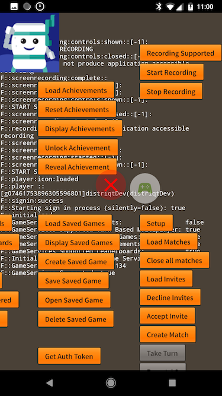

You can use the screen recording functionality to easily add video recording to your games and let users share their videos with friends.

The experience is similar on iOS and Android however their are some key differences in terms of the way you can control the recording, 
however the API has been designed so you can use a single code base across platforms.

We will address the particular details of each platform separately to avoid confusion.


## Checking for Support

You can check if the current device, platform and service support screen recording by checking the `isSupported` flag:

```actionscript
if (GameServices.service.recording.isSupported)
{
    // Screen recording supported
}
```


## Checking for Availability

Additionally you should check whether recording is currently available. There are many reasons that recording is not availble and 
you should not attempt to start recording if it isn't available.

To check simply use the `checkAvailability` function, either with a callback function:

```actionscript
GameServices.service.recording.checkAvailability( function( available:Boolean ):void
{
    // available indicates if screen recording is available
});
```

Or using an event:

```actionscript
GameServices.service.recording.addEventListener( ScreenRecordingEvent.AVAILABILITY_CHANGED, changeHandler );
GameServices.service.recording.checkAvailability();

function changeHandler( event:ScreenRecordingEvent ):void
{
	GameServices.service.recording.removeEventListener( ScreenRecordingEvent.AVAILABILITY_CHANGED, changeHandler );
	var available:Boolean = GameServices.service.recording.checkAvailability();
}
```


## Start Recording

To start the recording you call the `start` function:

```actionscript
GameServices.service.recording.start();
```

This will either start recording or present controls for the user to start recording. 

For example, on Google Play Games, you cannot start a recording directly, instead this call presents the screen recording controls.

Whereas on ReplayKit you can start a recording directly, so this call will initiate the recording.

At this point you can expect either a `ScreenRecordingEvent.CONTROLS_SHOWN` event, a `ScreenRecordingEvent.STARTED` event, or if an error occurred you could encounter a `ScreenRecordingEvent.ERROR` event.


### Recording Options

You can at this point specify some options for the recording on supported services, by passing a `ScreenRecordingOptions` object as the parameter to the `start` function:

```actionscript
var options:ScreenRecordingOptions = new ScreenRecordingOptions();

GameServices.service.recording.start( options );
```

- **Google Play Games**

No options are available here, all options will be ignored.


- **ReplayKit iOS 9/10** 

With iOS 9/10 you can specify an overlay UI stop button that won't be included in the screen recording. This allows you to present an interface for your user to stop the recording without being included in your game.

You can enable / disable the overlay and specify a custom bitmap data for the stop button:

```actionscript
var options:ScreenRecordingOptions = new ScreenRecordingOptions();
options.uiOverlayEnabled = true;
options.uiOverlayStopButton = stopButtonBitmapData;
```

The UI is enabled by default and uses a built in stop button as below:


- **ReplayKit iOS 11+** 

With iOS 11 ReplayKit additionally allows you to specify the location of the recorded video. 
You can still specify the overlay UI as previously.

For example, to specify the recording is saved to the application storage directory as `recording.mp4`:

```actionscript
var recordedFile:File = File.applicationStorageDirectory.resolvePath("recording.mp4");

var options:ScreenRecordingOptions = new ScreenRecordingOptions();
options.filepath = recordedFile.nativePath;
options.quality = ScreenRecordingOptions.LOW;
```

The quality can be set here, either `HIGH`, `MEDIUM` or `LOW`. This will control the quality and 
hence filesize of the recorded video. 


## Stop Recording 

With some services you can programmatically stop the screen recording. 

```actionscript
GameServices.service.recording.stop();
```

This is only currently supported with ReplayKit under iOS Game Center.


## Recording Events

During the screen recording process there will be a series of events dispatched depending on the current state of the recording. The main events related to a recording are:

- `ScreenRecordingEvent.STARTED`: Dispatched when a recording starts
- `ScreenRecordingEvent.COMPLETE`: Dispatched when a recording is complete and the result available (if supported)
- `ScreenRecordingEvent.STOPPED`: Dispatched directly after recording stops, generally just before a complete event
- `ScreenRecordingEvent.ERROR`: Dispatched if there was an error at any point during the recording

Additionally you have the following events that are dispatched when various views / controls are presented to the user:

- `ScreenRecordingEvent.CONTROLS_SHOWN`: The user controls have been shown allow the user to start / stop recording;
- `ScreenRecordingEvent.CONTROLS_CLOSED`: The user controls have been removed from view;
- `ScreenRecordingEvent.PREVIEW_SHOWN`: The preview controller is visible allowing the user to edit and share the video;
- `ScreenRecordingEvent.PREVIEW_CLOSED`: The preview controller has been closed;


The order of these events depends on the service so see the section below for details on the flow through each screen recording service.


## ReplayKit (GameCenter iOS/tvOS)

With ReplayKit you can control the screen recording start and stop processes, and present a stop button in an overlay that isn't recorded.

When recording starts the user will be presented with a permission dialog asking them to allow screen recording. This dialog is presented on subsequent recordings as well if there hasn't been a screen recording allowed within 8 minutes:


If they deny, you will receive an `ScreenRecordingEvent.ERROR` event.

If they allow, the recording will start and you will receive the `ScreenRecordingEvent.STARTED` event, and, if enabled, the UI overlay stop button will be shown:


### iOS 9 - 10

With iOS 9 and 10, after a video is recorded ReplayKit will present a preview controller allowing the user to view and edit (trim) the video and then share or save the video to their settings. You will not have direct access to the recorded video.


You will get `ScreenRecordingEvent.PREVIEW_SHOWN` and `ScreenRecordingEvent.PREVIEW_CLOSED` events when the preview controller is shown and closed respectively. After the preview controller is closed you will receive the `ScreenRecordingEvent.COMPLETE` event.


### iOS 11 + 

From iOS 11, the preview controller is no longer presented to the user. Instead when recording stops the `ScreenRecordingEvent.COMPLETE` event is dispatched containing the path of the recorded file. You have direct access to this file and can present in a media player as you require, or share to other platforms.


## Google Play Games (Android)

With Play Games the user controls the screen recording start and stop processes. When calling `start` the user is presented with a permission dialog and then UI controls are placed on screen to allow the user to enable camera / microphone recording and to start / stop the recording. 

On first run, the user will be taken through a guide on the process, asked for permission and the recording quality, and then the controls will be shown:


On subsequent calls to `start` the user will simply be asked the recording quality and then the controls will be shown:


You will receive the `ScreenRecordingEvent.CONTROLS_SHOWN` event when the controls are presented to the user.


When a user starts a recording by pressing the record button, a countdown will initiate and then recording will begin. At this point you will receive the `ScreenRecordingEvent.STARTED` event and the controls will change to show a stop recording button.

When the user stops recording the `ScreenRecordingEvent.STOPPED` and the `ScreenRecordingEvent.COMPLETE` events will be dispatched and the user will be shown a notification asking if they wish to review the recording.


The user can dismiss these controls at any time, even without performing a recording session by dragging the controls onto the close icon which will appear in the middle of the screen when dragging. The `ScreenRecordingEvent.CONTROLS_CLOSED` event will be dispatched whenever the controls are removed.




