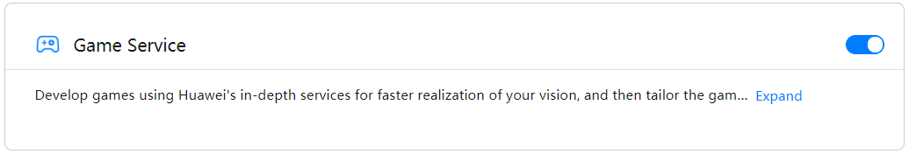
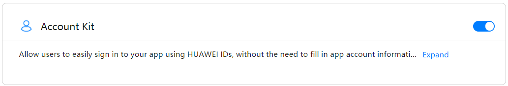
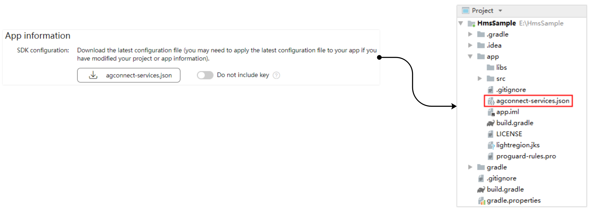

With Game Service, you will have access to a range of development capabilities. You can promote your game quickly and efficiently to Huawei's vast user base by having users sign in using their HUAWEI IDs. You can also use the service to quickly implement functions such as achievements, leaderboards and game addiction prevention.


## AppGallery Connect

Before you start developing an app, configure app information in AppGallery Connect.

- [Preparations in AppGallery Connect](https://developer.huawei.com/consumer/en/doc/development/HMSCore-Guides/config-agc-0000001281025916)


### Signing Certificate Fingerprint

When configuring the signing certificate fingerprint, use the p12 certificate you are using to sign your application. 

You can use the keytool utility to get the details of your `p12` certificate directly, the SHA1 signature will be listed in the output from the following command:

```
keytool -list -v -keystore /path/to/your/certificate.p12 
```

<details><summary><code>keytool</code> location</summary>
<p>

`keytool` is a key and certificate management utility. 

You will find it in `$JAVA_HOME/bin/keytool`.

</p>
</details>


Enter this SHA1 fingerprint in the required section in your project settings.


### Enabling Required Services

Before using Game Service, enable the permission for using its APIs in AppGallery Connect: Select your desired project, go to **Project settings** > **Manage APIs**, find Game Service, and toggle on its switch.

Ensure you enable the **Game Service** and **Account Kit** at a minimum. 





## AppGallery Connect Configuration File

Sign in to [AppGallery Connect](https://developer.huawei.com/consumer/en/service/josp/agc/index.html), download the `agconnect-services.json` file under **Project settings** > **General information** of the project of your app, and copy the file to your app's module directory



Add `agconnect-services.json` to the root of your application and ensure it is packaged.


