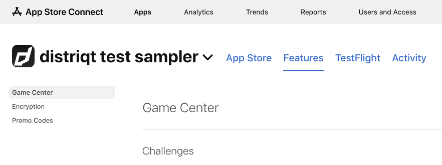
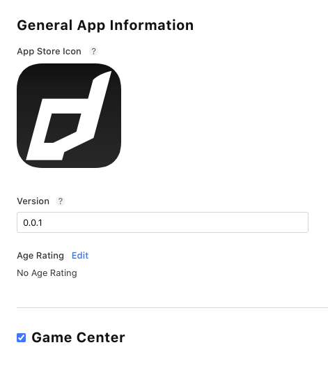
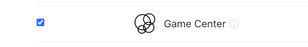
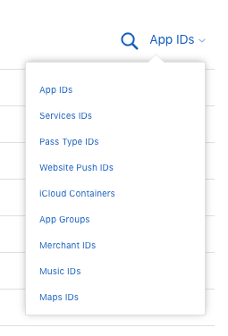
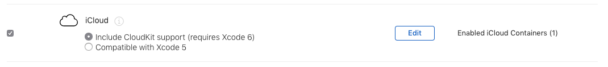
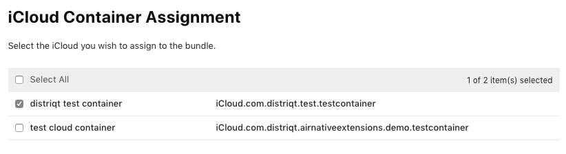

Game Center is setup through your iTunes Connect account at two levels, the app level and the app version level. 

At the app level, you configure all the details for leaderboards and achievements. 

At the version level, you identify which leaderboards and achievements to associate with that version of the app. 

> 
> The following documentation is a summary from the official Apple documentation [here](https://developer.apple.com/library/content/documentation/LanguagesUtilities/Conceptual/iTunesConnectGameCenter_Guide/AccessAndEnable/AccessAndEnable.html)
>

## Application Game Center Page

- Sign in to [App Store Connect](https://appstoreconnect.apple.com/) using your Apple ID user name and password.
- Click My Apps.
- Find the app in the list of apps or search for the app.
  If you don't see the app you are looking for on the My Apps page, you can search for the app using a variety of criteria. In the Search box, enter the criteria you want to use to search for an app. The view starts filtering the list of apps as soon as you start typing:
    - Name. Enter the name or a portion of the name.
    - Apple ID. Enter the Apple ID of the app. This value must match exactly to return an app.
    - SKU. Enter the SKU of the app.
  If no apps are listed, then the criteria you type match no apps.

- In the Search Results, click on the name of an app to open the App Details page.
- Select Features and then Game Center.

From this page you can configure Game Center components: Leaderboards and Leaderboard Sets, Achievements, and Groups.

## Enabling Game Center for Your App

From the Game Center page you configure all of the Game Center components used by your app. Enabling Game Center on this page allows this app to communicate with Game Center and adds Game Center metadata, as described in Game Center Properties, to the iTunes Connect record for the app.

To give your app access to configured components through Game Center, you also need to enable Game Center in the Game Center section on the Versions tab before you submit it for review.

## Enable the Capability

- Sign in to the [Developer portal](https://developer.apple.com/account) using your Apple ID 
- Go to your application [identifiers](https://developer.apple.com/account/resources/identifiers/list) and edit your application
- Enable the "Game Center" capability and save 

- Update any associated provisioning profiles and download them for use in your app

## Leaderboards, Achievements 

- [Leaderboards and Leaderboard Sets](https://developer.apple.com/library/content/documentation/LanguagesUtilities/Conceptual/iTunesConnectGameCenter_Guide/Leaderboards/Leaderboards.html#//apple_ref/doc/uid/TP40013726-CH2-SW1)

- [Achievements](https://developer.apple.com/library/content/documentation/LanguagesUtilities/Conceptual/iTunesConnectGameCenter_Guide/Achievements/Achievements.html#//apple_ref/doc/uid/TP40013726-CH3-SW1)

## Saved Games

The iCloud container is required to enable an area in iCloud for your application to store content for the user. 

In your developer console:

- Select "Identifiers",
- Change the drop down in the top right to "iCloud Containers",

- Register a new "iCloud Container" and **note the identifier**

- Select "App IDs" in the top right
- Edit your application identifier and enable "iCloud"

- Select the containers for your app

- Then follow the instructions in [add the extension](add-the-extension.mdx) to correctly add these values to your application. 

**Make sure you re-download your provisioning profile after making those changes.**

>
> Note: **Saved games are not supported on Apple tvOS.** If you are supporting this 
> platform you should not add the container to your application descriptor. If you are supporting 
> both platforms and utilising saved games on iOS you will need to create separate application 
> descriptors for each and only add the following to the iOS application build.
>

