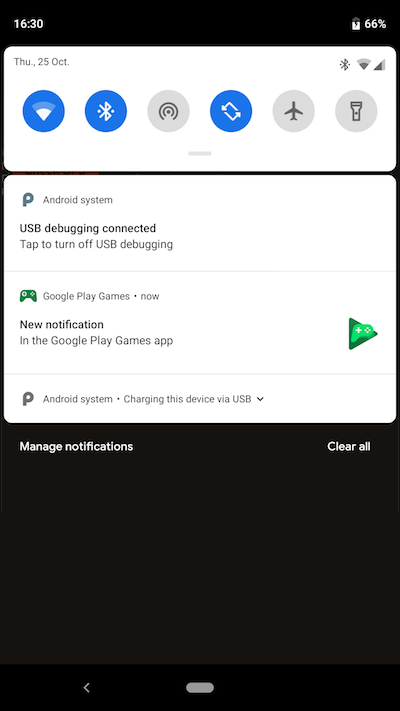
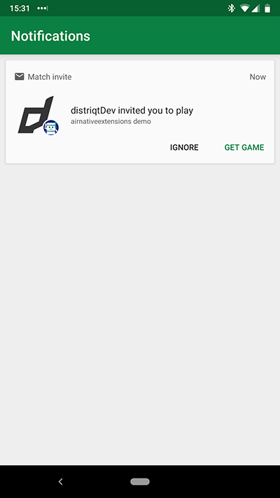

## Overview

During the process of making a turned based game you will follow the procedure below:

### Step 1 - Player 1

- [Create Match](turn-based-multiplayer---implementation.md#creating-a-match)
- Initialise the match with some data
- [Take the first turn and pass to "Player 2"](turn-based-multiplayer---implementation.md#taking-the-first-turn)
  - [Taking Turns](turn-based-multiplayer---implementation.md#taking-turns)

At this point the match will be valid and invited players will be sent invitations which will appear as notifications on their device. If they don't have the app installed they will be prompted to install.

### Step 2 - Player 2

The other players will now receive a notification about a game invitation.

If they don't have the game installed they can install it at this point or ignore the invitation.

At this point they can accept the invitation and open / install the game. This can be done through the Game Center / Play Games application outside your application, although with Play Games you can do this in your game as well.

When this player launches the app:

- Firstly check any [received invitations](turn-based-multiplayer---invitations.md#loading-invitations)
  - Accept / deny invitations as required  

As long as the player accepted one of the invitations they should now have an active match. So as part of your start up process you should load active matches.

- [Load matches](turn-based-multiplayer---implementation.md#loading-matches)
- Allow player to select a match if required
- [Take Turn and pass to "Player 1"](turn-based-multiplayer---implementation.md#taking-the-first-turn)

### Step 3

> This step will repeat until the game is completed.

If the player has the application open then the `TurnBasedMatchEvent.MATCH_UPDATED` event will be dispatched and you can respond immediately.

- [Listen for match updates](turn-based-multiplayer---implementation.md#match-updates)

Otherwise the player will receive a notification about a game update:

| | |
| --- | --- |
| [images/android_playgames_turnnotification.png]] ](-[[images/android_playgames_turnnotification_b.png) |

- [Load matches on start / activation](turn-based-multiplayer---implementation.md#loading-matches)

Either case you should process the match and give the user the option to take a turn.

- [Taking Turns](turn-based-multiplayer---implementation.md#taking-turns)

### Step 4

When your game logic determines the game to be complete the same process as step 3 above should be taken but instead of taking a turn the player should complete the match with the final game data.

- [Completing a Match](turn-based-multiplayer---implementation.md#completing-a-match)

