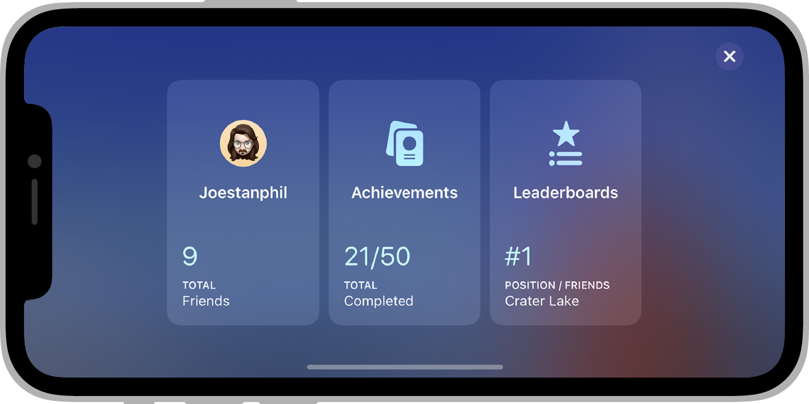
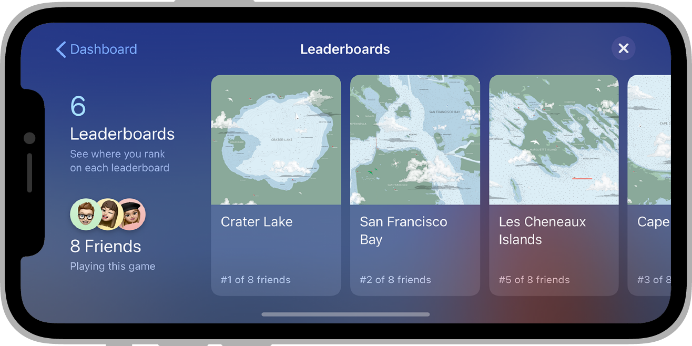
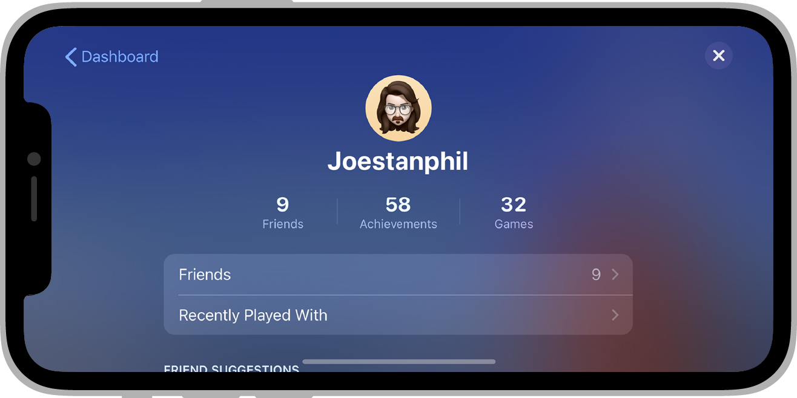

There are several user interface elements you can use. Some of these can be accessed from other parts of the API eg:

- [Display Achievements UI](achievements.md#displaying-achievements-ui)
- [Display Leaderboard UI](leaderboards.md#displaying-leaderboard-ui)
- [Saved Games UI](saved-games.md#saved-games-ui)

However there are some general elements that can be accessed here directly. This is broken into two major functionality pieces, a [Show UI](#show-ui) function that allows you to show fullscreen user interface elements and the [Access Point](access-point.md) functionality that overlays user interface elements on your application. 


## Show UI

A generic `showUI()` function allows you to show certain UI elements directly.

```actionscript
GameServices.service.showUI( state );
```

The state can be one of the following. Not all states are available on all services, and `showUI()` may return `false` in these situations. However we have tried to provide reasonable replacements wherever possible.

The possible states are:

- `dashboard`: The default dashboard screen if available (Game Center has a dashboard, whereas Play Games will present a profile icon);
- `achievements`: Will launch the achievements UI;
- `leaderboards`: Will launch the "all" leaderboards UI (Note: if you want to display a specific leaderboard see the [Display Leaderboard UI](leaderboards.md#displaying-leaderboard-ui) functionality);
- `profile`: Will launch a player profile UI;


### Dashboard 



### Achievements 


### Leaderboards 



### Player Profile 




