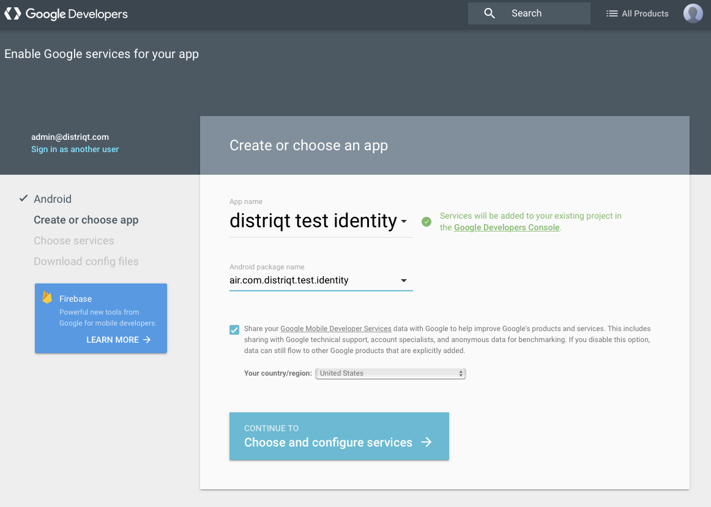
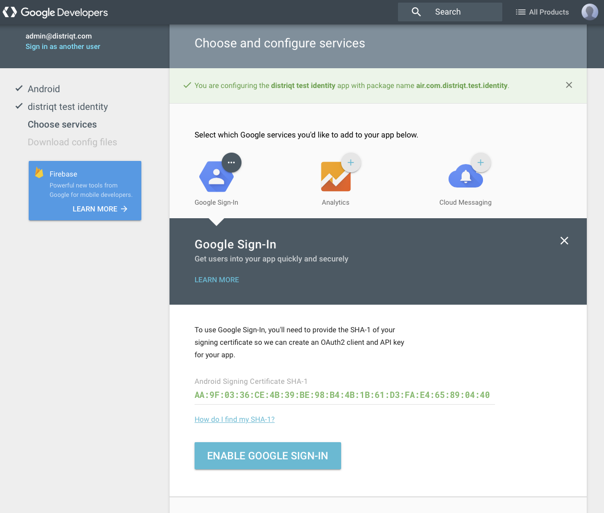
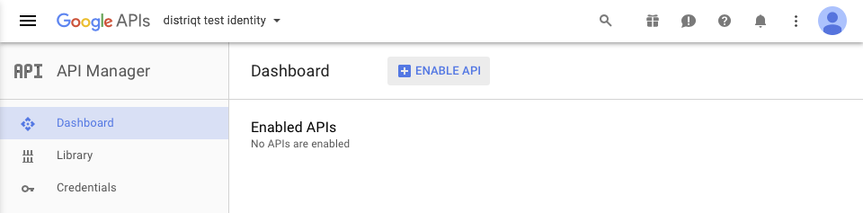
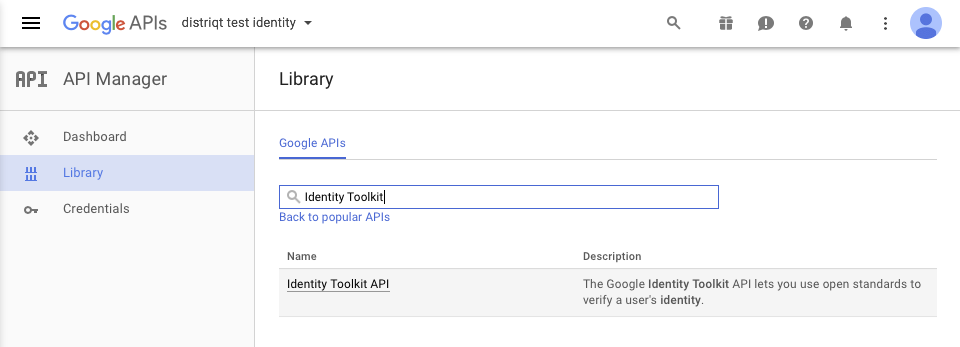
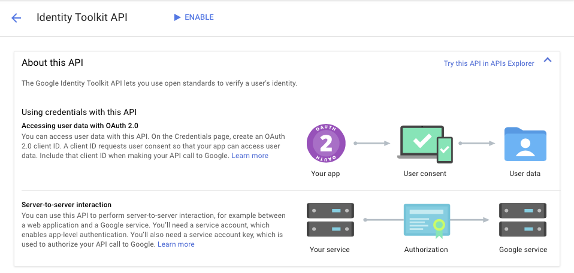
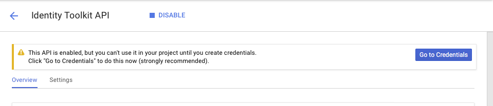
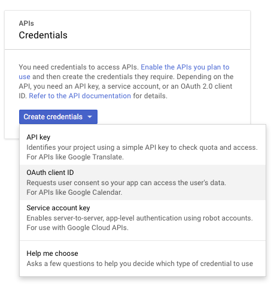
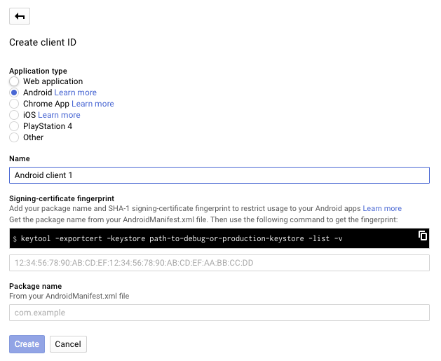
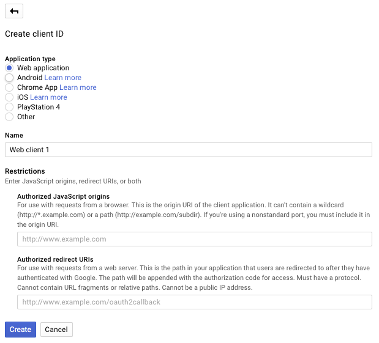

Firstly before setting up any console projects make sure you check if your Android application 
is currently linked to a API console project: https://play.google.com/apps/publish 
If it is then you MUST use that project details otherwise you will have issues getting tokens.

## Simple Method

The simple method uses the tools from Google to quickly create and add the appropriate APIs
to your API project.

- Add to your Android app: [here](https://developers.google.com/mobile/add?platform=android&cntapi=signin&cnturl=https:%2F%2Fdevelopers.google.com%2Fidentity%2Fsign-in%2Fios%2Fsign-in%3Fconfigured%3Dtrue&cntlbl=Continue%20Adding%20Sign-In)

	- This will ask you for:
		- the **App Name** which is your Google APIs project name. 
		If you have an existing one, select it from the list or else you can add a new one.
		- the **Android package name**, generally your AIR application ID prefixed by air eg: `air.com.distriqt.test`
		
		

	- Click **Choose and configure services** 

		

	- You will need to enter the fingerprint of your signing certificate here (see [Android Certificate](android-certificate) section for more)
	- then finally **Enable Google Sign-In**

- Add to your iOS app: [here](https://developers.google.com/mobile/add?platform=ios&cntapi=signin&cnturl=https:%2F%2Fdevelopers.google.com%2Fidentity%2Fsign-in%2Fios%2Fsign-in%3Fconfigured%3Dtrue&cntlbl=Continue%20Adding%20Sign-In)

	- This will ask you for:
		- the **App Name** which is your Google APIs project name. 
		If you have an existing one, select it from the list or else you can add a new one.
		- the **iOS Bundle ID** is generally your AIR application ID, eg: `com.distriqt.test`
	- Click **Choose and configure services** and then **Enable Google Sign-In**

Following this will add the required APIs and the 3 credentials to your Google APIs project.

You can now jump to the section [Google Identity Options](google-identity-options) to get 
the information for configuring this extension.

## Manual Method

The following method gives you more control over what is created and a better understanding 
of the details of the credentials created. 

If you need to create an API project 

1. Go to the [Google Developers APIs Console](https://console.developers.google.com/apis)
2. Select a the drop down at the top and click "Create project"
3. Enter the name of your API project and click "CREATE"
4. You will then need to wait for the project to be created and appear in the project list

Now that you have created a project or you have previously created a project, lets add the
Google Identity API to your project.

1. Go to the [Google Developers APIs Console](https://console.developers.google.com/apis)
2. Select the project from the drop down at the top
3. Select the **Dashboard**
4. Click on **ENABLE API**

5. Search for the Google **Identity Toolkit** and select it:

6. Click **Enable**:

7. You should now see the *This API is enabled, but you can't use it in your project until you create credentials*. 
  We will set these up later.

8. Similarly enable the **Token Service API** and the **Google+ API** 

9. Now you will need to create the credentials for your application. There are 3 credentials 
required to fully support all the functionality in this extension:

>
>	1. iOS:
>		- Create credential / **OAuth client ID** / iOS 
>		- Enter your bundle id: eg: `com.distriqt.test`
>		- Take note of the "Client ID", you will need to pass this to the `GoogleIdentityOptions` as the iOS client ID
>
>	2. Android:
>
>		- Create credential / **OAuth client ID** / Android
>		- Enter the SHA1 fingerprint of your certificate (See [Android Certificate](android-certificate))
>		- Enter the package name of your application: eg: `air.com.distriqt.test`. Please note that this 
>		  is related to your AIR application ID but can be very different. We suggest making sure you use 
>		  a valid Java package name for your AIR application ID. 
>		- You do not directly need to supply any information from this credential to the ANE. 
>		  The matching is made completely on the package name and the certificate fingerprint.

>		
>
>	3. Web Application:
>		- Create credential / **OAuth client ID** / Web application
>		- Take note of the "Client ID" for the "Web application", you will need this value for your `GoogleIdentityOptions`
>
>		
>

## Firebase

If you are using Firebase you can update your certifcate signature after setting up your project.

- Make sure that you have the SHA fingerprint of your signing certificate.
- In your Project settings, go to the Your apps card.
- Select the Firebase Android app to which you want to add a SHA fingerprint.
- Click Add fingerprint.
- Enter or paste the SHA fingerprint, then click Save.

More information: https://support.google.com/firebase/answer/9137403?hl=en

## More Information

More information can be found here:

- Android: [Getting Started](https://developers.google.com/identity/sign-in/android/start-integrating)
- iOS: [Getting Started](https://developers.google.com/identity/sign-in/ios/start-integrating)

