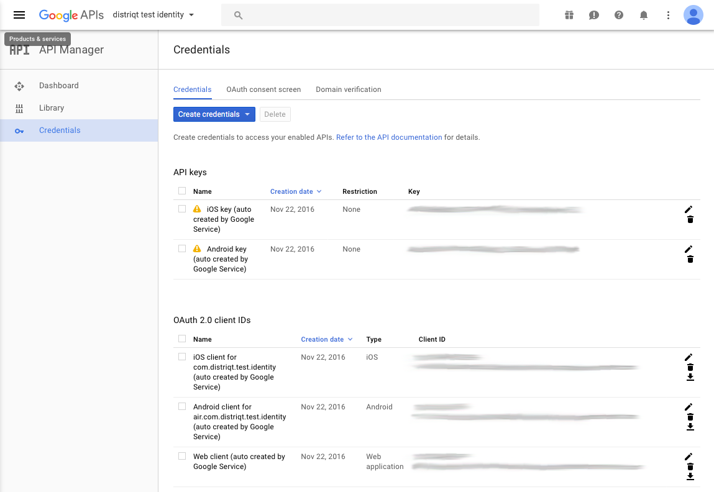

This shows you where to gather the information required for the Google Identity options you will use to initialise the extension.


## Client IDs

You should now go to the [Google Developers APIs Console](https://console.developers.google.com/apis)
select your project and retrieve the client IDs from the Credentials section.



Take note of the following identifiers from the *OAuth 2.0 client IDs*:

- The *Client ID* for the **iOS client**. This is your iOS application `clientID`
- The *Client ID* for the **Web client**. This is the `serverClientID`. 
    - If you have different servers and hence ids for applications you may have 2 different server client IDs 

:::note 
YOU DO NOT NEED TO USE THE *ANDROID CLIENT*. Android applications are identified through their package name and certificate signature so ensure those properties match the configuration of your application in the console.
:::


## Setup Options

The simplest method to correctly create your options for setup is to use the `GoogleIdentityOptionsBuilder`. This class contains helper functions to construct the options correctly for the `setup` of your application. The builder is setup in such a way that you can use a single code base and the builder will determine the correct values to use in the `GoogleIdentityOptions` instance based on the current platform of the device. This allows you to simplify your code having one code base for both Android and iOS. If you wish more control you can use the direct accessors, `setClientID` and `setServerClientID`, which will ignore the current platform.

At a minimum you will need to specify the iOS and Android client IDs:

```actionscript
var options:GoogleIdentityOptions = new GoogleIdentityOptionsBuilder()
	.requestEmail()
	.setIOSClientID( IOS_CLIENT_ID )
	.setAndroidServerClientID( WEB_CLIENT_ID )
	.build();

GoogleIdentity.service.setup( options );
```


If you plan on identifying your user with your server you will need to request the id token and provide the server client ids:

```actionscript
var options:GoogleIdentityOptions = new GoogleIdentityOptionsBuilder()
    .requestEmail()
    .requestIdToken()
	.setIOSClientID( IOS_CLIENT_ID )
    .setiOSServerClientID( IOS_SERVER_CLIENT_ID )
    .setAndroidServerClientID( ANDROID_SERVER_CLIENT_ID )
    .build();
```

See the section on [authenticating with a backend server](authenticate-with-a-backend-server.md).


If you require server side access then you will need to request the server auth code and provide the server client ids:

```actionscript
var options:GoogleIdentityOptions = new GoogleIdentityOptionsBuilder()
    .requestEmail()
    .requestIdToken()
    .requestServerAuthCode()
	.setIOSClientID( IOS_CLIENT_ID )
    .setiOSServerClientID( IOS_SERVER_CLIENT_ID )
    .setAndroidServerClientID( ANDROID_SERVER_CLIENT_ID )
    .build();
```

See the section on [enabling server-side access](enabling-server-side-access.md).


You can add additional scopes using the `addScope` method. This will add additional access permissions to your users signin process which you may require for your application:

```actionscript
var options:GoogleIdentityOptions = new GoogleIdentityOptionsBuilder()
    .requestEmail()
    .requestIdToken()
    .requestServerAuthCode()
	.setIOSClientID( IOS_CLIENT_ID )
    .setiOSServerClientID( IOS_SERVER_CLIENT_ID )
    .setAndroidServerClientID( ANDROID_SERVER_CLIENT_ID )
    .addScope( "https://www.googleapis.com/auth/plus.login" )
    .addScope( "https://www.googleapis.com/auth/plus.me" )
    .addScope( "profile" )
    .build();
```

Once you have your `options` instance you pass this to the `setup` function.  
