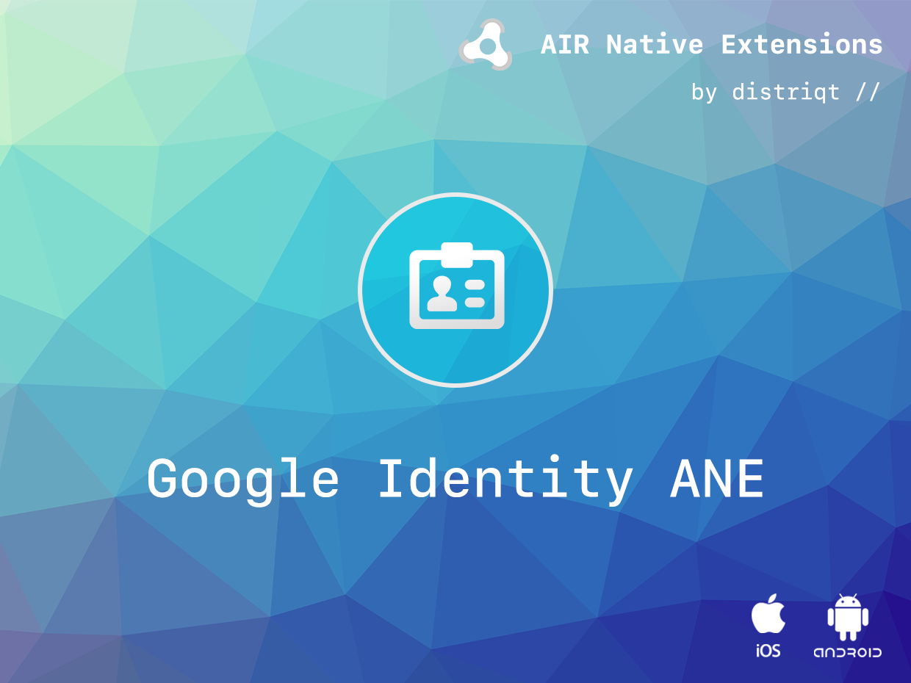
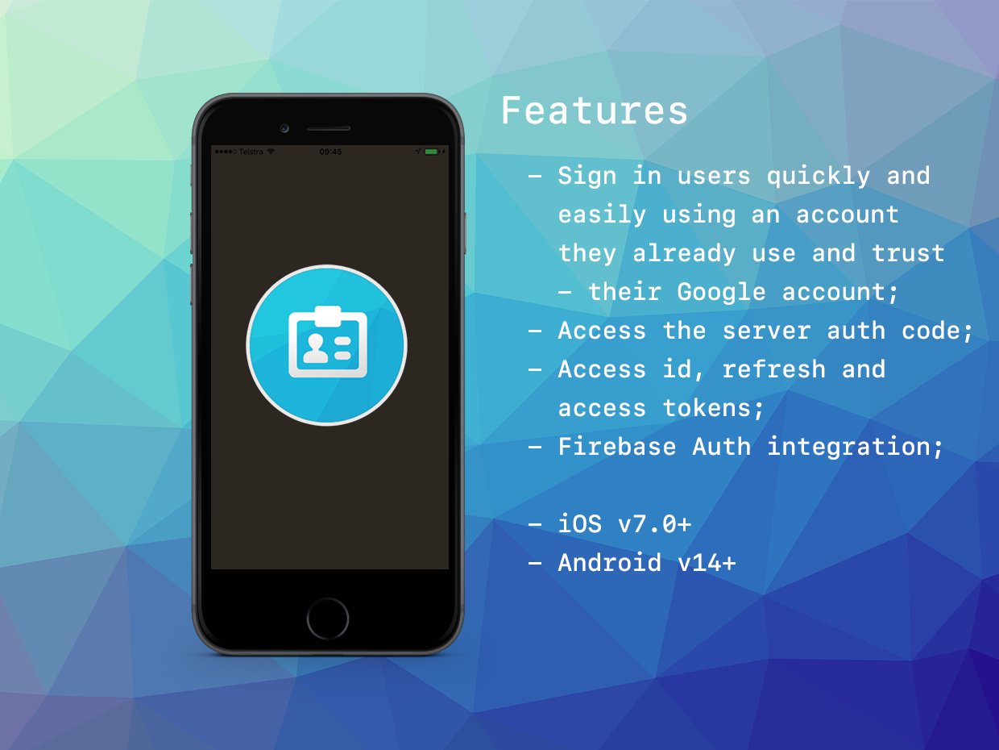

# Google Identity / Google SignIn

The [Google Identity](http://airnativeextensions.com/extension/com.distriqt.GoogleIdentity) extension
gives you the ability to sign in users using their Google account and then access to the Google APIs
using user authentication tokens.

The simple API allows you to quickly integrate Google identities in your AIR application. Identical
code base can be used across all platforms allowing you to concentrate on your application and not
device specifics.

We provide complete guides to get you up and running with asset selection quickly and easily.

### Features

- Setup the Google Identity API using your client IDs;
- Sign-in/out and disconnect users;
- Access to the server auth code to make queries on the user's behalf from your server;
- Access to the id, refresh and access tokens for user authentication

As with all our extensions you get access to a year of support and updates as we are continually
improving and updating the extensions for OS updates and feature requests.

## Documentation

Latest documentation can be found in the [documentation site](https://docs.airnativeextensions.com/docs/googleidentity/)

More information here:

[com.distriqt.GoogleIdentity](https://airnativeextensions.com/extension/com.distriqt.GoogleIdentity)

## License

You can purchase a license for using this extension:

[airnativeextensions.com](https://airnativeextensions.com/)

distriqt retains all copyright.

