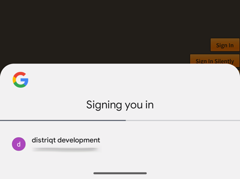

## Setup the extension

You need to setup the platform using your Google API client ID and specify any additional 
options such as scopes you require:

At a minimum you will need to specify the iOS and Android client IDs:

```actionscript
var options:GoogleIdentityOptions = new GoogleIdentityOptionsBuilder()
	.requestEmail()
	.setIOSClientID( IOS_CLIENT_ID )
	.setAndroidServerClientID( WEB_CLIENT_ID )
	.build();

GoogleIdentity.service.setup( options );
```

The options here specify the permissions and scopes that you require from your users. This information will get displayed as part of the sign in process. 

For more information on these options see the [Google Identity Options](google-identity-options.md) section.


This call will be asynchronous, certain situations require checks that perform asynchronous operations. 
You should await the `GoogleIdentityEvent.SETUP_COMPLETE` event before continuing with any other functionality of the extension:

```actionscript
GoogleIdentity.service.addEventListener( GoogleIdentityEvent.SETUP_COMPLETE, setupCompleteHandler );

function setupCompleteHandler( event:GoogleIdentityEvent ):void 
{
	// Setup has completed
}
```


### Automatic silent sign in

The setup process will perform an automatic silent sign in if the user has previously signed in successfully. 
This process is needed to ensure the `isSignedIn` flag is correct after setup. 

The means your user may be presented a view showing something like "signing you in" as part of the `setup()` call. 




:::note 
You can disable this functionality by changing the `attemptSilentSignIn` value in the options:

```actionscript
var options:GoogleIdentityOptions = new GoogleIdentityOptionsBuilder()
	
	...

	.setAttemptSilentSignIn( false )
	.build();
```

This will mean you can manage this process yourself, storing a flag for when users have successfully signed in and then performing a silent sign in when it suits your application.

**If you disable this process the `isSignedIn` flag may be incorrect after `setup()`**

More information on how to [sign in silently](signing-in.md#sign-in-silently).
:::


## Games Signin

:::danger 
This process is no longer supported. Please reach out to us if you require this integration.
:::


If you are planning to use Google Play Games on Android in your application then you can use this ANE to handle the signin process for games rather than handling two authentication processes. Additionally this ANE gives you more control over the sign in options and adding extra scopes that you don't get with the Game Services ANE. 

To do this we have added some default functionality to make the setup process simpler. Simply pass the `GoogleIdentityOptions.DEFAULT_GAMES_SIGN_IN` to the builder constructor and then set any additional options as required. 

```actionscript
var options:GoogleIdentityOptions = new GoogleIdentityOptionsBuilder( GoogleIdentityOptions.DEFAULT_GAMES_SIGN_IN )
	.requestProfile()
	.setIOSClientID( IOS_CLIENT_ID )
	.build();
```

:::note
You will most likely want to request the profile so you can retrieve the player information so make sure you add the `requestProfile()` call to the builder (as above).
:::

Utilising this method automatically adds the required scopes and permissions for games sign in along with any other options you add to the builder.


:::info iOS
As Play Games is no longer supported on iOS this addition does nothing on iOS and you will simply get the normal Google signin on iOS.
:::

