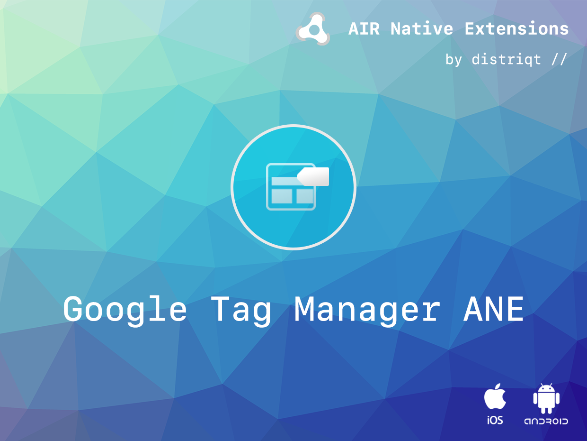

# Google Tag Manager

The [Google Tag Manager](https://airnativeextensions.com/extension/com.distriqt.GoogleTagManager) extension gives you the ability to use the Google Tag Manager analytics in your AIR application.

Never miss an opportunity. This extension enables the use of Google Tag Manager
in your application so you never miss a measurement or marketing opportunity.

The simple API will have you up and running with tags in just a few lines of code.
Identical code base can be used across all platforms without any platfrom specific code,
allowing you to develop once and deploy everywhere! It comes with detailed AS docs,
and a complete example application.

[](https://www.youtube.com/watch?v=7FXbsCWsEi8)

>
> Please note this extension requires Firebase.
>

### Features

- Single API interface - your code works across iOS and Android with no modifications
- Sample project code and ASDocs reference

As with all our extensions you get access to a year of support and updates as we are continually improving and updating the extensions for OS updates and feature requests.

## Documentation

The [documentation site](https://docs.airnativeextensions.com/docs/googletagmanager) forms the best source of detailed documentation for the extension along with the [asdocs](https://docs.airnativeextensions.com/asdocs/googletagmanager).

Simple example of pushing to the data layer:

```actionscript
Firebase.service.analytics.logEvent(
        new EventObject()
                .setName( "share_image" )
                .setParams( {
                                "image_name": "test.png",
                                "full_text" : "test image share"
                            } )
);
```

More information here:

[com.distriqt.GoogleTagManager](https://airnativeextensions.com/extension/com.distriqt.GoogleTagManager)

## License

You can purchase a license for using this extension:

[airnativeextensions.com](https://airnativeextensions.com/)

distriqt retains all copyright.


