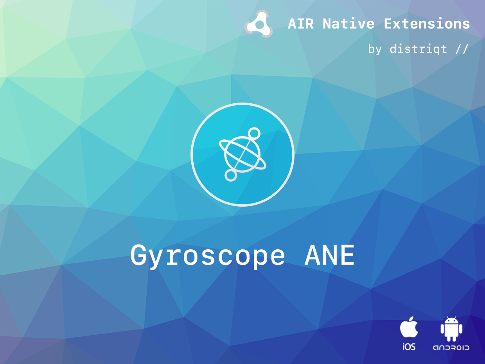
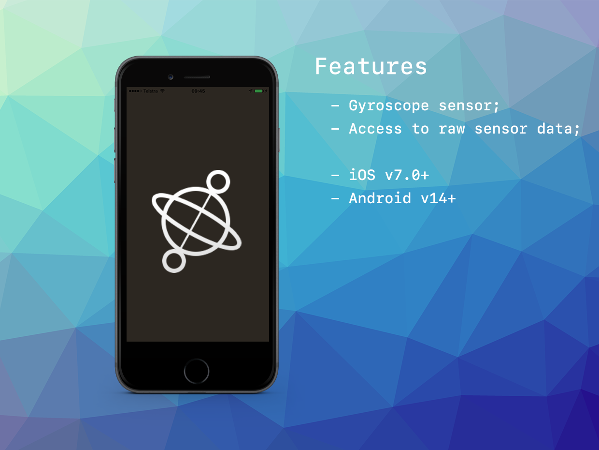

# Gyroscope

The [Gyroscope](https://airnativeextensions.com/extension/com.distriqt.Gyroscope)
extension provides access to a device's native gyroscope sensor, with raw sensor data.

The simple API will have you up and running in just a few lines of code.
Identical code base can be used across all platforms without any platfrom specific code,
allowing you to develop once and deploy everywhere!

It comes with detailed AS docs, and a complete example application.

### Features

- Provides access to native gyroscope sensor functionality
- Single API interface - your code works across iOS and Android with no modifications
- Sample project code and ASDocs reference

As with all our extensions you get access to a year of support and updates as we are continually
improving and updating the extensions for OS updates and feature requests.

## Documentation

Latest documentation can be found in the [documentation site](https://docs.airnativeextensions.com/docs/gyroscope)

More information here:

[com.distriqt.Gyroscope](https://airnativeextensions.com/extension/com.distriqt.Gyroscope)

## License

You can purchase a license for using this extension:

[airnativeextensions.com](https://airnativeextensions.com/)

distriqt retains all copyright.

