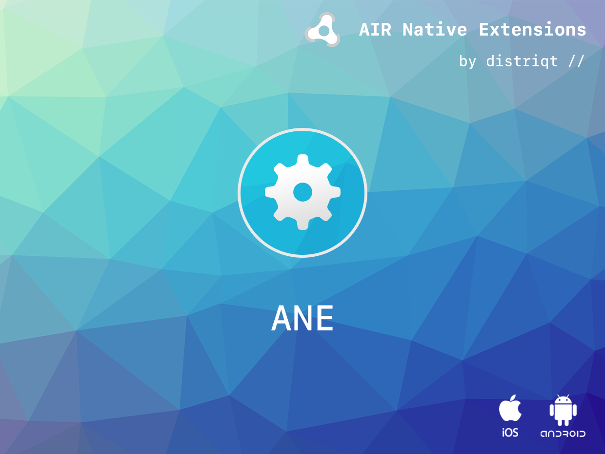

# Health

The [Health](https://airnativeextensions.com/extension/com.distriqt.Health) extension gives you access to the user's health data on a device, such as steps taken.


### Features:

- HealthKit data access on iOS
- HealthConnect data access on Android
- Single API interface - your code works across supported platforms with no modifications
- Sample project code and ASDocs reference


As with all our extensions you get access to a year of support and updates as we are 
continually improving and updating the extensions for OS updates and feature requests.


## Documentation

The [documentation site](https://docs.airnativeextensions.com/docs/health) forms the best source of detailed documentation for the extension along with the [asdocs](https://docs.airnativeextensions.com/asdocs/health). 

Quick Example: 

```actionscript title="AIR"
var now:Date = new Date();
var startDate:Date = new Date( 2023, 0, 1 );

var stepQuery:StatisticsQuery = new StatisticsQuery( HealthType.STEP_COUNT )
        .withStartDate( startDate )
        .withEndDate( now );

Health.instance.execute(
        stepQuery,
        function ( result:HealthQueryResult, error:Error ):void
        {
            if (error != null)
            {
                trace( "ERROR: " + error.message );
                return;
            }
            // result will contain query data
            for each (var stat:Statistic in result.statistics)
            {
                trace( stat.startDate.toString() + "::" + stat.sum );
            }
        }
);
```

More information here: 

[com.distriqt.Health](https://airnativeextensions.com/extension/com.distriqt.Health)


## License

You can purchase a license for using this extension:

[airnativeextensions.com](https://airnativeextensions.com/)


