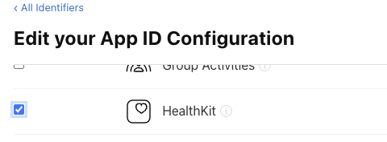

## Initialise

In order to use the rest of this extensions functionality you must first initialise the extension, specifying the service type you wish to use in your application.

This allows us to provide the same API to various different services.

To specify the service type, construct a `HealthService` instance and pass it to the `initialise()` method, eg to use the `HealthService.HEALTH_CONNECT` service:

```actionscript
Health.instance.initialise(
        new HealthService()
                .setServiceType( HealthService.HEALTH_CONNECT )
);
```

You can check whether a service is supported via the `isServiceSupported()` method:

```actionscript
if (Health.instance.isServiceSupported( HealthService.HEALTH_CONNECT ))
{
    // Health Connect is supported
}
```

You can just use the default service by calling `initialise()` with no parameters:


```actionscript
// Initialise the default service
Health.instance.initialise();
```

On iOS this will use HealthKit, and on Android this will use Health Connect. 


Services include: 
- `HealthService.APPLE`: Apple's HealthKit;
- `HealthService.HEALTH_CONNECT`: Android Health Connect;
- `HealthService.FIT`: Google Fitness API;


## Android Health Connect

There is no setup required outside your application to use Health Connect. 


## Google Fitness API

Follow Google's Guide to create an OAuth client ID for your application and add the Fitness API to your Google app console project.

- [Guide](https://developers.google.com/fit/android/get-started)

:::note 
You may need to submit your application for verification from Google 
:::

You will need to setup and sign-in your users using the [Google Identity extension](authorisation.md#users).


## Apple HealthKit

### Enable HealthKit

Before you can use HealthKit, you must enable the HealthKit capabilities for your app.

Open your developer console and enable HealthKit for your application identifier:

- Open the [Developer Console](https://developer.apple.com/account/resources/identifiers)
- Locate your application and click on it to edit;
- Under **Capabilities**, locate **HealthKit** and enable it:



- Click **Save**;

You will now need to regenerate your provisioning profiles and download them again:

- Navigate to [Profiles](https://developer.apple.com/account/resources/profiles/list)
- Locate and **Edit** your profile;
- Click **Save**;
- Click **Download** to download the updated profile;

