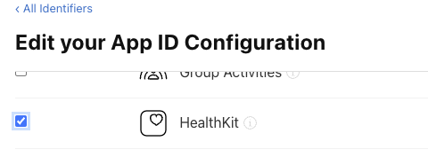

import Tabs from '@theme/Tabs'
import TabItem from '@theme/TabItem'


## Initialise

In order to use the rest of this extensions functionality you must first initialise the extension, specifying the service type you wish to use in your application.

This allows us to provide the same API to various different services.


<Tabs groupId="framework" defaultValue="air" values={[
    {label: 'AIR', value: 'air'},
    {label: 'Unity', value: 'unity'},
  ]}>
<TabItem value="air" >

To use the default service just call `initialise()` with no parameters:

```actionscript
// Initialise the default service
Health.instance.initialise();
```

To specify the service type, construct a `HealthService` instance and pass it to the `initialise()` method, eg to use the `HealthService.HEALTH_CONNECT` service:

```actionscript
Health.instance.initialise(
        new HealthService()
                .setServiceType( HealthService.HEALTH_CONNECT )
);
```

</TabItem>
<TabItem value="unity" >

To use the default service just call `Initialise()` with no parameters:

```csharp
// Initialise the default service
Health.Instance.Initialise();
```

To specify the service type, construct a `HealthService` instance and pass it to the `Initialise()` method, eg to use the `HealthService.HEALTH_CONNECT` service:

```csharp
Health.Instance.Initialise(
        new HealthService()
                .SetServiceTypw( HealthService.HEALTH_CONNECT )
);
```

</TabItem>
</Tabs>


You can check whether a service is supported via the following:

<Tabs groupId="framework" defaultValue="air" values={[
    {label: 'AIR', value: 'air'},
    {label: 'Unity', value: 'unity'},
  ]}>
<TabItem value="air" >

```actionscript
if (Health.instance.isServiceSupported( HealthService.HEALTH_CONNECT ))
{
    // Health Connect is supported
}
```

</TabItem>
<TabItem value="unity" >

```csharp
if (Health.Instance.IsServiceSupported( HealthService.HEALTH_CONNECT ))
{
    // Health Connect is supported
}
``` 

</TabItem>
</Tabs>


Services include: 
- `HealthService.APPLE`: Apple's HealthKit;
- `HealthService.HEALTH_CONNECT`: Android Health Connect;
- `HealthService.FIT`: Google Fitness API;

The default service on iOS is HealthKit, and on Android is Health Connect. 


## Android Health Connect

Access to Health Connect depends on the Android version installed on the phone. The following sections outline how to handle several recent versions of Android.

### Android 14

Starting Android 14 (API Level 34), Health Connect is part of the Android Framework. This version of Health Connect is a framework module. With that, there's no setup necessary.

### Android 13 and lower

On Android 13 (API Level 33) and lower versions, Health Connect is not part of the Android Framework. With that, you need to install the [Health Connect app](https://play.google.com/store/apps/details?id=com.google.android.apps.healthdata) from the Google Play Store.


### Open the Health Connect app

Health Connect no longer appears on the Home screen by default. You can open Health Connect through Settings, though the path varies depending on the Android version:

- **On Android 14 and higher**: Go to *Settings > Security and Privacy > Privacy Controls > Health Connect*, or search for *Health Connect* in Settings.
- **On Android 13 and lower**: Go to *Settings > Apps > Health Connect*, or add Health Connect to your Quick Settings menu.

:::note
The Health Connect SDK supports Android 8 (API level 26) or higher, while the Health Connect app is only compatible with Android 9 (API level 28) or higher. This means that third-party apps can support users with Android 8, but only users with Android 9 or higher can use Health Connect.
:::


## Google Fitness API

:::warning 
Please note that the Fitness API has been deprecated in favour of Health Connect. You should use Health Connect where possible.
:::

Follow Google's Guide to create an OAuth client ID for your application and add the Fitness API to your Google app console project.

- [Guide](https://developers.google.com/fit/android/get-started)

:::note 
You may need to submit your application for verification from Google. 
:::

You will need to setup and sign-in your users using the [Google Identity extension](authorisation.mdx#users).


## Apple HealthKit

### Enable HealthKit

Before you can use HealthKit, you must enable the HealthKit capabilities for your app.

Open your developer console and enable HealthKit for your application identifier:

- Open the [Developer Console](https://developer.apple.com/account/resources/identifiers)
- Locate your application and click on it to edit;
- Under **Capabilities**, locate **HealthKit** and enable it:



- Click **Save**;

You will now need to regenerate your provisioning profiles and download them again:

- Navigate to [Profiles](https://developer.apple.com/account/resources/profiles/list)
- Locate and **Edit** your profile;
- Click **Save**;
- Click **Download** to download the updated profile;

