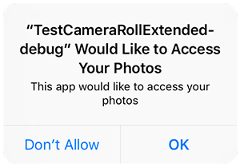

### Extension IDs

The following should be added to your `extensions` node in your application descriptor to identify all the required ANEs in your application:

```xml
<extensions>
    <extensionID>com.distriqt.Image</extensionID>
    <extensionID>com.distriqt.Core</extensionID>
    <extensionID>androidx.core</extensionID>
</extensions>
```


### Android

#### Manifest Additions

In order for the extension to request permissions to save images to the camera roll you must 
add the following to your manifest additions:

```xml
<manifest android:installLocation="auto">
	<uses-permission android:name="android.permission.INTERNET"/>
	<uses-permission android:name="android.permission.WRITE_EXTERNAL_STORAGE" />
	
	<application>
		<activity android:name="com.distriqt.core.auth.AuthorisationActivity" android:theme="@android:style/Theme.Translucent.NoTitleBar" android:exported="false" />
	</application>
	
</manifest>
```


### iOS

#### InfoAdditions

The following additions are for the `InfoAdditions` node of the iPhone section in your application descriptor:

```xml
<iPhone>
	<InfoAdditions><![CDATA[

		HERE

	]]></InfoAdditions>
</iPhone>
```


If you are using iOS 10+ you now need to add some strings to display messages to the user 
when certain permissions are requested. If you are sharing images then there is a chance 
the user may select to save to their camera roll in which case the following is displayed 
the first time your user attempts to access the camera roll.



There are 2 keys required here that control the text in this dialog:

```xml
	<key>NSPhotoLibraryUsageDescription</key>
	<string>Access to photo library is required to save images.</string>
	<key>NSPhotoLibraryAddUsageDescription</key>
	<string>Access to photo library is required to save images.</string>
```

The second key was added in iOS 11.2. You should add both keys to your info additions.

