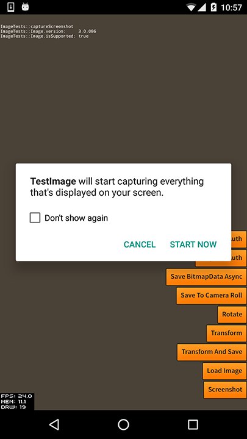
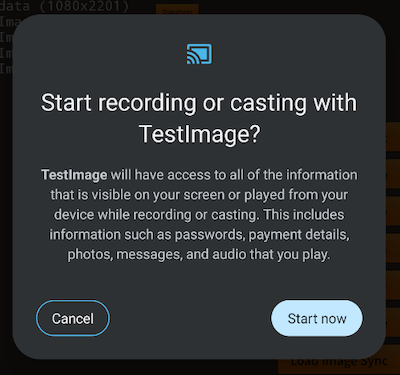

You can use this extension to capture a screenshot of your application as bitmap data and subsequently use that data as you require. 

This is currently supported on iOS and Android API version 21 or higher. 

To capture a screenshot you simply call `captureScreenshot()` and await completion. 

```actionscript
Image.service.captureScreenshot();
```

`captureScreenshot()` may return `false` if the current platform is not supported or if a screenshot capture is currently in progress. You should avoid wherever possible capturing two screenshot simulataneously as this may have undesirable results.


## Completion

You can either use a callback or events to handle the completion of the screenshot.


### Callback

You can pass a callback function to the `captureScreenshot()` method:

```actionscript
Image.service.captureScreenshot(
        function ( bitmap:BitmapData ):void
        {
            if (bitmap != null)
            {
                // bitmap will contain the bitmap data of the screenshot
                trace( "captureScreenshot: complete" );
            }
            else
            {
                trace( "captureScreenshot: an error occurred" );
            }
        }
);
```

The callback function must be of the format: `function ( bitmap:BitmapData ):void`.


### Events

You can listen for a success event `ImageEvent.SCREENSHOT_COMPLETE` or an error `ImageEvent.SCREENSHOT_ERROR`. 

```actionscript
Image.service.addEventListener( ImageEvent.SCREENSHOT_COMPLETE, screenshot_completeHandler );
Image.service.addEventListener( ImageEvent.SCREENSHOT_ERROR, screenshot_errorHandler );

var success:Boolean = Image.service.captureScreenshot();

function screenshot_completeHandler( event:ImageEvent ):void
{
    // event.bitmapData will contain the bitmap data of the screenshot
}

function screenshot_errorHandler( event:ImageEvent ):void
{
    // event.error will contain a description of the error
    // event.errorCode will contain a numeric code of the error
}
```


## Platform Considerations

There are some differences between the platforms here.


### iOS

On iOS your screenshot will be captured without any user interaction. It is not possible to get the current image of the status bar so only your application accessible content will be contained in the screenshot. 


### Android 

Since Android 26 we now have a method to capture the screen without user interaction and this is now the default operation of the extension. This approach won't capture the status or navigation bar elements similar to iOS however the operation will be much more seamless.


If you wish to force the extension to use the older approach (with a media projection) you can pass `false` as the second parameter to the `captureScreenshot()` method, which will attempt to capture the full screen.

```actionscript
Image.service.captureScreenshot( null, false );
```

#### Permission 

On Android, user permission is required to capture a screenshot of the full screen. On calling `captureScreenshot()` your user may be presented a permission dialog. If they accept then the screenshot will be captured. If they deny the permission then the screenshot will fail with an error event and subsequent screenshot capture attempts will present the permission dialog again. 

On older versions of the Android the following permission request is shown: 




With Android 26 and higher you are likely to see something like:




On Android 36 and higher, you will have to get the user to select the "Share entire screen" option:


