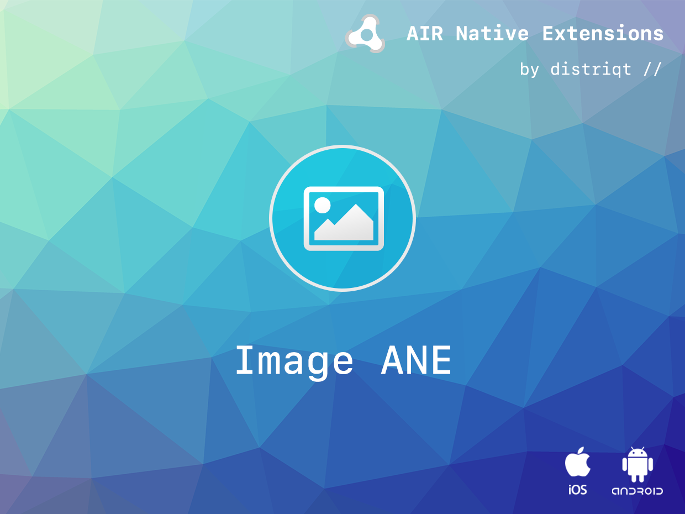

# Image

The [Image](https://airnativeextensions.com/extension/com.distriqt.Image) extension 
provides functionality to manipulate, encode and decode image data. Using native code 
for these operations will speed up your application significantly!

The simple API allows you to quickly integrate user responses in your AIR application 
in just a few lines of code. Identical code base can be used across all platforms 
allowing you to concentrate on your application and not device specifics.

The extension provides the ability to encode/decode, save/load image data both 
synchronously and asynchronously. Using native functionality to encode image data 
will significantly increase the speed of saving image data to the device.

We provide complete guides to get you up and running with dialogs quickly and easily.

As with all our extensions you get access to a year of support and updates as we are 
continually improving and updating the extensions for OS updates and feature requests.


### Features

- Performance: Ability to encode a BitmapData structure into a JPG on PNG using native code;
- Save bitmap data to the camera roll;
- Save and load images to/from encoded image files;
- Encode BitmapData to encoded image format bytes;
- Decode ByteArray containing image bytes to BitmapData;
- Single API: Works across iOS and Android with the same code;
- Sample project code and ASDocs reference


## Documentation

The [Wiki](https://github.com/distriqt/ANE-Image/wiki) forms the best source of detailed documentation for the extension along with 
the [asdocs](https://docs.airnativeextensions.com/asdocs/image). 

Quick Example:


```actionscript
var icon:Bitmap = new Icon() as Bitmap;
var encodedData:ByteArray = new ByteArray();

Image.service.encode( icon.bitmapData, encodedData, ImageFormat.JPG, 0.2 ); 
```


More information here: 

[com.distriqt.Image](https://airnativeextensions.com/extension/com.distriqt.Image)


## License

You can purchase a license for using this extension:

[airnativeextensions.com](https://airnativeextensions.com/)

distriqt retains all copyright.


