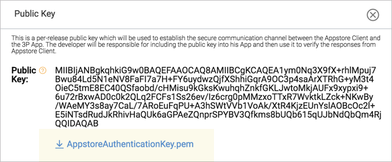

:::info About
Amazon In-App Purchasing (IAP) API allows your app to present, process, and fulfill purchases of digital content and subscriptions within your Android app through the Amazon Appstore. 

Amazon runs the purchase workflow, starting when the customer decides to purchase an item and ending when Amazon provides the app either a receipt for the purchase or a status code, in the case of a failed purchase. You do not need to provide purchase dialogs, transaction timeout logic, or "Thank You" dialogs. The Amazon Appstore provides all of these pieces of a transaction.
:::

This section describes how to setup your AIR application to use Amazon In-App Purchasing with this extension.


import Tabs from '@theme/Tabs'
import TabItem from '@theme/TabItem'

import InstallAPM from './_includes/add-apm.mdx'
import InstallManual from './_includes/add-manual.mdx'

import AppDescriptorAPM from './_includes/add-apm-appdescriptor.mdx'
import AppDescriptorManual from './_includes/add-manual-appdescriptor.mdx'


## Install

The simplest way to install and manage your AIR native extensions and libraries is to use the AIR Package Manager (`apm`). We highly recommend using `apm`, as it will handle downloading all required dependencies and manage your application descriptor (Android manifest additions, iOS info additions etc).

However you can choose to install it manually, as you would have done in the past. 

<Tabs
  groupId="packagemanager"
  defaultValue="apm"
  values={[
    {label: 'APM', value: 'apm'},
    {label: 'Manual', value: 'manual'},
  ]}>

  <TabItem value="apm" >
	<InstallAPM/>
  </TabItem>
  <TabItem value="manual" >
	<InstallManual/>
  </TabItem>
  
</Tabs>


## Application Descriptor

<Tabs
  groupId="packagemanager"
  defaultValue="apm"
  values={[
    {label: 'APM', value: 'apm'},
    {label: 'Manual', value: 'manual'},
  ]}>

  <TabItem value="apm" >
	<AppDescriptorAPM/>
  </TabItem>
  <TabItem value="manual" >
	<AppDescriptorManual/>
  </TabItem>
  
</Tabs>


## Appstore Authentication Key

To add the PEM file to your application:

- Log into the Developer Console with your developer account.
- Go to Apps & Services > My Apps. Then click your app.
- Go to the APK Files tab.
- Click Public Key in the upper-right area.
- In the Public Key dialog box that appears, click the **AppstoreAuthenticationKey.pem** link to download the PEM file. This file contains your public key.

:::note
The link to the public key appears only when you create a new version or when you create a new app. If you had a new version in progress prior to the release of the Appstore SDK, you must complete your existing version and then create a new version — then the public key link will appear. Alternatively, for this tutorial you can just create a new Android app.
:::



- Copy the `AppstoreAuthenticationKey.pem` file to the root folder of your project and ensure it is packaged with your amazon application.


## Checking for Support

You can use the `isSupported` flag to determine if this extension is supported on the current platform and device.

This allows you to react to whether the functionality is available on the device and provide an alternative solution if not.


```actionscript
if (InAppBilling.isSupported)
{
	// Functionality here
}
```

:::note 
This only checks if there is some functionality supported, not whether a particular billing service is available.
:::

