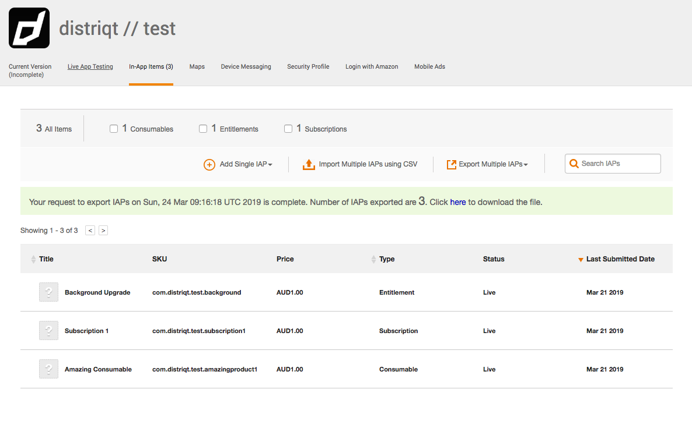

## Amazon In-App Purchasing

Amazon does not provide a complete "sandbox" type environment for testing like Google's In-App Billing and Apple's In-App Purchases.  

Instead you will need to install and configure the **App Tester** application and utilise the app to intercept IAP calls.


### Install and Configure the App Tester

App Tester allows you to unit test the In-App Purchasing (IAP) functionality of your app in sandbox mode before you submit the app for publication. You download App Tester from the Amazon Appstore onto the same Android device as your app. The App Tester simulates the production environment. You run IAP-related test cases on your app, and App Tester generates API responses (that you configure using a JSON file).

The easiest way is to install the app from the Amazon Appstore: 

- On your Android mobile device, start the Amazon Appstore app.
- Search for "Amazon App Tester".
- Select the "Amazon App Tester" app. (Do not select the Web App Tester, which is a different app.)
- Tap through the prompts to download and install the app.

You can also find the application at the following link: 

http://www.amazon.com/Amazon-App-Tester/dp/B00BN3YZM2/


### Create a JSON Data File

The App Tester responds to API calls using data stored in a JavaScript Object Notation (JSON) text file. The file contains purchase data for the IAP items.

You can automatically create the JSON file through the Apps & Games Developer Portal.


- In a web browser, go to the your app's page on the Apps & Games Developer Portal.
- Add your IAP purchasable items to your app, if you have not already done so.
- Export the IAPs to JSON by selecting: **Export Multiple IAPs / JSON**
- Click the link to download your JSON Data File. 
- Name the downloaded file "amazon.sdktester.json".
- Copy the file to `/mnt/sdcard/` folder in your device file system.

```
adb push amazon.sdktester.json /mnt/sdcard/amazon.sdktester.json
```

The location of the download link is as in the following screenshot:




### Verify IAP Items

You can easily review the contents of the JSON file. From the App Tester main menu, tap the **IAP Items in JSON File** option to display a human-readable list of the item data in the JSON file.


### Enter sandbox mode

Sandbox mode constrains calls that would normally go to the Appstore client to route to the Amazon App Tester app instead. Use this mode only for testing locally.

In the same terminal where you connected to your Fire device through ADB, enter sandbox mode:

```
adb shell setprop debug.amazon.sandboxmode debug
```

(Note that if you need to exit sandbox mode, run the following: `adb shell setprop debug.amazon.sandboxmode none`.)

Every time you reconnect to your Fire device through ADB, you need to reinitiate sandbox mode.

To confirm you have sandbox mode enabled have a look in the adb logs for something like the following line:

```
D/Kiwi    (12294): AppstoreSDK: Sandbox Mode: Debug build and debug.amazon.sandboxmode property is set on device
```

If it is in production mode you will see something like the following:

```
D/Kiwi    (11971): AppstoreSDK: Production Mode: Release build or debug.amazon.sandboxmode property is not set on devic
```


:::caution Packaging Target
It is important the you use a debug build target when testing Amazon applications, ie. you must use `-target apk-debug`. This ensures AIR produces a debug build of your application that allows the Amazon AppstoreSDK to enter debug mode.

If you use a release target eg `apk-captive-runtime` then you will always see the "Production mode" warning and won't be able to test.
:::

:::note AIR Version
You must be using a recent release of AIR, version 33.1.1.889 or higher. APK's produced in older versions of AIR are always packaged as release builds. You can work around this by using the AndroidStudioProject output if required however we recommend updating the AIR SDK and using the debug target.
:::


### Next Steps

Familiarize yourself with the App Tester tool and the test options for IAP:

1. Read the [App Tester User Guide](https://developer.amazon.com/docs/in-app-purchasing/iap-app-tester-user-guide.html) to learn how to use this tool.
2. See [Design and Execute Test Cases for IAP](https://developer.amazon.com/docs/in-app-purchasing/iap-design-test-cases.html) for ideas on how to test your IAP functionality.


For more information on any of the processes here see the [Amazon documentation](https://developer.amazon.com/docs/in-app-purchasing/iap-install-and-configure-app-tester.html).


## Set Installer Package

If you are using a non-Amazon device with the Amazon App-Store installed to test you must set the correct installer package in order that the extension can correctly detect that the amazon service is supported. 

When installing your application you will need to use the following commands using the `adb` terminal command:

```
adb push YOURAPP.apk /data/local/tmp/app.apk
adb shell pm install -i "com.amazon.venezia" -r /data/local/tmp/app.apk
adb shell rm /data/local/tmp/app.apk
```

Change `YOURAPP.apk` to be the path to your application. This command will set the installer package name to be the Amazon AppStore's package name `com.amazon.venezia`.

If you don't set this and rely on the default detection then you will find debugging may default to the Google Play Billing implementation.


## Amazon Terms

In order to understand the difference between our implementation and the standard Amazon documentation the table belows shows where the associated Amazon methods are called by the extension. Most have a direct relationship between the Amazon call and the extension however there are some minor differences. 

| Amazon Method | | Extension Method |
| --- | --- | --- |
| `registerListener` | | `setup` |
| `getProductData` | | `getProducts` |
| `getPurchaseUpdates` | | `getPurchases` & `restorePurchases`
| `purchase` | | `makePurchase` |
| `notifyFulfillment` | entitlement and subscription products | `finishPurchase` | 
| | consumable products | `consumePurchase` | 


Listener callbacks are mapped to extension events depending on the triggered call:

| Amazon Listener Callback | | Extension Event(s) |
| --- | --- | --- |
| `onProductDataResponse` | success | `ProductEvent.PRODUCTS_LOADED` |
| `onProductDataResponse` | invalid SKU | `ProductEvent.PRODUCT_INVALID` |
| `onProductDataResponse` | failed | `ProductEvent.PRODUCTS_FAILED` |
| `onPurchaseResponse` | success | `PurchaseEvent.PURCHASES_UPDATED` |
| `onPurchaseResponse` | failed | `PurchaseEvent.PURCHASE_FAILED` |
| `onPurchaseUpdatesResponse` | `getPurchases` > success | `PurchaseEvent.GET_PURCHASES_COMPLETE` |
| `onPurchaseUpdatesResponse` | `getPurchases` > failed | `PurchaseEvent.GET_PURCHASES_FAILED` |
| `onPurchaseUpdatesResponse` | `restorePurchases` > success | `PurchaseEvent.RESTORE_PURCHASES_SUCCESS` |
| `onPurchaseUpdatesResponse` | `restorePurchases` > failed | `PurchaseEvent.RESTORE_PURCHASES_FAILED` |


This is provided only as a guide of the implementation to better utilise the Amazon documentation. The exact implementation is more complex.