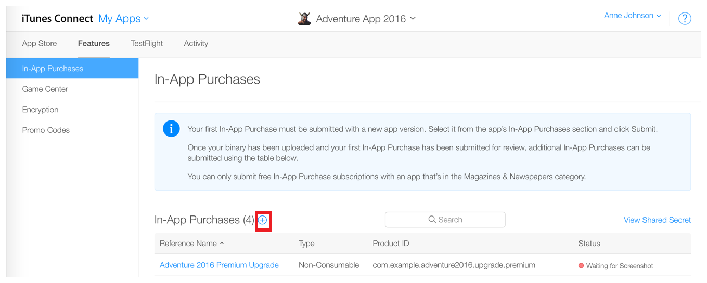

## Creating Your Products

The first step to setting up purchases is to create your products.

This is done through the iTunes Connect configuration for your application. Before starting make sure you understand what you can sell using in-app purchases.

From the Apple [documentation](https://developer.apple.com/library/content/documentation/NetworkingInternet/Conceptual/StoreKitGuide/Chapters/Products.html#//apple_ref/doc/uid/TP40008267-CH2-SW2): 

> 
> You can use In-App Purchase to sell content, app functionality, and services.
> 
> - **Content**. Deliver digital content or assets, such as magazines, photos, and artwork. Content can also be used by the app itself—for example, additional characters and levels in a game, filters in a camera app, and stationery in a word processor.
> - **App functionality**. Unlock behavior and expand features you’ve already delivered. Examples include a free game that offers multiplayer mode as an in-app purchase and a free weather app that lets users make a one-time purchase to remove ads.
> - **Services**. Have users pay for one-time services such as voice transcription and for ongoing services such as access to a collection of data.
>
> You can’t use In-App Purchase to sell real-world goods and services or to sell unsuitable content.
> 
> - **Real-world goods and services**. You must deliver a digital good or service within your app when using In-App Purchase. Use a different payment mechanism to let your users buy real-world goods and services in your app, such as a credit card or payment service.
> - **Unsuitable content**. Don’t use In-App Purchase to sell content that the isn’t allowed by the App Review Guidelines—for example, pornography, hate speech, or defamation.
>
> For detailed information about what you can offer using In-App Purchase, see your license agreement and the App Review Guidelines. Reviewing the guidelines carefully before you start coding helps you avoid delays and rejection during the review process. If the guidelines don’t address your case in sufficient detail, you can ask the App Review team specific questions using the online contact form.
> 

Once you are certain you can sell your product log in to [iTunes Connect](https://itunesconnect.apple.com) and select your application.

Under **Features** you will see the **In-App Purchases** section.

Every product you create is only available to one particular application and cannot be shared amongst other applications.

To create a product (the following is adapted from the [Apple documentation](https://developer.apple.com/library/content/documentation/LanguagesUtilities/Conceptual/iTunesConnectInAppPurchase_Guide/Chapters/CreatingInAppPurchaseProducts.html#//apple_ref/doc/uid/TP40013727-CH3-SW1)):

- Click the Add button (+) as highlighted in the screenshot below:

- In the section for the type of in-app purchase you want to create, click Create. 

  The in-app purchase product type cannot be changed once your in-app purchase has been created.

- In the Reference Name field, enter an internal name for the product.
- In the Product ID field, enter an alphanumeric identifier for the product.

  In iTunes Connect, you identify the in-app purchase product using a string called a **product identifier**. 
  For example, com.company.app_name.productid.
  When your app uses the extension to communicate with the App Store, it uses product identifiers 
  to the `getProducts` function to retrieve the configuration data you provided for the products. 
  Later, when a user wants to purchase a product, your app identifies the product to be purchased 
  using its product identifier.

- For auto-renewable subscriptions, create a New Subscription Group, or add it to an existing group. 
  All auto-renewable subscriptions must be part of a group. 
  You can learn more in Understanding Subscription Groups and Durations.
- Specify whether the product is cleared for sale.
- Choose a price tier. The price tier determines both the customer price and your proceeds.
- Configure the product display text for at least one language.
- In the Review Notes section, enter information that can help Apple review the product.
- Upload a screenshot of the product as it appears on the device.

  This screenshot is used for Apple’s review only and is not displayed on the App Store.

- Click Save.

Your in-app purchase product appears on the app’s In-App Purchases page. 

If the product is Ready to Submit, the product’s configuration is complete and ready for you to test the product with your app. 
You should now be able to use the extension to query and make test purchases of your products.

You will need to have your product reviewed and release your application in order to have your products available to your users.

---

## Testing 

Each platform has slightly different test environments that you will need to be aware of and setup to be able to 
correctly implement and test purchases.

- Create a test user in the sandbox environment: [Setting Up User Accounts](https://developer.apple.com/library/ios/documentation/LanguagesUtilities/Conceptual/iTunesConnect_Guide/Chapters/SettingUpUserAccounts.html#//apple_ref/doc/uid/TP40011225-CH25-SW10)
- Log out from your iTunes account on the test iOS device
- Do not sign in with your test account in the Settings
- Launch your application, you'll be asked to sign into the store while you are testing

Test each part of your code to verify that you’ve implemented it correctly.

---

## Security Recommendation

When you send a purchase request, create a `String` token that identifies the user making this purchase request 
and include this token in the `applicationUsername`. You can use a randomly generated string as the token. 

By way of illustration, consider the following two examples. In the normal 
case, many different users on your server each buy coins to 
use in your game, and each user pays for the purchase from a different 
App Store account. In contrast, it would be very unusual for a single 
user on your server to buy coins multiple times, paying for each 
purchase from a different App Store account. The App Store can't
detect this kind of irregular activity on its own—it needs information 
from your app about which account on your server is associated with
the transaction.

https://developer.apple.com/library/ios/releasenotes/General/ValidateAppStoreReceipt/Chapters/ValidateRemotely.html

---

## Further information

Apple provides a guide for setting up InApp Purchases. 
It can be quite a complex process so make sure you follow the guide exactly and complete each step: 

[Adding In-App Purchase to your iOS and Mac Applications](http://developer.apple.com/library/ios/#technotes/tn2259/_index.html)

You can also see the Apple FAQs [here](http://developer.apple.com/library/ios/#technotes/tn2259/_index.html#//apple_ref/doc/uid/DTS40009578-CH1-FREQUENTLY_ASKED_QUESTIONS).

