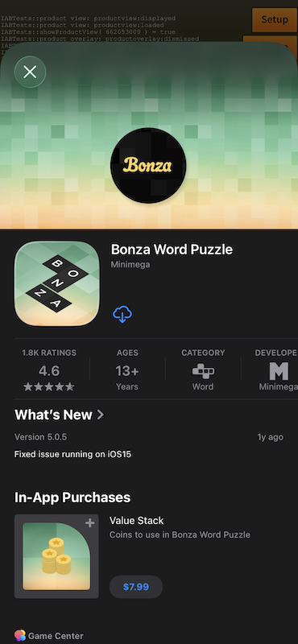
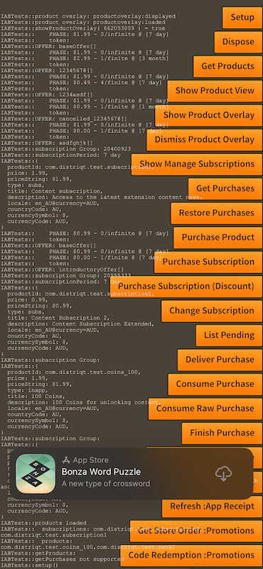

import Tabs from '@theme/Tabs'
import TabItem from '@theme/TabItem'

There are a number of dialogs that can be displayed to the user to allow them to manage their purchases and subscriptions and also to display information about products and other applications.


## Subscription Management 

If you use subscriptions in your application you should include a link on a settings or preferences screen that allows users to manage their subscriptions.

The Subscription Management dialog allows the user to manage their subscriptions, including viewing their current subscriptions, cancelling subscriptions, and renewing expiring subscriptions.

| iOS AppStore | Play Billing | 
| --- | --- | 
|  |  |


To display the subscription management dialog, you can call the `showSubscriptionManagement()` method.

<Tabs groupId="framework" defaultValue="air" values={[
    {label: 'AIR', value: 'air'},
    {label: 'Unity', value: 'unity'},
  ]}>
<TabItem value="air" >

```actionscript  
if (InAppBilling.service.isShowManageSubscriptionsSupported)
{
    InAppBilling.service.showManageSubscriptions();
}
```

</TabItem>
<TabItem value="unity">

```csharp
if (InAppBilling.Instance.isShowManageSubscriptionsSupported)
{
    InAppBilling.Instance.ShowManageSubscriptions();
}
```

</TabItem>
</Tabs>


If you know the product of the subscription you want to manage, you can pass the product object to the `showSubscriptionManagement()` method to directly open the subscription management dialog for that product.

<Tabs groupId="framework" defaultValue="air" values={[
    {label: 'AIR', value: 'air'},
    {label: 'Unity', value: 'unity'},
  ]}>
<TabItem value="air" >

```actionscript  
var product:Product = ...; // the product you want to manage
if (InAppBilling.service.isShowManageSubscriptionsSupported)
{
    InAppBilling.service.showManageSubscriptions( product );
}
```

</TabItem>
<TabItem value="unity">

```csharp
Product product = ...; // the product you want to manage
if (InAppBilling.Instance.isShowManageSubscriptionsSupported)
{
    InAppBilling.Instance.ShowManageSubscriptions( product );
}
```

</TabItem>
</Tabs>

Where subscription groups are supported (iOS AppStore) the dialog will display all subscriptions in the group, otherwise it will only display the subscription for the product you passed to the method.


:::note Supported Platforms
The subscription management dialog is supported on both iOS and Android using the following services:
- iOS StoreKit
- Google Play Billing

You can check if the subscription management dialog is supported by calling the `isShowManageSubscriptionsSupported` method before attempting to show the dialog.
:::


## Product View

The product view dialog presents information about a product or application. 
It can be used to provide information about products with in your application or to promote other applications that you own or that you have a partnership with.
This may redirect the user to the billing service store to view the product details, or it may display a custom view with information about the product.



To display the product view, you will need to provide the ID of the product or application you wish to display. 

The first parameter to the `showProductView()` method is the identifier of the application or product you want to show in the product view:
- Under Android this is the package name of the application, eg `air.com.distriqt.test`. 
- Under iOS this is the App Store ID of the app or product you want to show (`SKStoreProductParameterITunesItemIdentifier` normally a number). You can find this ID in App Store Connect or by looking at the app's App Store URL. To find a product’s iTunes identifier, go to linkmaker.itunes.apple.com and search for the product, then locate the iTunes identifier in the link URL. For example, the iTunes identifier for the iBooks app is 364709193.


<Tabs groupId="framework" defaultValue="air" values={[
    {label: 'AIR', value: 'air'},
    {label: 'Unity', value: 'unity'},
  ]}>
<TabItem value="air" >

```actionscript
if (InAppBilling.service.isProductViewSupported)
{
    var success:Boolean = InAppBilling.service.showProductView( identifier );
}
```

</TabItem>
<TabItem value="unity">

```csharp
if (InAppBilling.Instance.isProductViewSupported)
{
    bool success = InAppBilling.Instance.ShowProductView( identifier );
}
```

</TabItem>
</Tabs>

The product view will dispatch several events to indicate the result of the operation:

<Tabs groupId="framework" defaultValue="air" values={[
    {label: 'AIR', value: 'air'},
    {label: 'Unity', value: 'unity'},
  ]}>
<TabItem value="air" >

```actionscript
InAppBilling.service.addEventListener( ProductViewEvent.LOADED, productView_loadedHandler );
InAppBilling.service.addEventListener( ProductViewEvent.DISPLAYED, productView_displayedHandler );
InAppBilling.service.addEventListener( ProductViewEvent.FAILED, productView_failedHandler );
InAppBilling.service.addEventListener( ProductViewEvent.DISMISSED, productView_dismissedHandler );
```

</TabItem>
<TabItem value="unity">

```csharp
InAppBilling.Instance.Events.OnProductViewDisplayed += Instance_OnProductViewDisplayed;
InAppBilling.Instance.Events.OnProductViewFailed += Instance_OnProductViewFailed;
InAppBilling.Instance.Events.OnProductViewDismissed += Instance_OnProductViewDismissed;
InAppBilling.Instance.Events.OnProductViewLoaded += Instance_OnProductViewLoaded;
```

</TabItem>
</Tabs>


:::note Supported Platforms
The product view is supported on both iOS and Android using the following services:
- iOS StoreKit
- Google Play Billing
- Huawei In-App Purchases

The operation of the method will differ depending on the service used.

You can check if the product view is supported by calling the `isProductViewSupported` method before attempting to show the view.
::: 


## Product (Application) Overlay 

The product overlay is a non-intrusive promotional banner that encourages users to download or open another application. It can be used to promote other applications that you own or applications that you have a partnership with.
It is similar to the product view, but it is displayed as an overlay on top of the current application, rather than opening a new view.


### Show overlay

To display the product overlay, you will need to provide the application ID of the product you wish to display.

The `applicationId` parameter to the `showProductOverlay` method is the identifier of the application you want to show in the product overlay:
- Under Android this is the package name of the application, eg `air.com.distriqt.test`. 
- Under iOS this is the App Store ID of the app you want to show (normally a number). You can find this ID in App Information or by looking at the url in App Store Connect. 

The second parameter `position` is the position of the overlay on the screen, which can be either `raised` or `bottom` (default is `bottom`). 
This will determine where the overlay is displayed on the screen as a raised overlay or as a bottom overlay.




<Tabs groupId="framework" defaultValue="air" values={[
    {label: 'AIR', value: 'air'},
    {label: 'Unity', value: 'unity'},
  ]}>
<TabItem value="air" >

```actionscript  
if (InAppBilling.service.isProductOverlaySupported)
{
    var success:Boolean = InAppBilling.service.showProductOverlay( applicationId );
}
```

</TabItem>
<TabItem value="unity">

```csharp
if (InAppBilling.Instance.isProductOverlaySupported)
{
    bool success = InAppBilling.Instance.ShowProductOverlay( applicationId );
}
```

</TabItem>
</Tabs>


### Events

The product overlay will dispatch several events to indicate the result of the operation:

<Tabs groupId="framework" defaultValue="air" values={[
    {label: 'AIR', value: 'air'},
    {label: 'Unity', value: 'unity'},
  ]}>
<TabItem value="air" >

```actionscript
InAppBilling.service.addEventListener( ProductOverlayEvent.LOADED, productOverlay_loadedHandler );
InAppBilling.service.addEventListener( ProductOverlayEvent.DISPLAYED, productOverlay_displayedHandler );
InAppBilling.service.addEventListener( ProductOverlayEvent.FAILED, productOverlay_failedHandler );
InAppBilling.service.addEventListener( ProductOverlayEvent.DISMISSED, productOverlay_dismissedHandler );
```

</TabItem>
<TabItem value="unity">

```csharp
InAppBilling.Instance.Events.OnProductOverlayDisplayed += Instance_OnProductOverlayDisplayed;
InAppBilling.Instance.Events.OnProductOverlayFailed += Instance_OnProductOverlayFailed;
InAppBilling.Instance.Events.OnProductOverlayDismissed += Instance_OnProductOverlayDismissed;
InAppBilling.Instance.Events.OnProductOverlayLoaded += Instance_OnProductOverlayLoaded;
```

</TabItem>
</Tabs>

:::note Supported Platforms
The product overlay is only supported on iOS.

You can check if the product overlay is supported by calling the `isProductOverlaySupported` method before attempting to show the overlay.
::: 


### Dismiss overlay

You can dismiss the product overlay at any time by calling the `dismissProductOverlay()` method.

<Tabs groupId="framework" defaultValue="air" values={[
    {label: 'AIR', value: 'air'},
    {label: 'Unity', value: 'unity'},
  ]}>
<TabItem value="air" >  

```actionscript
InAppBilling.service.dismissProductOverlay();
```

</TabItem>
<TabItem value="unity"> 

```csharp
InAppBilling.Instance.DismissProductOverlay();
``` 

</TabItem>
</Tabs>