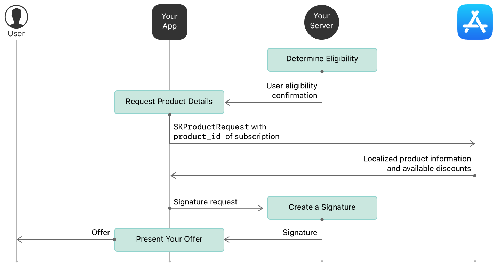
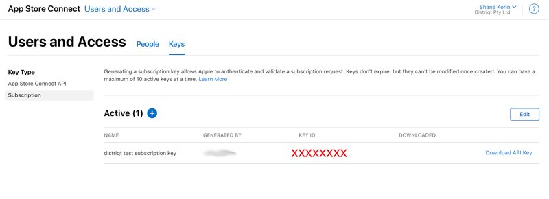
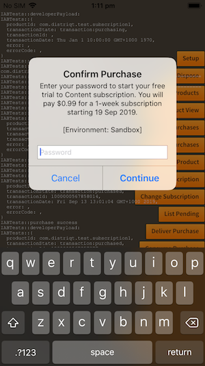
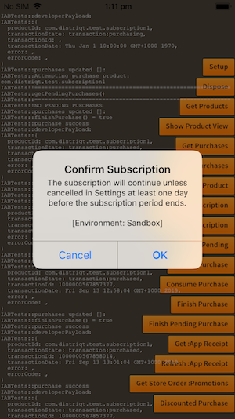
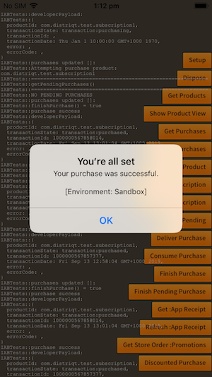

**Offer discounted pricing for auto-renewable subscription products to eligible subscribers.**

> Available with Apple In-App Purchases

- https://developer.apple.com/documentation/storekit/in-app_purchase/implementing_subscription_offers_in_your_app?language=objc


To present a subscription offer, first determine the subscriber’s eligibility, get the product details from the App Store, and generate a signature on your server.




## Available Discounts

You retrieve the available discounts along with the product details. A `Product` instance will contain a `discounts` array of `ProductDiscount` objects representing the discounts available for the product.


```actionscript  
InAppBilling.service.addEventListener( 
    InAppBillingEvent.PRODUCTS_LOADED, 
    products_loadedHandler );
				
InAppBilling.service.getProducts( [ productId ] );


function products_loadedHandler( event:InAppBillingEvent ):void 
{
    for each (var product:Product in event.data)
    {
        if (product.discounts != null)
        {
            for each (var discount:ProductDiscount in product.discounts)
            {
                // 
            }
        }
    }
}
```


## Determine Eligibility

You then need to determine whether the user is eligible for a discount and present the appropriate user interface to the user. 

There are two aspects to determining a user’s eligibility for a subscription offers:

- The App Store deems all customers with an existing or expired subscription in the app eligible to redeem a subscription offer. You can check whether the receipt contains any existing or expired subscription purchases to identify these current or lapsed subscribers.

- You determine any additional eligibility criteria for a specific subscription offer. Eligibility can be contingent on a wide range of business logic determined by your business needs.

> 
> Note: 
> 
> Customers can redeem subscription offers only on devices running iOS 12.2 and later, macOS 10.14.4 and later, and tvOS 12.2 and later. Consider providing messaging prompting your customer to update their OS if they try to redeem a subscription offer in your app on a device running an older OS version.
>


## Generate Signature

- [Reference](https://developer.apple.com/documentation/storekit/in-app_purchase/generating_a_signature_for_subscription_offers)

Once you have decided to apply a discount to the purchase for the user you must construct a `PurchaseDiscountRequest` and add it to the `PurchaseRequest`.

A `PurchaseDiscountRequest` object requires a `ProductDiscount` and a signature that you must generate through a server.

The signature information required includes:

- `keyIdentifier` - the identifier of the subscription key used to sign the discount;
- `nonce` - a throwaway value generated along with the signature;
- `signature` - the actual signature;
- `timestamp` - the timestamp when the signature was generated. 

The subscription key is generated through Apple's [AppStoreConnect](https://appstoreconnect.apple.com/), in the "Users and Access" section.



On your server you must generate the signature using the following parameters:

- `appBundleID`: The app bundle identifier.
- `keyIdentifier` : A string that identifies the private key you use to generate the signature. You can find this identifier in App Store Connect Users and Access > Keys, in the KEY ID column for the subscription key you generated.
- `productIdentifier` : The subscription product identifier, productIdentifier. The app can provide this value.
- `offerIdentifier` : The subscription discount identifier, identifier. The app can provide this value.
- `applicationUsername` : An optional string value that you define; may be an empty string. The app can provide this value and uses it in applicationUsername.
- `nonce` : A unique UUID value that your server defines. This value is cached for 24 hours. The string representation of the nonce used in the signature must be in lowercase.
- `timestamp` : A timestamp your server generates in UNIX epoch time format, in milliseconds; the timestamp keeps the offer active for 24 hours.

You use all of this information to create the signature as per the [Apple documentation](https://developer.apple.com/documentation/storekit/in-app_purchase/generating_a_signature_for_subscription_offers). See the example below for a simple NodeJS implementation.


## Make the Purchase

Once you have your signature for the purchase discount you can construct your `PurchaseDiscountRequest` and initiate the purchase.

```actionscript
var product:Product = ...;
var discount:ProductDiscount = ...; 

var request:PurchaseRequest = new PurchaseRequest()
        .setProductId( product.id )
        .setApplicationUsername( applicationUsername )
        .setDiscountRequest(
                new PurchaseDiscountRequest()
                        .setProductDiscount( discount )
                        .setSignature( key, nonce, signature, timestamp )
        );

if (InAppBilling.service.checkPurchaseRequestValid( request ))
{
    InAppBilling.service.makePurchase( request );
}
```

The flow of the purchase will then proceed as a normal purchase.









### NodeJS Example

The following is a basic NodeJS example accepting the required information in the get parameters and returning the signature information in the JSON output.
You will need to place the private key that you created and downloaded alongside this script in the `subscription_certificate.p8` file.

```js
const http = require('http');
const url = require('url');
const express = require('express');
const app = express();
const uuid4 = require('uuid4');
const fs = require('fs');

const EC = require("elliptic").ec;
const ec = new EC("secp256k1");
const crypto = require('crypto');

const port = 8080;


function generateSignatureHandler(req, res) { 
  
    // https://developer.apple.com/documentation/storekit/in-app_purchase/generating_a_signature_for_subscription_offers
    
    // Params
    const appBundleID = req.query.appBundleID
    const keyIdentifier = req.query.keyIdentifier
    const productIdentifier = req.query.productIdentifier
    const offerIdentifier = req.query.offerIdentifier
    const applicationUsername = req.query.applicationUsername

    const nonce = uuid4()
    const timestamp = Math.floor(new Date())

    // Combine the parameters into a UTF-8 string with 
    // an invisible separator ('\u2063') between them, 
    // in the order shown:
    // appBundleId + '\u2063' + keyIdentifier + '\u2063' + productIdentifier + 
    // '\u2063' + offerIdentifier + '\u2063' + applicationUsername + '\u2063' + 
    // nonce + '\u2063' + timestamp

    let payload = 
        appBundleID + '\u2063' 
        + keyIdentifier + '\u2063' 
        + productIdentifier + '\u2063' 
        + offerIdentifier + '\u2063' 
        + applicationUsername + '\u2063'
        + nonce+ '\u2063' 
        + timestamp;

    // Sign the combined string
    // Private Key - p8 file downloaded
    // Algorithm - ECDSA with SHA-256

    const keyPem = fs.readFileSync('subscription_certificate.p8', 'ascii');

    // Step 4
    // Base64-encode the binary signature
    const signature = crypto.createSign('RSA-SHA256')
                    .update(payload)
                    .sign(keyPem, 'base64');

    let response1 = {
        "signature": signature,
        "nonce": nonce,
        "timestamp": timestamp,
        "keyIdentifier": keyIdentifier
    }
    res.type('json').send(response1);

}

app.get( '/', generateSignatureHandler );
app.listen( port, () => console.log(`Listening on port ${port}!`) );


// http://localhost:8080?appBundleID=ASDFASDF&keyIdentifier=JZCXH9P46S&productIdentifier=asdf&offerIdentifier=asdf&applicationUsername=asdf

```


This could be used in your AIR application as below, (however you will most likely need to implement a more robust solution for a production application):

```actionscript
purchaseWithDiscountGetSignature(
        product,
        discount,
        applicationUsername,
        function(key:String, nonce:String, signature:String, timestamp:Number):void
        {
            var request:PurchaseRequest = new PurchaseRequest()
                    .setProductId( product.id )
                    .setApplicationUsername(applicationUsername)
                    .setDiscountRequest(
                            new PurchaseDiscountRequest()
                                    .setProductDiscount( discount )
                                    .setSignature( key, nonce, signature, timestamp )
                    );
            
            if (InAppBilling.service.checkPurchaseRequestValid( request ))
            {
                InAppBilling.service.makePurchase( request );
            }
        }
);
		
function purchaseWithDiscountGetSignature( 
    product:Product, 
    discount:ProductDiscount,
    applicationUsername:String, 
    callback:Function ):void
{
    var vars:URLVariables = new URLVariables();
    vars.appBundleID = "com.distriqt.test";
    vars.keyIdentifier = "AAAAAXXXXX";
    vars.productIdentifier = product.id;
    vars.offerIdentifier = discount.id;
    vars.applicationUsername = applicationUsername;
    
    var request:URLRequest = new URLRequest();
    request.url = "http://server_ip_addr:8080/";
    request.method = URLRequestMethod.GET;
    request.data = vars;
    
    var loader:URLLoader = new URLLoader();
    loader.addEventListener( Event.COMPLETE, function(event:Event):void
    {
        event.currentTarget.removeEventListener( event.type, arguments.callee );
        
        var data:Object = JSON.parse( loader.data );
        
        var key:String = data.keyIdentifier;
        var nonce:String = data.nonce;
        var signature:String = data.signature;
        var timestamp:Number = data.timestamp;
        
        callback( key, nonce, signature, timestamp );
    });
    loader.load( request );
}
```
