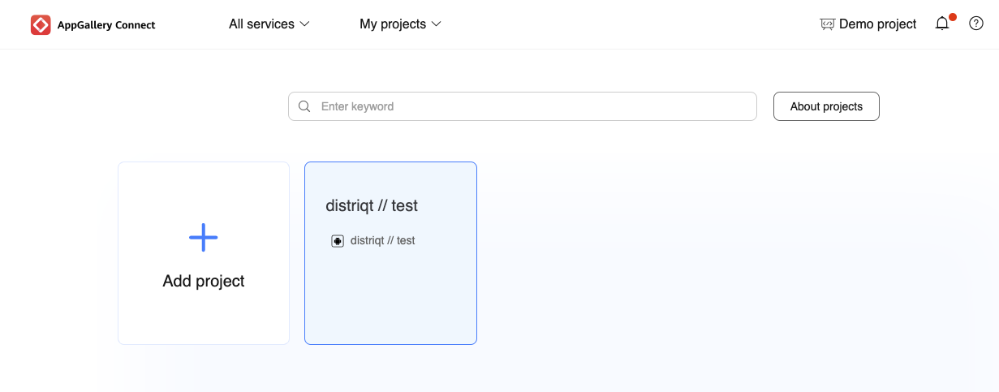

The following outlines the steps required to enable AppGallery in app purchases in your application.


## Signing Certificate Fingerprint

A signing certificate fingerprint is used to verify the authenticity of an app when it attempts to access HMS Core (APK) through the HMS SDK. Before using HMS Core (APK), you must locally generate a signing certificate fingerprint and configure it in AppGallery Connect.


### Generate

The following command retrieves the signature for the specified certificate and password. Replace the path and password to match your certificate.

You will need the **"SHA-256"** fingerprint for Huawei services.


macOS: 

```
keytool -keystore PATH_TO_CERTIFICATE.p12 -storepass PASSWORD -list -v -storetype PKCS12
```


windows:

```
keytool.exe -keystore PATH_TO_CERTIFICATE.p12 -storepass PASSWORD -list -v -storetype PKCS12
```

>
> The `keytool` program will be located in the `bin` folder of your JDK installation. Generally this should be available in your path. 
>


### Configure

- Sign in to [AppGallery Connect](https://developer.huawei.com/consumer/en/service/josp/agc/index.html) and select My projects.
- Find your project from the project list and click the app on the project card.
- On the Project Setting page, set SHA-256 certificate fingerprint to the SHA-256 fingerprint.


## Enable Services

- Sign in to [AppGallery Connect](https://developer.huawei.com/consumer/en/service/josp/agc/index.html) and select My projects.
- Find your project from the project list and click the app for which you need to enable a service on the project card.
- Click the Manage APIs tab and toggle the "In-App Purchases" switch


## AppGallery Connect Configuration File

- Sign in to [AppGallery Connect](https://developer.huawei.com/consumer/en/service/josp/agc/index.html) and select My projects.
- Find your project from the project list and click the app.



- Go to Project settings > App information.
- Click `agconnect-services.json` to download the configuration file.


 - Add `agconnect-services.json` to the root of your application and ensure it is packaged.  


:::warning
You must make sure the `agconnect-services.json` is packaged at the root of your application otherwise you will find the service will unexpectedly fail.
:::


## Setting up a Billing Service

> The following is in addition to the documentation in [Setting up a Billing Service](../billing-service.md).

When setting up your service you will need to specify the `InAppBillingServiceTypes.HUAWEI_APP_GALLERY` service type and provide your Huawei AppGallery Public key. The public key is used to verify purchases to provide a level of fraud protection:

```actionscript
var service:BillingService = new BillingService( InAppBillingServiceTypes.HUAWEI_APP_GALLERY )
    .setHuaweiIAPPublicKey( HUAWEI_APPGALLERY_INAPP_PUBLIC_KEY );

var success:Boolean = InAppBilling.service.setup( service );
```

You should wait for the `InAppBillingEvent.SETUP_SUCCESS` event to ensure the AppGallery is correctly initialised and available on the device.

