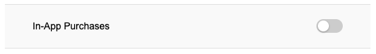
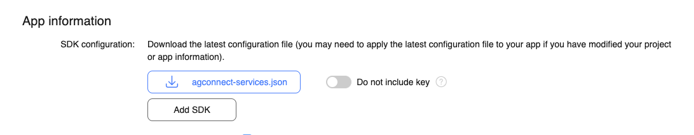

Huawei devices use a variant of Android. Some may include both Google Play and the Huawei AppGallery. 

The following outlines the steps required to enable AppGallery in app purchases in your application.


## Signing Certificate Fingerprint

A signing certificate fingerprint is used to verify the authenticity of an app when it attempts to access HMS Core (APK) through the HMS SDK. Before using HMS Core (APK), you must locally generate a signing certificate fingerprint and configure it in AppGallery Connect.


### Generate

The following command retrieves the signature for the specified certificate and password. Replace the path and password to match your certificate.

You will need the **"SHA-256"** fingerprint for Huawei services.


macOS: 

```
keytool -exportcert -keystore PATH_TO_CERTIFICATE.p12 -storepass PASSWORD -list -v -storetype PKCS12
```


windows:

```
keytool.exe -exportcert -keystore PATH_TO_CERTIFICATE.p12 -storepass PASSWORD -list -v -storetype PKCS12
```

>
> The `keytool` program will be located in the `bin` folder of your JDK installation. Generally this should be available in your path. 
>


### Configure

- Sign in to [AppGallery Connect](https://developer.huawei.com/consumer/en/service/josp/agc/index.html) and select My projects.
- Find your project from the project list and click the app on the project card.
- On the Project Setting page, set SHA-256 certificate fingerprint to the SHA-256 fingerprint.


## Enable Services

- Sign in to [AppGallery Connect](https://developer.huawei.com/consumer/en/service/josp/agc/index.html) and select My projects.
- Find your project from the project list and click the app for which you need to enable a service on the project card.
- Click the Manage APIs tab and toggle the "In App Purchases" switch




## AppGallery Connect Configuration File

- Sign in to [AppGallery Connect](https://developer.huawei.com/consumer/en/service/josp/agc/index.html) and select My apps.
- Find your app from the list and click the app name.


- Go to Development > Overview > App information.
- Click `agconnect-services.json` to download the configuration file.



 - Add `agconnect-services.json` to the root of your application and ensure it is packaged.  


## Assets

Along with the `agconnect-services.json` there are a series of assets that need to be packaged with your application. 
These assets are required by the Huawei SDK and if not included an error will be dispatched when calling `setup()`. 

Copy all the files in the `assets` folder (alongside the extension):

- `grs_sdk_global_route_config_opensdkService.json`
- `grs_sdk_server_config.json`
- `grs_sp.bks`
- `hianalytics_njjn`
- `updatesdkcas.bks`

These need to be added at the root level of your application and packaged with your application. 


## Dependencies

The following dependencies are required in addition to the generic dependencies outlined in [Add the Extension](../add-the-extension).


### Variant

The AppGallery implementation is provided in the AppGallery variant of the InAppBilling extension, i.e. `com.distriqt.InAppBilling.AppGallery.ane`. You must use this version of the extension to ensure you have the AppGallery code available to your application.

You must only use one variant in your application. Remove any other versions of the InAppBilling extension from your project.


### Huawei Mobile Services

This extension requires usage of certain aspects of the Huawei Mobile Services (HMS) SDK. 

The HMS SDK is available as a series of extensions that you add into your applications packaging options.  Each separate extension provides a component(s) from the HMS SDK and are used by different extensions. These client libraries aren't packaged with this extension as they are used by multiple extensions and separating them will avoid conflicts, allowing you to use multiple extensions in the one application.

This extension requires the following HMS extensions:

- [com.huawei.hms.base](https://github.com/distriqt/ANE-HuaweiMobileServices/raw/master/lib/com.huawei.hms.base.ane)


You must include the above native extensions in your application along with this extension, and you need to ensure they are packaged with your application.

You can access the Huawei Mobile Services SDK extensions here: [https://github.com/distriqt/ANE-HuaweiMobileServices](https://github.com/distriqt/ANE-HuaweiMobileServices).


## Extension IDs

The following should be added to your `extensions` node in your application descriptor to identify all the required ANEs in your application:

```xml
<extensions>
    <extensionID>com.distriqt.InAppBilling</extensionID>
    <extensionID>com.distriqt.Core</extensionID>
    <extensionID>com.huawei.hms.base</extensionID>
</extensions>
```


## Manifest Additions

Add the following permissions to your manifest additions, these permissions are used by the Huawei SDK to access certain configuration data and request installation of packages if found missing from the device:

```xml
<uses-permission android:name="com.android.vending.BILLING" />
<uses-permission android:name="android.permission.ACCESS_NETWORK_STATE" /> 
<uses-permission android:name="android.permission.REQUEST_INSTALL_PACKAGES" /> 
<uses-permission android:name="com.huawei.appmarket.service.commondata.permission.GET_COMMON_DATA" />
```


These should be added to the `application` node in your manifest additions. Replace any occurances of `APPLICATION_PACKAGE` with the Android java package name of your application.


```xml
<!-- HUAWEI APP GALLERY -->
<meta-data android:name="com.huawei.hms.client.service.name:iap" android:value="iap:4.0.2.300" />
<meta-data android:name="com.huawei.hms.client.service.name:base" android:value="base:4.0.2.300" />
<meta-data android:name="com.huawei.hms.min_api_level:base:hmscore" android:value="1" />

<activity
    android:name="com.huawei.hms.activity.BridgeActivity"
    android:configChanges="orientation|locale|layoutDirection|fontScale|screenSize|smallestScreenSize|screenLayout"
    android:excludeFromRecents="true"
    android:exported="false"
    android:hardwareAccelerated="true"
    android:theme="@android:style/Theme.Translucent" >
    <meta-data
        android:name="hwc-theme"
        android:value="androidhwext:style/Theme.Emui.Translucent" />
</activity>
<activity
    android:name="com.huawei.hms.activity.EnableServiceActivity"
    android:configChanges="orientation|keyboardHidden|screenSize|smallestScreenSize|screenLayout" >
</activity>

<provider
    android:name="com.huawei.hms.update.provider.UpdateProvider"
    android:authorities="APPLICATION_PACKAGE.hms.update.provider"
    android:exported="false"
    android:grantUriPermissions="true" >
</provider>
<provider
    android:name="com.huawei.agconnect.core.provider.AGConnectInitializeProvider"
    android:authorities="APPLICATION_PACKAGE.AGCInitializeProvider"
    android:exported="false" />

<service
    android:name="com.huawei.agconnect.core.ServiceDiscovery"
    android:exported="false" />

<activity
    android:name="com.huawei.updatesdk.service.otaupdate.AppUpdateActivity"
    android:configChanges="orientation|screenSize"
    android:exported="false"
    android:theme="@style/upsdkDlDialog" >
    <meta-data
        android:name="hwc-theme"
        android:value="androidhwext:style/Theme.Emui.Translucent.NoTitleBar" />
</activity>
<activity
    android:name="com.huawei.updatesdk.support.pm.PackageInstallerActivity"
    android:configChanges="orientation|keyboardHidden|screenSize"
    android:exported="false"
    android:theme="@style/upsdkDlDialog" >
    <meta-data
        android:name="hwc-theme"
        android:value="androidhwext:style/Theme.Emui.Translucent" />
</activity>
```


#### Manifest Example 

The following example uses our test applicaiton id `air.com.distriqt.test`:

```xml
<android>
    <manifestAdditions><![CDATA[
        <manifest android:installLocation="auto">

            <uses-sdk android:targetSdkVersion="28" />

            <uses-permission android:name="android.permission.INTERNET"/>
            <uses-permission android:name="com.android.vending.BILLING" />
            <uses-permission android:name="android.permission.ACCESS_NETWORK_STATE" /> 
            <uses-permission android:name="android.permission.REQUEST_INSTALL_PACKAGES" /> 
            <uses-permission android:name="com.huawei.appmarket.service.commondata.permission.GET_COMMON_DATA" />

            <application>

                <!-- HUAWEI APP GALLERY -->

                <meta-data android:name="com.huawei.hms.client.service.name:iap" android:value="iap:4.0.2.300" />
                <meta-data android:name="com.huawei.hms.client.service.name:base" android:value="base:4.0.2.300" />
                <meta-data android:name="com.huawei.hms.min_api_level:base:hmscore" android:value="1" />

                <activity
                    android:name="com.huawei.hms.activity.BridgeActivity"
                    android:configChanges="orientation|locale|layoutDirection|fontScale|screenSize|smallestScreenSize|screenLayout"
                    android:excludeFromRecents="true"
                    android:exported="false"
                    android:hardwareAccelerated="true"
                    android:theme="@android:style/Theme.Translucent" >
                    <meta-data
                        android:name="hwc-theme"
                        android:value="androidhwext:style/Theme.Emui.Translucent" />
                </activity>
                <activity
                    android:name="com.huawei.hms.activity.EnableServiceActivity"
                    android:configChanges="orientation|keyboardHidden|screenSize|smallestScreenSize|screenLayout" >
                </activity>

                <provider
                    android:name="com.huawei.hms.update.provider.UpdateProvider"
                    android:authorities="air.com.distriqt.test.hms.update.provider"
                    android:exported="false"
                    android:grantUriPermissions="true" >
                </provider>
                <provider
                    android:name="com.huawei.agconnect.core.provider.AGConnectInitializeProvider"
                    android:authorities="air.com.distriqt.test.AGCInitializeProvider"
                    android:exported="false" />

                <service
                    android:name="com.huawei.agconnect.core.ServiceDiscovery"
                    android:exported="false" />

                <activity
                    android:name="com.huawei.updatesdk.service.otaupdate.AppUpdateActivity"
                    android:configChanges="orientation|screenSize"
                    android:exported="false"
                    android:theme="@style/upsdkDlDialog" >
                    <meta-data
                        android:name="hwc-theme"
                        android:value="androidhwext:style/Theme.Emui.Translucent.NoTitleBar" />
                </activity>
                <activity
                    android:name="com.huawei.updatesdk.support.pm.PackageInstallerActivity"
                    android:configChanges="orientation|keyboardHidden|screenSize"
                    android:exported="false"
                    android:theme="@style/upsdkDlDialog" >
                    <meta-data
                        android:name="hwc-theme"
                        android:value="androidhwext:style/Theme.Emui.Translucent" />
                </activity>


            </application>

        </manifest>
    ]]></manifestAdditions>
</android>
```


## Setting up a Billing Service

> The following is in addition to the documentation in [Setting up a Billing Service](../billing-service).

When setting up your service you will need to specify the `InAppBillingServiceTypes.HUAWEI_APP_GALLERY` service type and provide your Huawei AppGallery Public key. The public key is used to verify purchases to provide a level of fraud protection:

```actionscript
var service:BillingService = new BillingService( InAppBillingServiceTypes.HUAWEI_APP_GALLERY )
    .setHuaweiIAPPublicKey( HUAWEI_APPGALLERY_INAPP_PUBLIC_KEY );

var success:Boolean = InAppBilling.service.setup( service );
```

You should wait for the `InAppBillingEvent.SETUP_SUCCESS` event to ensure the AppGallery is correctly initialised and available on the device.

