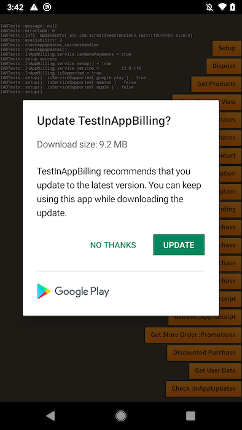

In-App Updates is a method for your application to check with the store as to whether there is a newer version of your application available. Although some users enable background updates when their device is connected to an unmetered connection, other users may need to be reminded to update.

This feature allows you to check and prompt active users to update your app.





## Additional Requirements 


### Google Play 

You will need to add the common Play Core extension ([`com.google.android.play`](https://github.com/distriqt/ANE-GooglePlayServices/raw/master/lib/com.google.android.play.ane)).


And add the following to the manifest additions inside the `application` node:


```xml
<activity
    android:name="com.google.android.play.core.missingsplits.PlayCoreMissingSplitsActivity"
    android:enabled="false"
    android:exported="false"
    android:launchMode="singleInstance"
    android:process=":playcore_missing_splits_activity"
    android:stateNotNeeded="true" />
<activity
    android:name="com.google.android.play.core.common.PlayCoreDialogWrapperActivity"
    android:enabled="false"
    android:exported="false"
    android:stateNotNeeded="true"
    android:theme="@style/Theme.PlayCore.Transparent" /> 
<service
    android:name="com.google.android.play.core.assetpacks.AssetPackExtractionService"
    android:enabled="false"
    android:exported="true" />
```


### Huawei App-Gallery

For Huawei you will need to add the [`com.huawei.hms.game`](https://github.com/distriqt/ANE-HuaweiMobileServices/raw/master/lib/com.huawei.hms.game.ane) Huawei Mobile Services extension and add the following to your manifest additions:


```xml
<!-- HUAWEI GAME -->
<meta-data
    android:name="com.huawei.hms.client.service.name:game"
    android:value="game:4.0.3.301" />
<meta-data
    android:name="com.huawei.hms.jos.versioncode"
    android:value="40003301" />

<service
    android:name="com.huawei.hms.jos.games.service.GameService"
    android:exported="true" >
    <intent-filter>
        <action android:name="com.huawei.hms.games.service" />
    </intent-filter>
</service>

<provider
    android:name="com.huawei.hms.jos.games.archive.ArchiveRemoteAccessProvider"
    android:authorities="com.distriqt.extension.hms.game.test.hmssdk.jos.archive"
    android:exported="true" >
</provider>

<activity
    android:name="com.huawei.appmarket.component.buoycircle.impl.delegete.BuoyBridgeActivity"
    android:configChanges="orientation|locale|screenSize|layoutDirection|fontScale"
    android:excludeFromRecents="true"
    android:exported="false"
    android:hardwareAccelerated="true"
    android:theme="@android:style/Theme.Translucent" >
    <meta-data
        android:name="hwc-theme"
        android:value="androidhwext:style/Theme.Emui.Translucent" />
```


## Usage

### Check if supported

Only certain services support In-App Updates:

- Google Play
- Huawei AppGallery


You can use the `isSupported` flag to check whether the current device and service supported In App Updates:

```actionscript
if (InAppBilling.service.inAppUpdates.isSupported)
{
    // In-App Updates are supported
}
```


### Check for an update

To check for an update, call `checkAppUpdate()` and await one of the events:

- `InAppUpdatesEvent.CHECK_APP_UPDATES_SUCCESS`: dispatched when the check was completed successfully
- `InAppUpdatesEvent.CHECK_APP_UPDATES_FAILED`: dispatched if there was an error performing the check.


```actionscript
InAppBilling.service.inAppUpdates.addEventListener( InAppUpdatesEvent.CHECK_APP_UPDATES_SUCCESS, successHandler );
InAppBilling.service.inAppUpdates.addEventListener( InAppUpdatesEvent.CHECK_APP_UPDATES_FAILED, failedHandler );

InAppBilling.service.inAppUpdates.checkAppUpdate();
```


If successful you can use the details in the event to determine if there is an update available:

```actionscript
function successHandler( event:InAppUpdatesEvent ):void
{
    if (event.updateAvailability == InAppUpdateAvailablity.UPDATE_AVAILABLE)
    {
        // An update is available
        trace( "info: " + (event.updateInfo == null ? "null" : event.updateInfo.toString()) );
    }
    else 
    {
        // No update available
    }
}
```


If an error occurred you can use the `errorCode` and `message` fields to understand the issue:

```actionscript
function checkAppUpdates_failedHandler( event:InAppUpdatesEvent ):void
{
    trace( "errorCode: " + event.errorCode );
    trace( "message: " + event.message );
}
```


### Start an update

If there is an update available, you can start the in app update process by calling `startAppUpdate()`:

```actionscript
InAppBilling.service.inAppUpdates.startAppUpdate();
```


## Testing

### Google Play

With internal app sharing, you can quickly share an app bundle or APK with your internal team and testers by uploading the app bundle you want to test to the Play Console.

You can also use internal app sharing to test in-app updates, as follows:

1. On your test device, make sure you've already installed a version of your app that meets the following requirements:
  - The app was installed using an internal app sharing URL
  - Supports in-app updates
  - Uses a version code that's lower than the updated version of your app

2. Follow the Play Console instructions on how to [share your app internally](https://support.google.com/googleplay/android-developer/answer/9303479). Make sure you upload a version of your app that uses a version code that's higher than the one you have already installed on the test device.

3. On the test device, only click the internal app-sharing link for the updated version of your app. **Do not install the app** from the Google Play Store page you see after clicking the link.

4. Open the app from the device's app drawer or home screen. The update should now be available to your app, and you can test your implementation of in-app updates.

