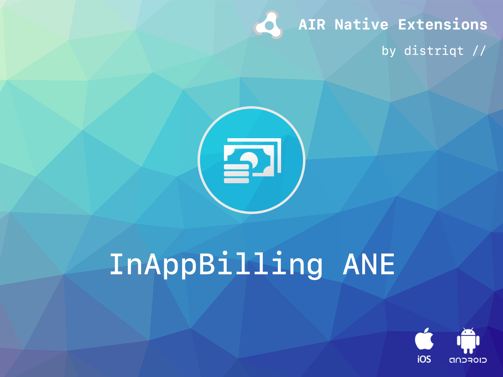
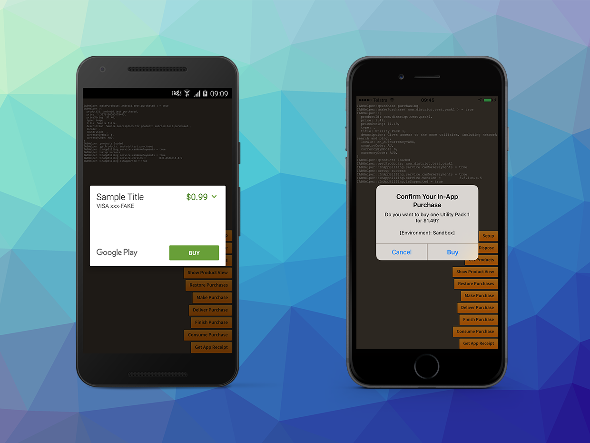

# InAppBilling

The [In-App Billing](https://airnativeextensions.com/extension/com.distriqt.InAppBilling) 
provides functionality to purchase items from stores through your application.

Identical code base can be used across all supported platforms allowing you to 
concentrate on your application and not device specifics.

### Features

- Get product information;
- Purchase consumable and non-consumable products;
- Restore purchases on a new or other device;
- Get current purchases on supported services;
- Subscriptions;
- Handle AppStore product promotions;
- Access **Apple's In-App Purchases** through the App Store on iOS / tvOS and macOS;
- Access **Google's In-App Billing** through the Play Store on Android;
- Access **Amazon's In-App Purchasing** through the Amazon Store on Android;
- Access **Huawei AppGallery's In-App Purchases** through the Huawei AppGallery on Android;
- Access **Samsung Galaxy Store's In-App Purchases** through the Samsung Galaxy Store on Android;
- Sample project code and ASDocs reference

As with all our extensions you get access to a year of support and updates as we are continually 
improving and updating the extensions for OS updates and feature requests.

## Documentation

The [documentation site](https://docs.airnativeextensions.com/docs/inappbilling/) forms the best source of detailed documentation for the extension along with the [asdocs](https://docs.airnativeextensions.com/asdocs/inappbilling). 

More information here: 

[com.distriqt.InAppBilling](https://airnativeextensions.com/extension/com.distriqt.InAppBilling)

## License

You can purchase a license for using this extension:

[airnativeextensions.com](https://airnativeextensions.com/)

