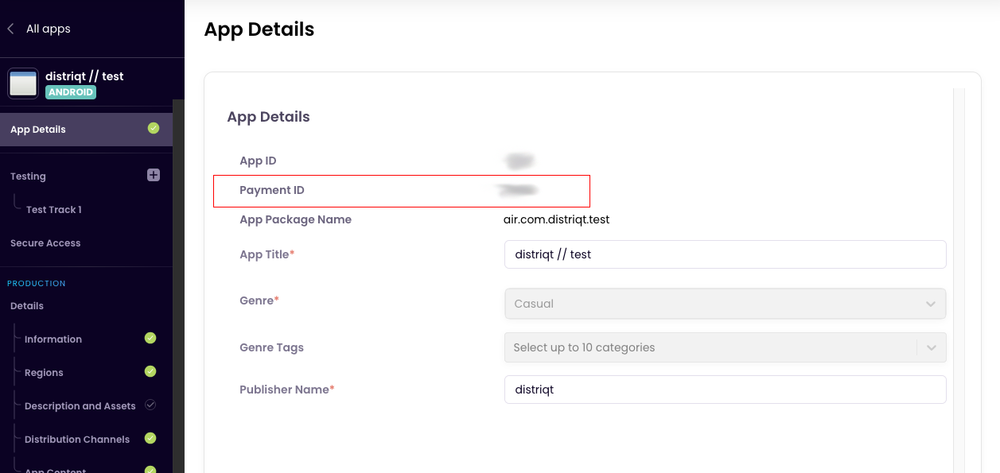
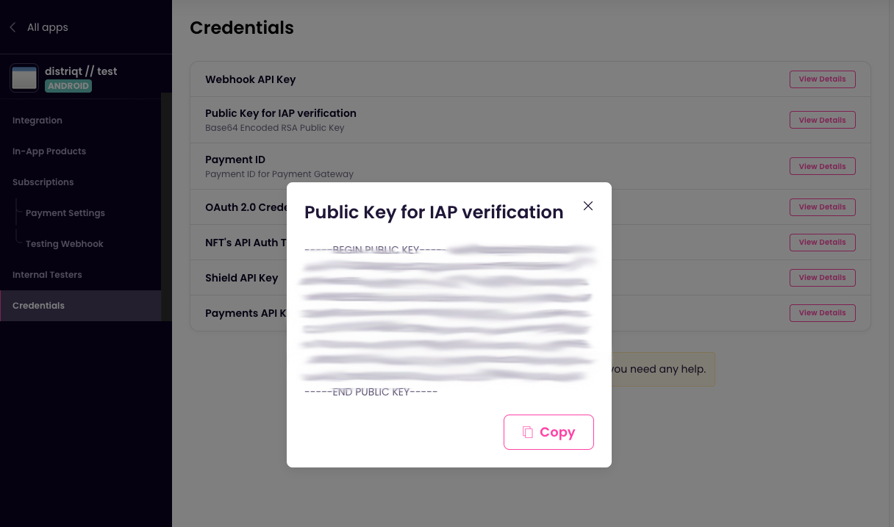

Now.gg is a controlled environment similar to steam or other game services. It has an application that you will need to install (an Android emulator) which runs the payment services. 


## now.gg Studio

Firstly you will need to sign up to become a developer and get access to the "nowgg studio". This is a developer portal where you configure your applications and applicable products and subscriptions.

- Register here: https://now.us/

It can take a few days to get your account approved. 

Once approved follow the developer guides to setup your application in the studio. Once you have setup your application you will need to make note of two values from the studio. Firstly you will need to find the identifier for your application, the "nowgg App Id" you need is referenced as the "Payment ID" in the "App Details" section:



Copy this value as your `NOWGG_APP_ID` (below).

Secondly you will need the Base64 encoded public key (for local verification of purchases). This is found under "Payments / Credentials / Public Key for IAP verification". 



Copy this value as your `NOWGG_PUBLIC_KEY` (below). This value can either be left as supplied or you can remove the `-----BEGIN PUBLIC KEY-----` and `-----END PUBLIC KEY-----` to bring the base64 contents in directly. (The extension will handle either case for you).


## Products

Follow the documentation to add your products into the "Payments" section of your application in now.gg Studio.


## Setting up a Billing Service

> The following is in addition to the documentation in [Setting up a Billing Service](../billing-service).

When setting up your service you will need to specify the `InAppBillingServiceTypes.NOW_GG_BILLING` service type. 
You will also need to specify your application id, in-game id and public key. 

```actionscript
var service:BillingService = new BillingService( InAppBillingServiceTypes.NOW_GG_BILLING )
										.setNowggAppId( NOWGG_APP_ID )
										.setNowggInGameId( NOWGG_INGAME_ID )
										.setNowggPublicKey( NOWGG_PUBLIC_KEY );

var success:Boolean = InAppBilling.service.setup( service );
```

The `NOWGG_INGAME_ID` should be an identifier for your user in your game. 


You should wait for the `InAppBillingEvent.SETUP_SUCCESS` event to ensure the now.gg Payments modile is correctly initialised and available on the device.


