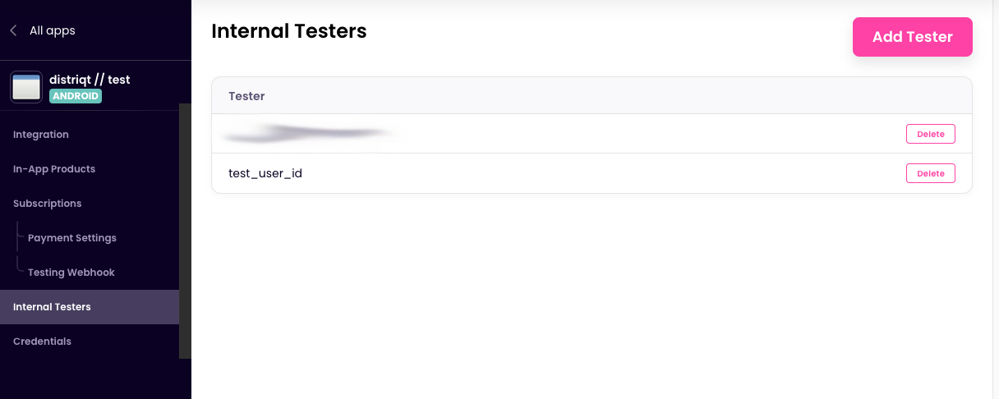
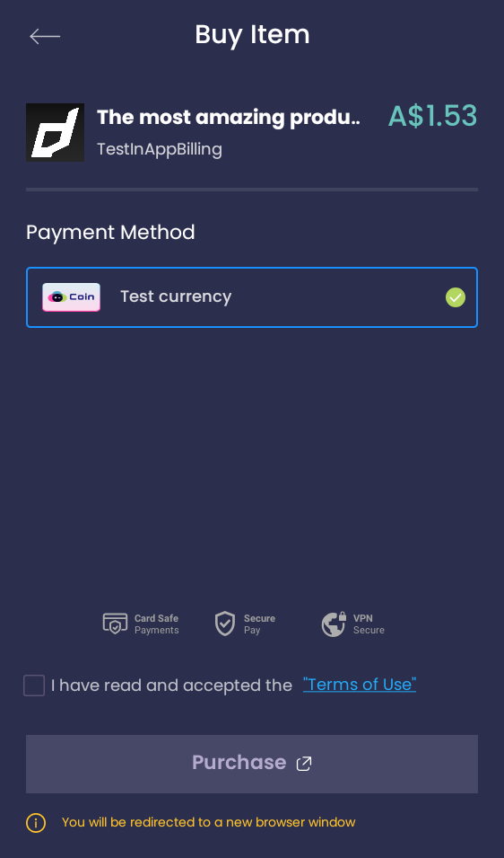
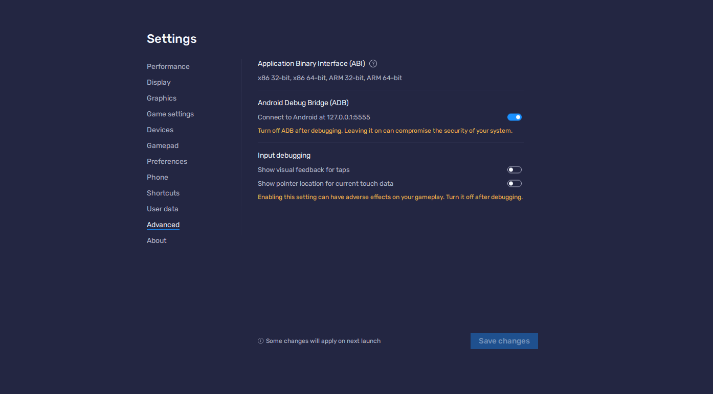
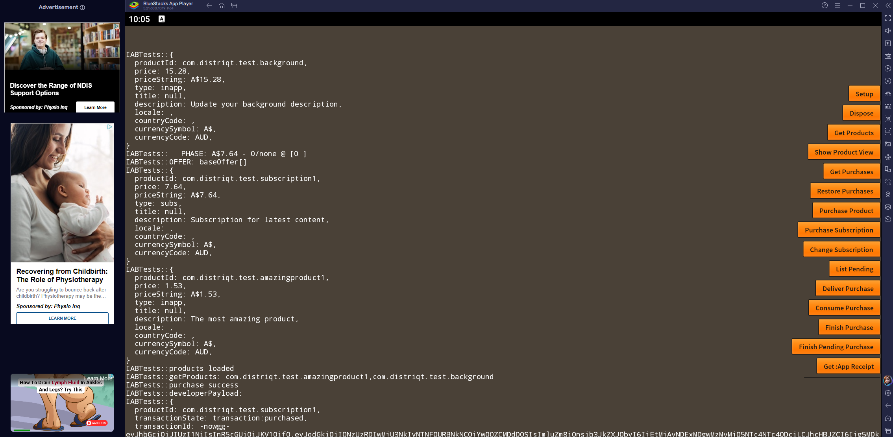

## Users

You need to add the users you are going to test with to the "Internal Testers" list through the Studio. 

The identifier you use either matches the email address of the user you sign in with or the GAME ID you passed with the service when calling `setup()`.

Once you have correctly specified the test user you should see "Test currency" as an option when attempting purchases:

## Bluestacks

In order to test your application you will need to install BlueStacks 5. You will need to download v5 currently by selecting the specific version: https://www.bluestacks.com/download.html

Once installed, launch the BlueStacks App Player.

### Enable Developer Mode 

In order to install and connect to your application in the app player you need to enable the "Android Debug Bridge" (adb).

In the App Player select "Settings" (gear cog in the lower right). Then go to "Advanced" and enable the "Android Debug Bridge".

Now you should be able to use AIR to install your application to the player and debug as a normal Android device.

