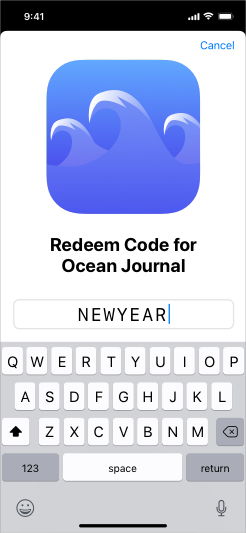

import Tabs from '@theme/Tabs'
import TabItem from '@theme/TabItem'

With iOS 11, users can browse in-app purchases directly on the App Store and start a purchase even before downloading your app. 
Promoted in-app purchases appear on your product page, can display in search results, and may be featured on the Today, Games, and Apps tabs.

Promoting in-app purchases can also encourage downloads of your app. When a user doesn’t have your app installed but wants to buy a promoted in-app purchase, they'll receive a prompt to download the app first. Once the app is downloaded, the transaction will continue in the app.


## Checking for Support

You can use the `isSupported` flags to check whether the current device (and platform) supports the promotions functionality:

<Tabs groupId="framework" defaultValue="air" values={[
    {label: 'AIR', value: 'air'},
    {label: 'Unity', value: 'unity'},
  ]}>
<TabItem value="air" >

```actionscript
if (InAppBilling.isSupported)
{
	if (InAppBilling.service.promotions.isSupported)
	{
		// Promotions functionality supported
	}
}
```

</TabItem>
<TabItem value="unity">

```csharp
if (InAppBilling.Instance.isSupported)
{
	if (InAppBilling.Instance.Promotions.isSupported)
	{
		// Promotions functionality supported
	}
}
```
</TabItem>
</Tabs>

## Handling Promotion Purchases


When a user starts an in-app purchase on the App Store, they are taken into your app to continue the transaction.

Consider presenting the payment sheet as soon as they are in the app to make the process of completing their purchase as easy as possible. Avoid unnecessary interstitials and messaging, as each extra step you require may decrease the likelihood that the user will complete the purchase.

Purchases that are initiated in the Store trigger an event in your application which allows you to decide whether to proceed with the purchase.

<Tabs groupId="framework" defaultValue="air" values={[
    {label: 'AIR', value: 'air'},
    {label: 'Unity', value: 'unity'},
  ]}>
<TabItem value="air" >

```actionscript
InAppBilling.service.addEventListener( 
	PurchaseRequestEvent.SHOULD_ADD_PURCHASE, 
	shouldAddPurchaseHandler );
```

You then respond to the request by calling the `shouldAddPurchase()` function, with the `request` property from the event and a `Boolean` flag indicating whether the purchase should be started or cancelled.
For example, you may need to cancel a transaction if the user has already unlocked the product they are trying to buy.


</TabItem>
<TabItem value="unity">

```csharp
InAppBilling.Instance.Events.OnShouldAddPurchase += OnShouldAddPurchase;
```

You then respond to the request by calling the `ShouldAddPurchase()` function, with the `request` property from the event and a flag indicating whether the purchase should be started or cancelled.
For example, you may need to cancel a transaction if the user has already unlocked the product they are trying to buy.

</TabItem>
</Tabs>


If you respond with `true` the purchase flow UI will start, similar to if you make a purchase with a similar purchase request. 
If you respond `false` the purchase will be cancelled and no UI will be presented.


<Tabs groupId="framework" defaultValue="air" values={[
    {label: 'AIR', value: 'air'},
    {label: 'Unity', value: 'unity'},
  ]}>
<TabItem value="air" >

```actionscript
function shouldAddPurchaseHandler( event:PurchaseRequestEvent ):void 
{
	//
	//  Do any checks to see whether this should be added to the queue
	
	var request:PurchaseRequest = event.request;
	var shouldAddPurchaseToQueue:Boolean = true;
			
	InAppBilling.service.shouldAddPurchase( request, shouldAddPurchaseToQueue );
}
```

</TabItem>
<TabItem value="unity">

```csharp
private void OnShouldAddPurchase(PurchaseRequestEvent e)
{
	//
	//  Do any checks to see whether this should be added to the queue

	PurchaseRequest request = e.request;
	bool shouldAddPurchaseToQueue = true;
	
	InAppBilling.Instance.ShouldAddPurchase(request, shouldAddPurchaseToQueue);
}
```

</TabItem>
</Tabs>

You can hold onto the `request` property and call the `shouldAddPurchase()` function at a later point if you wish to delay the initiation of the purchase until your application is ready to process the purchase.

For example, you may need to defer a transaction if the user is in the middle of onboarding, and continue it after onboarding is completed.

:::warning Warning
This delay will not work across application restarts or disposal of the extension.
:::


### Application State

If your app is not installed when the user taps or clicks Buy, the App Store automatically downloads the app or prompts the user to buy it. If the installed version of your app is an older version that doesn’t support in-app purchase promotions, the App Store prompts the user to upgrade the app. If your application is not running, the app will be started.

<Tabs groupId="framework" defaultValue="air" values={[
    {label: 'AIR', value: 'air'},
    {label: 'Unity', value: 'unity'},
  ]}>
<TabItem value="air" >

When your application was not running you won't immediately receive the `PurchaseRequestEvent.SHOULD_ADD_PURCHASE` event. 
You should start your application normally and add a listener for the event before you call `setup()` 
(this is similar to how you should be handling pending purchases with the `PurchaseEvent.PURCHASES_UPDATED` event).

```actionscript
InAppBilling.service.addEventListener( 
	PurchaseRequestEvent.SHOULD_ADD_PURCHASE, 
	shouldAddPurchaseHandler );

// OTHER EVENT LISTENERS 

InAppBilling.service.setup(
        new BillingService()
                .setGooglePlayPublicKey( GOOGLE_PLAY_INAPP_BILLING_KEY )
);
```

</TabItem>
<TabItem value="unity">

When your application was not running you won't immediately receive the `OnShouldAddPurchase` event. 
You should start your application normally and add a listener for the event before you call `Setup()` 
(this is similar to how you should be handling pending purchases with the `OnPurchasesUpdated` event).

```csharp
InAppBilling.Instance.Events.OnShouldAddPurchase += OnShouldAddPurchase;

// OTHER EVENT LISTENERS

InAppBilling.Instance.Setup(
		new BillingService(),
		(e) =>
		{
			// Setup complete
		}
);
```

</TabItem>
</Tabs>

If your application was started from a promotion purchase you will receive the event after the 
setup call so you should be prepared to handle it at this stage, or at least prepared to store 
the `request` until your application is ready.


## Testing 

### iOS

You can open the following link on a device to replicate the promotional purchase (changing the product and bundle ID's appropriately):

```
itms-services://?action=purchaseIntent&bundleId=com.example.app&productIdentifier=com.example.product_id
```

Send this URL to yourself in an email or iMessage and open it from your device. You will know the test is running when your app opens automatically. You can then test your promoted in-app purchase.


## Customising Promotions 

From your application you can control some aspects of the promotions displayed to your user. 
This can be useful to emphasise different promotions as your user progresses through your 
application or game, and to hide promotions that are no longer or not yet applicable to your user.

For example, your user may have to reach a certain level in your game before a certain promotion is available to them.

The default order and visibility of in-app purchases are set in iTunes Connect. Your overrides are per device, and are not synced to an iCloud account. Note that this feature relies on local device storage, and the API can only run after the app has launched on a device at least once.

Implementing these advanced features is optional. They are not required for your in-app purchases to appear on the App Store.


### Visibility

<Tabs groupId="framework" defaultValue="air" values={[
    {label: 'AIR', value: 'air'},
    {label: 'Unity', value: 'unity'},
  ]}>
<TabItem value="air" >

To get whether a promotion is visible to a user you can use the `getStoreVisibility()` function with the product id of the promotion. This call will dispatch one of two events:

- `PromotionsEvent.GET_STORE_VISIBILITY_COMPLETE` on success
- `PromotionsEvent.GET_STORE_VISIBILITY_ERROR` on failure

</TabItem>
<TabItem value="unity">

To get whether a promotion is visible to a user you can use the `GetStoreVisibility()` function with the product id of the promotion. This call will dispatch one of two events:

- `OnGetStoreVisibilityComplete` on success
- `OnGetStoreVisibilityFailed` on failure

or you can use the callback:

```csharp
InAppBilling.Instance.Promotions.GetStoreVisibility(
	"com.example.product_id",
	(e) =>
	{
		if (e.type == PromotionsEvent.GET_STORE_VISIBILITY_COMPLETE)
		{
			// e.visibility contains the visibility property
		}
		else
		{
			// There was an error 
			trace( e.error );
		}
	}
);
```

</TabItem>
</Tabs>

The `visibility` property is one of either:

- `PromotionVisibility.DEFAULT`
- `PromotionVisibility.SHOW`
- `PromotionVisibility.HIDE`


<Tabs groupId="framework" defaultValue="air" values={[
    {label: 'AIR', value: 'air'},
    {label: 'Unity', value: 'unity'},
  ]}>
<TabItem value="air" >

```actionscript
InAppBilling.service.promotions.addEventListener( 
	PromotionsEvent.GET_STORE_VISIBILITY_COMPLETE, 
	getStoreVisbility_completeHandler);
InAppBilling.service.promotions.addEventListener( 
	PromotionsEvent.GET_STORE_VISIBILITY_ERROR, 
	getStoreVisbility_errorHandler);

InAppBilling.service.promotions.getStoreVisibility( "com.example.product_id" );

function getStoreVisbility_completeHandler( event:PromotionsEvent ):void 
{
	// event.visibility contains the visibility property
}

function getStoreVisbility_errorHandler( event:PromotionsEvent ):void 
{
	// There was an error 
	trace( event.error );
}
```

</TabItem>
<TabItem value="unity">

```csharp
InAppBilling.Instance.Promotions.GetStoreVisibility(
	"com.example.product_id",
	(e) =>
	{
		if (e.type == PromotionsEvent.GET_STORE_VISIBILITY_COMPLETE)
		{
			// e.visibility contains the visibility property
		}
		else
		{
			// There was an error 
			trace( e.error );
		}
	}
);
```

</TabItem>
</Tabs>


### Update Visibility

You can change the visibility passing the product id of the promotion and the new visibility value to use to the **update store visibility** method.

<Tabs groupId="framework" defaultValue="air" values={[
    {label: 'AIR', value: 'air'},
    {label: 'Unity', value: 'unity'},
  ]}>
<TabItem value="air" >

In AIR you use the `updateStoreVisibility()` method to set the visibility of a promotion. 
This call will dispatch one of two events:

- `PromotionsEvent.UPDATE_STORE_VISIBILITY_COMPLETE` on success
- `PromotionsEvent.UPDATE_STORE_VISIBILITY_ERROR` on failure

```actionscript
InAppBilling.service.promotions.addEventListener( 
	PromotionsEvent.UPDATE_STORE_VISIBILITY_COMPLETE,
	updateStoreVisbility_completeHandler );
InAppBilling.service.promotions.addEventListener( 
	PromotionsEvent.UPDATE_STORE_VISIBILITY_ERROR, 
	updateStoreVisbility_errorHandler );

InAppBilling.service.promotions.updateStoreVisibility( 
	"com.distriqt.example_id", 
	PromotionVisibility.SHOW );

function updateStoreVisbility_completeHandler( event:PromotionsEvent ):void 
{
	// event.visibility contains the visibility property
}

function updateStoreVisbility_errorHandler( event:PromotionsEvent ):void 
{
	// There was an error 
	trace( event.error );
} 
```

</TabItem>
<TabItem value="unity">

In Unity you use the `UpdateStoreVisibility()` method to set the visibility of a promotion.
This call will dispatch one of two events:
- `OnUpdateStoreVisibilityComplete` on success
- `OnUpdateStoreVisibilityFailed` on failure

or you can use the callback:

```csharp
InAppBilling.Instance.Promotions.UpdateStoreVisibility(
	"com.example.product_id",
	PromotionVisibility.SHOW,
	(e) =>
	{
		if (e.type == PromotionsEvent.UPDATE_STORE_VISIBILITY_COMPLETE)
		{
			// e.visibility contains the visibility property
		}
		else
		{
			// There was an error 
			trace( e.error );
		}
	}
);
```

</TabItem>
</Tabs>


### Display Order Override

You can override the order of promoted in-app purchases on the App Store product page, per device. 
For example, you can promote an in-app purchase product that unlocks a specific level in your game 
when a user reaches the level immediately before the specified level.

To override the default product order for in-app purchases, put the product identifier for the 
subset of products you want to reorder into an array, in the order you want them to appear in. 

Pass the array to the **update store order** method.


<Tabs groupId="framework" defaultValue="air" values={[
    {label: 'AIR', value: 'air'},
    {label: 'Unity', value: 'unity'},
  ]}>
<TabItem value="air" >

```actionscript
var productOrder:Array = [ "com.example.product_1", "com.example.product_2" ];
					
InAppBilling.service.promotions.addEventListener( 
	PromotionsEvent.UPDATE_STORE_ORDER_COMPLETE, 
	updateStoreOrder_completeHandler );
InAppBilling.service.promotions.addEventListener( 
	PromotionsEvent.UPDATE_STORE_ORDER_ERROR, 
	updateStoreOrder_errorHandler);

InAppBilling.service.promotions.updateStoreOrder( productOrder );

function updateStoreOrder_completeHandler( event:PromotionsEvent ):void 
{
	for each (var productId:String in event.productIdOrder)
	{
		trace( "storeOrder: " + productId );
	}
}

function updateStoreOrder_errorHandler( event:PromotionsEvent ):void 
{
	// There was an error 
	trace( event.error );
}
```

To read a product order override as it will appear on a given device, call the `getStoreOrder()` method. 
You should receive an array of products whose order is overridden. 
**If you get an empty array, you have not set any overrides and the products are in the default order.**

```actionscript
InAppBilling.service.promotions.addEventListener( 
	PromotionsEvent.GET_STORE_ORDER_COMPLETE, 
	getStoreOrder_completeHandler );
InAppBilling.service.promotions.addEventListener( 
	PromotionsEvent.GET_STORE_ORDER_ERROR, 
	getStoreOrder_errorHandler);
	
InAppBilling.service.promotions.getStoreOrder();

function getStoreOrder_completeHandler( event:PromotionsEvent ):void
{
	for each (var productId:String in event.productIdOrder)
	{
		trace( "storeOrder: " + productId );
	}
}

function getStoreOrder_errorHandler( event:PromotionsEvent ):void
{
	// There was an error 
	trace( event.error );
}
```

</TabItem>
<TabItem value="unity">

```csharp
var productOrder = new List<string> { "com.example.product_1", "com.example.product_2" };
InAppBilling.Instance.Promotions.UpdateStoreOrder(
	productOrder,
	(e) =>
	{
		if (e.type == PromotionsEvent.UPDATE_STORE_ORDER_COMPLETE)
		{
			foreach (var productId in e.productIdOrder)
			{
				Debug.Log( "storeOrder: " + productId );
			}
		}
		else
		{
			// There was an error 
			Debug.Log( e.error );
		}
	}
);
```

To read a product order override as it will appear on a given device, call the `GetStoreOrder()` method.
You should receive an array of products whose order is overridden.
**If you get an empty array, you have not set any overrides and the products are in the default order.**

```csharp
InAppBilling.Instance.Promotions.GetStoreOrder(
	(e) =>
	{
		if (e.type == PromotionsEvent.GET_STORE_ORDER_COMPLETE)
		{
			foreach (var productId in e.productIdOrder)
			{
				Debug.Log( "storeOrder: " + productId );
			}
		}
		else
		{
			// There was an error 
			Debug.Log( e.error );
		}
	}
);
```

</TabItem>
</Tabs>


## Offer Codes



Offer codes can help you acquire, retain, and win back subscribers by providing a subscription at a 
discount or for free for a limited time. 

You'll distribute offer codes using your channels, such as email or offline marketing campaigns. 
Consider which channels might be most effective at reaching your intended customers and be sure to 
mention eligibility or availability limits.

You can provide a place in your application to redeem offer codes by presenting the offer code 
redemption dialog via the following:

<Tabs groupId="framework" defaultValue="air" values={[
    {label: 'AIR', value: 'air'},
    {label: 'Unity', value: 'unity'},
  ]}>
<TabItem value="air" >

```actionscript
var success:Boolean = 
  InAppBilling.service.promotions.showCodeRedemptionDialog();
```

</TabItem>
<TabItem value="unity">

```csharp
bool success = 
  InAppBilling.Instance.Promotions.ShowCodeRedemptionDialog();
```

</TabItem>
</Tabs>


The value of `success` will be `true` if the redemption dialog is presented or `false` if the current platform / version doesn't support offer codes, eg iOS < 14.


## Imports


<Tabs groupId="framework" defaultValue="air" values={[
	{label: 'AIR', value: 'air'},
	{label: 'Unity', value: 'unity'},
  ]}>
<TabItem value="air">

```actionscript
import com.distriqt.extension.inappbilling.promotions.Promotions;
import com.distriqt.extension.inappbilling.promotions.PromotionVisibility;
import com.distriqt.extension.inappbilling.PurchaseRequest;
import com.distriqt.extension.inappbilling.events.PromotionsEvent;
import com.distriqt.extension.inappbilling.events.PurchaseRequestEvent;
```

</TabItem>
<TabItem value="unity">

```csharp
using com.distriqt.extension.inappbilling;
using com.distriqt.extension.inappbilling.events;
using com.distriqt.extension.inappbilling.promotions;
```

</TabItem>
</Tabs>

