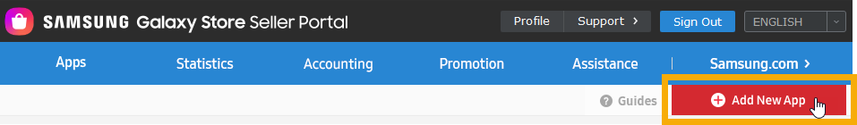
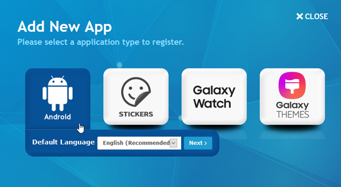
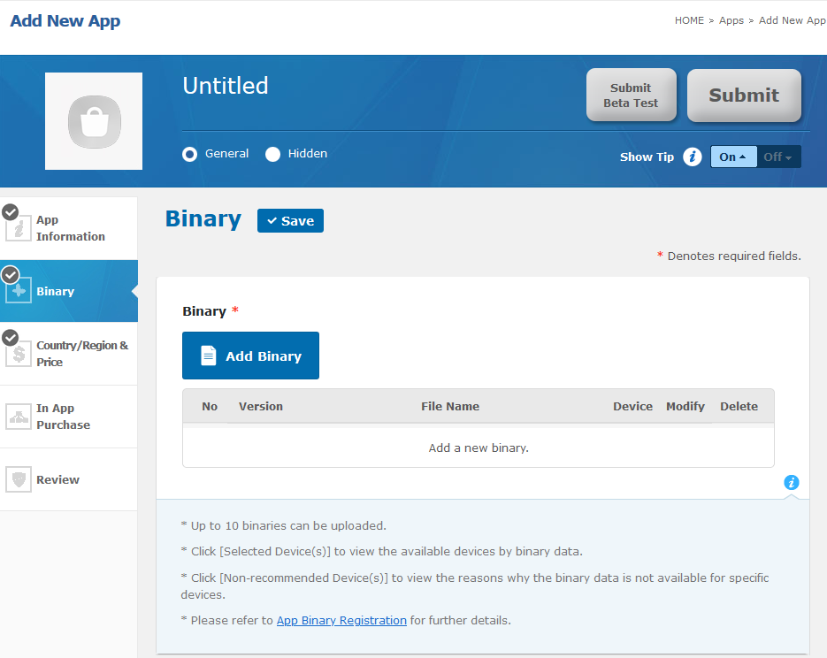
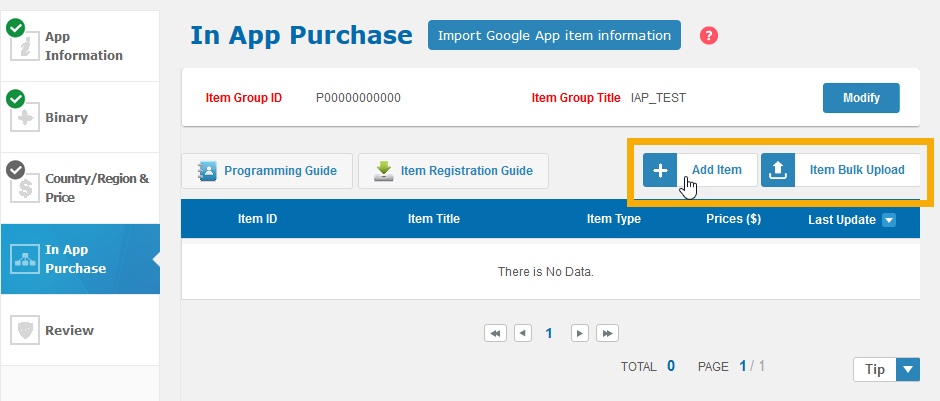
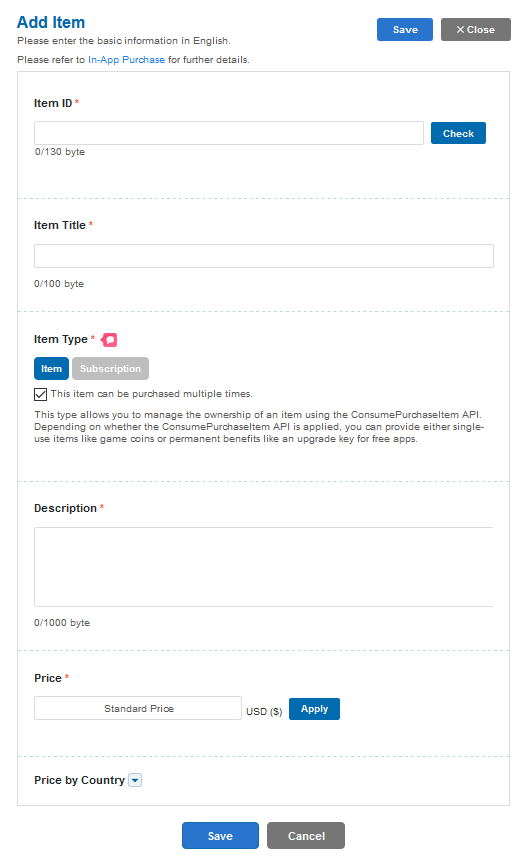
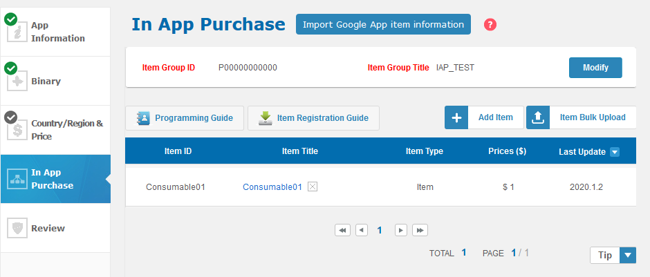

Samsung devices use a variant of Android. Some may include both Google Play and the Samsung Galaxy Store. 

The following outlines the steps required to enable Galaxy Store in app purchases in your application.


## Developer console

Samsung have created a [guide here](https://developer.samsung.com/iap/programming-guide/integrate-iap-helper-into-your-app.html) to setup an application for IAP. Below we will summarise the key points.

Add the `com.samsung.android.iap.permission.BILLING` permission to your application (see [manifest additions](#manifest-additions) below) and create an APK making sure you have set a package name (application id) **different from the app registered in other app stores**.

You can use this APK to upload to the store as a "dummy" application to go through the process of setting up your application's in-app items and start testing locally.

:::info

You do not need to publish either to beta or live before testing. However make sure you have correctly set your testing users as per [testing](testing).

:::


### Register an app and in-app items

1. Sign in to [Seller Portal](https://seller.samsungapps.com/) using your Samsung account.
2. Click **Add New App**



3. Click **Android**, select the default language, and click Next.




> Note :
> After entering information in each tab, click Save.
> 

4. In the **Binary** tab, upload your app APK.




5. In the **App Information** tab, enter fundamental app details.

6. In the **Country / Region & Price** tab, specify a free or paid app, a paid app price, and countries to sell your items.

7. In the **In App Purchase** tab, register one or more in-app items:




a. Click **Add Item**



b. Enter in-app item information.

c. Click **Save**.

>
> Note :
> For a subscription item, ensure your item registration information is correct. After saving a subscription item, you can only change its item title.
>

d. Verify the item is listed




## Variant

The Samsung In-App Purchases implementation is provided in the Samsung variant of the InAppBilling extension, i.e. `com.distriqt.InAppBilling.Samsung.ane`. You must use this version of the extension to ensure you have the Samsung In-App Purchases code available to your application.

You must only use one variant in your application. Remove any other versions of the InAppBilling extension from your project.


## Manifest Additions

Add the following permissions to your manifest additions, these permissions indicate that Samsung In-App Purchases are used in this application:

```xml
<uses-permission android:name="com.samsung.android.iap.permission.BILLING" />
```


These should be added to the `application` node in your manifest additions. 

```xml
<!-- SAMSUNG -->
<activity
    android:name="com.samsung.android.sdk.iap.lib.activity.DialogActivity"
    android:theme="@style/Theme.Empty"
    android:configChanges="orientation|screenSize"/>

<activity
    android:name="com.samsung.android.sdk.iap.lib.activity.CheckPackageActivity"
    android:theme="@style/Theme.Empty"
    android:configChanges="orientation|screenSize"/>

<activity
    android:name="com.samsung.android.sdk.iap.lib.activity.AccountActivity"
    android:theme="@style/Theme.Transparent"
    android:configChanges="orientation|screenSize"/>

<activity
    android:name="com.samsung.android.sdk.iap.lib.activity.PaymentActivity"
    android:theme="@style/Theme.Empty"
    android:configChanges="orientation|screenSize|smallestScreenSize|screenLayout|keyboard|keyboardHidden|locale|uiMode|fontScale|density"/>
```


#### Manifest Example 

The following example uses our test applicaiton id `air.com.distriqt.test`:

```xml
<android>
    <manifestAdditions><![CDATA[
        <manifest android:installLocation="auto">

            <uses-sdk android:minSdkVersion="19" android:targetSdkVersion="29" />

            <uses-permission android:name="android.permission.INTERNET"/>

            <uses-permission android:name="com.samsung.android.iap.permission.BILLING" />

            <application>

                <!-- SAMSUNG -->
                <activity
                    android:name="com.samsung.android.sdk.iap.lib.activity.DialogActivity"
                    android:theme="@style/Theme.Empty"
                    android:configChanges="orientation|screenSize"/>

                <activity
                    android:name="com.samsung.android.sdk.iap.lib.activity.CheckPackageActivity"
                    android:theme="@style/Theme.Empty"
                    android:configChanges="orientation|screenSize"/>

                <activity
                    android:name="com.samsung.android.sdk.iap.lib.activity.AccountActivity"
                    android:theme="@style/Theme.Transparent"
                    android:configChanges="orientation|screenSize"/>

                <activity
                    android:name="com.samsung.android.sdk.iap.lib.activity.PaymentActivity"
                    android:theme="@style/Theme.Empty"
                    android:configChanges="orientation|screenSize|smallestScreenSize|screenLayout|keyboard|keyboardHidden|locale|uiMode|fontScale|density"/>


            </application>

        </manifest>
    ]]></manifestAdditions>
</android>
```


## Setting up a Billing Service

> The following is in addition to the documentation in [Setting up a Billing Service](../billing-service).

When setting up your service you will need to specify the `InAppBillingServiceTypes.SAMSUNG_INAPP_PURCHASE` service type. You will also want to set the "operation mode". This is a setting that allows testing of samsung In-App Purchases and should be disabled in production builds (or set to `BillingService.OPERATION_MODE_PRODUCTION`).

```actionscript
var service:BillingService = new BillingService( InAppBillingServiceTypes.SAMSUNG_INAPP_PURCHASE )
                                    .setOperationMode( BillingService.OPERATION_MODE_TEST );

var success:Boolean = InAppBilling.service.setup( service );
```

You should wait for the `InAppBillingEvent.SETUP_SUCCESS` event to ensure the Samsung In-App Purchases are correctly initialised and available on the device.

