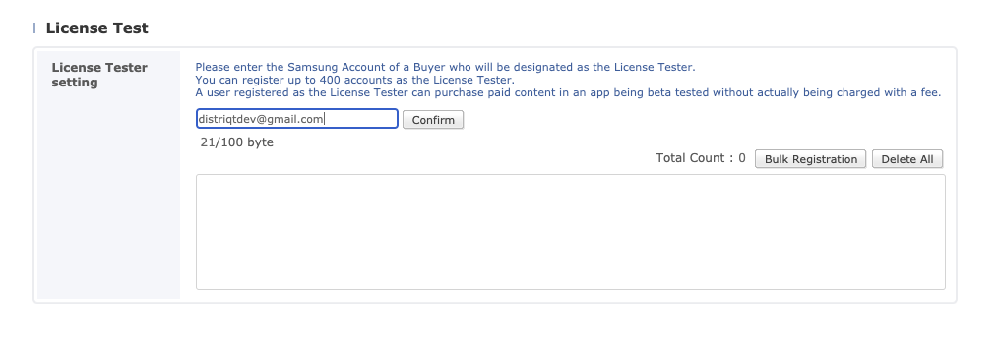

## Users

:::caution Important

Testers must be registered as a License Tester in the seller's Seller Portal profile. If you do not do this you will experience issues when testing your implementation.



:::


## Operation Mode

Samsung In-App Purchase uses "operation modes" to test your application in various states.


The operation mode is set through the Billing Service:

```actionscript
var service:BillingService = 
    new BillingService( InAppBillingServiceTypes.SAMSUNG_INAPP_PURCHASE )
        .setOperationMode( BillingService.OPERATION_MODE_TEST );

InAppBilling.service.setup( service );
```

The type of responses from the store is determined by the state of the application and the operation mode as per the table below:

| IAP Test | Transactions | IAP Operating Mode | App Status |
| --- | --- | --- | ---|
| Always Successful Side Load | No charge | `OPERATION_MODE_TEST` | Registering |
| Always Fail Side Load | No charge | `OPERATION_MODE_TEST_FAILURE` | Registering |
| Production Closed Beta | No charge or Charge (depends on type of tester) | `OPERATION_MODE_PRODUCTION` | Beta Deployed |


:::caution

Do not test when the IAP operating mode is `OPERATION_MODE_PRODUCTION` and the app status is **Registering**. 
IAP functionality is not supported under these conditions.

:::


For more information on these modes and the transaction charges for different user types, see the [guide here](https://developer.samsung.com/iap/iap-test-guide.html).