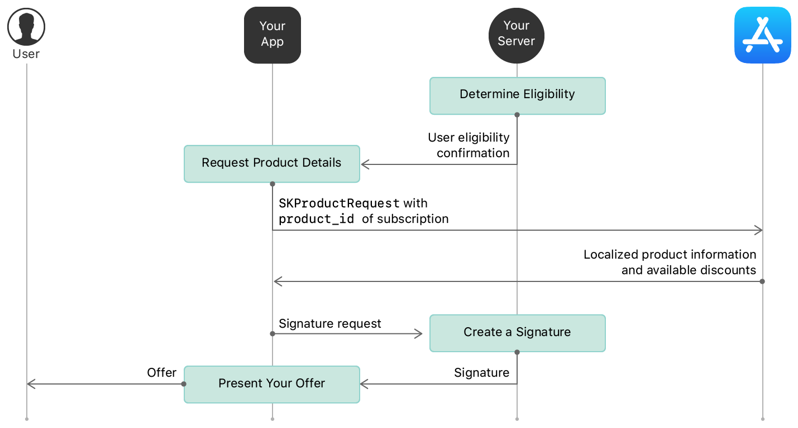
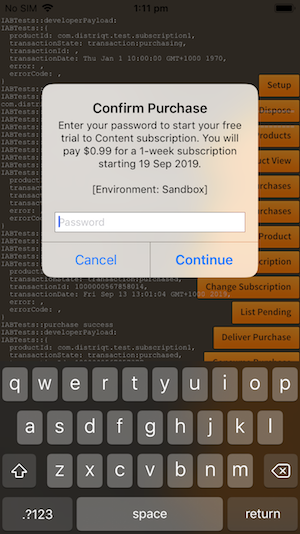
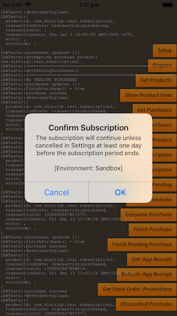
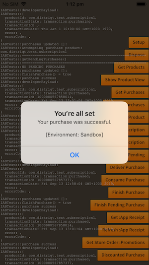
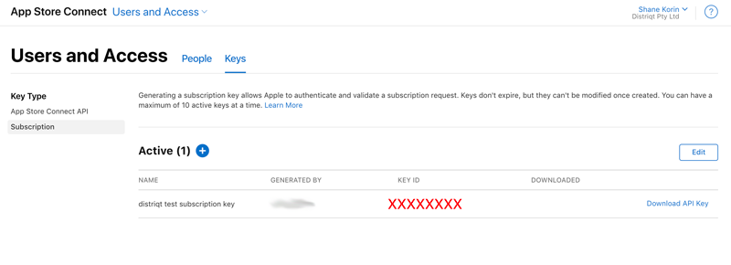

import Tabs from '@theme/Tabs'
import TabItem from '@theme/TabItem'

A subscription represents a set of benefits users can access during a specified time period. For example, a subscription might entitle a user to access a music streaming service.

You can have multiple subscriptions within the same app, either to represent different sets of benefits, or different tiers of a single set of benefits ("Silver" and "Gold" tiers, for example).

Through base plans and offers, you can create multiple configurations for the same subscription product. For example, you can create an introductory offer for users who have never subscribed to your app.


## Retrieving Subscription Offers

Information on the offers for a subscription are retrieved when you get your products.

Every subscription will have at least one available `SubscriptionOffer`. These are retrieved for each `Product` in the `subscriptionOffers` property which is an array of `SubscriptionOffer` objects.


<Tabs groupId="framework" defaultValue="air" values={[
    {label: 'AIR', value: 'air'},
    {label: 'Unity', value: 'unity'},
  ]}>
<TabItem value="air" >

```actionscript  
InAppBilling.service.addEventListener( 
    InAppBillingEvent.PRODUCTS_LOADED, 
    products_loadedHandler );
                
InAppBilling.service.getProducts( [ productId ] );


function products_loadedHandler( event:InAppBillingEvent ):void 
{
    for each (var product:Product in event.data)
    {
        if (product.subscriptionOffers != null)
        {
            for each (var offer:SubscriptionOffer in product.subscriptionOffers)
            {
                trace( "OFFER: " + offer.id + "[" + offer.tags.join( "," ) + "]" )
                for each (var phase:SubscriptionPhase in offer.pricingPhases)
                {
                    trace( "\t PHASE: " + phase.priceString + " - " + phase.numberOfPeriods + "/" + phase.recurrenceMode
                                    + " @ [" + phase.subscriptionPeriod.numberOfUnits + " " + phase.subscriptionPeriod.unit + "]" );

                }
            }
        }
    }
}
```

</TabItem>
<TabItem value="unity">

```csharp
InAppBilling.Instance.Events.OnGetProductsSuccess += ProductsLoadedHandler;

InAppBilling.Instance.GetProducts( new List<string> { productId } );


private void ProductsLoadedHandler(ProductsEvent e)
{
    foreach (var product in e.products)
    {
        if (product.subscriptionOffers != null)
        {
            foreach (var offer in product.subscriptionOffers)
            {
                Debug.Log( "OFFER: " + offer.id + "[" + string.Join( ",", offer.tags ) + "]" );
                foreach (var phase in offer.pricingPhases)
                {
                    Debug.Log( "\t PHASE: " + phase.priceString + " - " + phase.numberOfPeriods + "/" + phase.recurrenceMode
                                    + " @ [" + phase.subscriptionPeriod.numberOfUnits + " " + phase.subscriptionPeriod.unit + "]" );
                }
            }
        }
    }
}
```

</TabItem>
</Tabs>

### Phases

Each `SubscriptionOffer` contains a series of `SubscriptionPhase`'s. Each phase describes a period of the subscription that has a specific price and period. 

For example, you may have a free trial phase followed by the normal subscription:
- phase 1 : price $0, period 1 week;
- phase 2 : price $X, period 1 month;

Each offer will contain at least 1 phase. 


## Determine Eligibility 

Depending on the store, you may need to determine whether the current user is eligible for the discount. You can check this by inspecting the `storeDeterminedEligible` flag on the `SubscriptionOffer` instance.

This flag indicates whether the current user is determined to be eligible for the discount by the source store.

If this value is `true` then you can assume the user is eligible for the discount. If it is `false` then you will need to use the process defined by the current store to determine user eligibility.

For example, Google Play Billing only provides details on these offers to users who are eligible for the discount and so this value will be `true`.

As opposed to Apple In-App Purchases where you must determine eligibility by determining if the user has previously purchased a subscription.


### Google Play Billing 

The discount will only be available in the `subscriptionOffers` array if the user is eligible for the offer. 


### Apple In-App Purchases

#### Introductory Offers

Introductory offers will have the offer `id` set to `introductoryOffer`.

To determine if a user is eligible for an introductory offer, check their receipt:
- Validate the receipt as described in [Validating Receipts with the App Store](https://developer.apple.com/documentation/storekit/in-app_purchase/validating_receipts_with_the_app_store?language=objc).
- Send the receipt to your server;
- Call the Apple verify receipt end point;
- Process the response;
- In the receipt, check the values of the is_trial_period and the is_in_intro_offer_period for all in-app purchase transactions. If either of these fields are true for a given subscription, the user is not eligible for an introductory offer on that subscription product or any other products within the same subscription group. 

Based on the receipt, you will find that new and returning customers are eligible for introductory offers, including free trials:
- New subscribers are always eligible.
- Lapsed subscribers who renew are eligible if they haven't previously used an introductory offer for the given product (or any product within the same subscription group).


#### Promotional Offers 

There are two aspects to determining a user's eligibility for an Apple promotional subscription offer:

- The App Store deems all customers with an existing or expired subscription in the app eligible to redeem a subscription offer. You can check whether the receipt contains any existing or expired subscription purchases to identify these current or lapsed subscribers.

- You determine any additional eligibility criteria for a specific subscription offer. Eligibility can be contingent on a wide range of business logic determined by your business needs.

:::note
Customers can redeem subscription offers only on devices running iOS 12.2 and later, macOS 10.14.4 and later, and tvOS 12.2 and later. Consider providing messaging prompting your customer to update their OS if they try to redeem a subscription offer in your app on a device running an older OS version.
:::


- https://developer.apple.com/documentation/storekit/in-app_purchase/implementing_subscription_offers_in_your_app?language=objc


With Apple, some offers require the generation of a signature on your server. You can check this by checking the value of the `requiresSignature` property on the `SubscriptionOffer`. If this is `true` then the offer represents an Apple promotional subscription offer and you need to generate a signature as per the following diagram:



See [Generate Signature](#generate-signature) for more information.


## Display Offer

Once you determine the user is eligible for an introductory discount, query the extension for available products, and inspect the `subscriptionOffers` property.

**You will have to display the alternate pricing based on whether you determined the user to be eligible.** 

There may be more than one offer, so ensure that you display information on all of them. Eg, you may have a free trial period, followed by an introductory price discount, before the normal subscription price is applied. It is considered very important by the store policies that all this information is clearly displayed.


## Make the Purchase

To make a purchase of a subscription product you must provide details on the `SubscriptionOffer` to purchase by adding a `SubscriptionOfferRequest` to your `PurchaseRequest`: 

<Tabs groupId="framework" defaultValue="air" values={[
    {label: 'AIR', value: 'air'},
    {label: 'Unity', value: 'unity'},
  ]}>
<TabItem value="air" >

```actionscript
var product:Product = ...;
var offer:SubscriptionOffer = ...;

var request:PurchaseRequest = new PurchaseRequest()
        .setProductId( product.id )
        .setApplicationUsername( applicationUsername )
        .setSubscriptionOfferRequest(
            new SubscriptionOfferRequest()
                    .setSubscriptionOffer( offer )
        );

if (InAppBilling.service.checkPurchaseRequestValid( request ))
{
    InAppBilling.service.makePurchase( request );
}
```

</TabItem>
<TabItem value="unity">

```csharp
Product product = ...;
SubscriptionOffer offer = ...;

PurchaseRequest request = new PurchaseRequest()
        .SetProductId( product.id )
        .SetApplicationUsername( applicationUsername )
        .SetSubscriptionOfferRequest(
            new SubscriptionOfferRequest()
                    .SetSubscriptionOffer( offer )
        );

InAppBilling.Instance.MakePurchase( request );
```

</TabItem>
</Tabs>

The flow of the purchase will then proceed as a normal purchase.

| | | |
| --- | --- | --- |
|  |  |  |


## Generate Signature


- [Reference](https://developer.apple.com/documentation/storekit/in-app_purchase/generating_a_signature_for_subscription_offers)

Once you have decided a user is eligible for the subscription offer, you can check if the offer requires a signature by looking at the `requiresSignature` property on the `SubscriptionOffer`. If this is `true` then you must construct a signature for the `SubscriptionOfferRequest` on your server.

The signature information required includes:

- `keyIdentifier` - the identifier of the subscription key used to sign the discount;
- `nonce` - a throwaway value generated along with the signature;
- `signature` - the actual signature;
- `timestamp` - the timestamp when the signature was generated. 

This information is then passed when purchasing the subscription by using the `setSignature()` method on the `SubscriptionOfferRequest`:


<Tabs groupId="framework" defaultValue="air" values={[
    {label: 'AIR', value: 'air'},
    {label: 'Unity', value: 'unity'},
  ]}>
<TabItem value="air" >

```actionscript
var request:PurchaseRequest = new PurchaseRequest()
        .setProductId( product.id )
        .setApplicationUsername( applicationUsername )
        .setSubscriptionOfferRequest(
            new SubscriptionOfferRequest()
                    .setSubscriptionOffer( offer )
                    .setSignature( key, nonce, signature, timestamp )
        );
```

</TabItem>
<TabItem value="unity">

```csharp
PurchaseRequest request = new PurchaseRequest()
        .SetProductId( product.id )
        .SetApplicationUsername( applicationUsername )
        .SetSubscriptionOfferRequest(
            new SubscriptionOfferRequest()
                    .SetSubscriptionOffer( offer )
                    .SetSignature( key, nonce, signature, timestamp )
        );
```

</TabItem>
</Tabs>

The subscription key is generated through Apple's [AppStoreConnect](https://appstoreconnect.apple.com/), in the "Users and Access" section.



On your server you must generate the signature using the following parameters:

- `appBundleID`: The app bundle identifier.
- `keyIdentifier` : A string that identifies the private key you use to generate the signature. You can find this identifier in App Store Connect Users and Access > Keys, in the KEY ID column for the subscription key you generated.
- `productIdentifier` : The subscription product identifier, productIdentifier. The app can provide this value.
- `offerIdentifier` : The subscription discount identifier, identifier. The app can provide this value.
- `applicationUsername` : An optional string value that you define; may be an empty string. The app can provide this value and uses it in applicationUsername.
- `nonce` : A unique UUID value that your server defines. This value is cached for 24 hours. The string representation of the nonce used in the signature must be in lowercase.
- `timestamp` : A timestamp your server generates in UNIX epoch time format, in milliseconds; the timestamp keeps the offer active for 24 hours.

You use all of this information to create the signature as per the [Apple documentation](https://developer.apple.com/documentation/storekit/in-app_purchase/generating_a_signature_for_subscription_offers). See the example below for a simple NodeJS implementation.


### NodeJS Example

The following is a basic NodeJS example accepting the required information in the get parameters and returning the signature information in the JSON output.
You will need to place the private key that you created and downloaded alongside this script in the `subscription_certificate.p8` file.

```js
const http = require('http');
const url = require('url');
const express = require('express');
const app = express();
const uuid4 = require('uuid4');
const fs = require('fs');

const EC = require("elliptic").ec;
const ec = new EC("secp256k1");
const crypto = require('crypto');

const port = 8080;


function generateSignatureHandler(req, res) { 

    // https://developer.apple.com/documentation/storekit/in-app_purchase/generating_a_signature_for_subscription_offers
    
    // Params
    const appBundleID = req.query.appBundleID
    const keyIdentifier = req.query.keyIdentifier
    const productIdentifier = req.query.productIdentifier
    const offerIdentifier = req.query.offerIdentifier
    const applicationUsername = req.query.applicationUsername

    const nonce = uuid4()
    const timestamp = Math.floor(new Date())

    // Combine the parameters into a UTF-8 string with 
    // an invisible separator ('\u2063') between them, 
    // in the order shown:
    // appBundleId + '\u2063' + keyIdentifier + '\u2063' + productIdentifier + 
    // '\u2063' + offerIdentifier + '\u2063' + applicationUsername + '\u2063' + 
    // nonce + '\u2063' + timestamp

    let payload = 
        appBundleID + '\u2063' 
        + keyIdentifier + '\u2063' 
        + productIdentifier + '\u2063' 
        + offerIdentifier + '\u2063' 
        + applicationUsername + '\u2063'
        + nonce+ '\u2063' 
        + timestamp;

    // Sign the combined string
    // Private Key - p8 file downloaded
    // Algorithm - ECDSA with SHA-256

    const keyPem = fs.readFileSync('subscription_certificate.p8', 'ascii');

    // Step 4
    // Base64-encode the binary signature
    const signature = crypto.createSign('RSA-SHA256')
                    .update(payload)
                    .sign(keyPem, 'base64');

    let response1 = {
        "signature": signature,
        "nonce": nonce,
        "timestamp": timestamp,
        "keyIdentifier": keyIdentifier
    }
    res.type('json').send(response1);

}

app.get( '/', generateSignatureHandler );
app.listen( port, () => console.log(`Listening on port ${port}!`) );


// http://localhost:8080?appBundleID=ASDFASDF&keyIdentifier=JZCXH9P46S&productIdentifier=asdf&offerIdentifier=asdf&applicationUsername=asdf

```

<Tabs groupId="framework" defaultValue="air" values={[
    {label: 'AIR', value: 'air'},
    {label: 'Unity', value: 'unity'},
  ]}>
<TabItem value="air" >

This could be used in your AIR application as below, (however you will most likely need to implement a more robust solution for a production application):

```actionscript
var product:Product = ...;
var offer:SubscriptionOffer = ...;

generateSignature(
        product,
        offer,
        applicationUsername,
        function(key:String, nonce:String, signature:String, timestamp:Number):void
        {
            var request:PurchaseRequest = new PurchaseRequest()
                .setProductId( product.id )
                .setApplicationUsername( applicationUsername )
                .setSubscriptionOfferRequest(
                        new SubscriptionOfferRequest()
                                .setSubscriptionOffer( offer )
                                .setSignature( key, nonce, signature, timestamp )
                );
            
            if (InAppBilling.service.checkPurchaseRequestValid( request ))
            {
                InAppBilling.service.makePurchase( request );
            }
        }
);
        
function generateSignature(
    product:Product, 
    offer:SubscriptionOffer, 
    applicationUsername:String,
    callback:Function ):void
{
    var vars:URLVariables    = new URLVariables();
    vars.appBundleID         = "com.distriqt.test";
    vars.keyIdentifier       = APPLE_KEY_IDENTIFIER;
    vars.productIdentifier   = product.id;
    vars.offerIdentifier     = offer.id;
    vars.applicationUsername = applicationUsername;

    var request:URLRequest = new URLRequest();
    request.url            = APPLE_DISCOUNT_SIGNATURE_SERVER;
    request.method         = URLRequestMethod.GET;
    request.data           = vars;

    var loader:URLLoader = new URLLoader();
    loader.addEventListener( Event.COMPLETE, function ( event:Event ):void
    {
        event.currentTarget.removeEventListener( event.type, arguments.callee );

        var data:Object = JSON.parse( loader.data );

        var key:String       = data.keyIdentifier;
        var nonce:String     = data.nonce;
        var signature:String = data.signature;
        var timestamp:Number = data.timestamp;

        callback( key, nonce, signature, timestamp );
    } );
    loader.load( request );
}
```

</TabItem>
<TabItem value="unity">

This could be used in your Unity application as below, (however you will most likely need to implement a more robust solution for a production application):

```csharp
Product sub = ...;
SubscriptionOffer offer = ...;

StartCoroutine(
    GenerateSignature(
        sub,
        offer,
        "applicationUsername",
        (keyIdentifier, nonce, signature, timestamp) =>
        {
            Log("Signature: " + keyIdentifier + " " + nonce + " " + signature + " " + timestamp);
            PurchaseRequest request = new PurchaseRequest()
                .SetProductId("com.distriqt.test.subscription1")
                .SetSubscriptionOfferRequest(
                    new SubscriptionOfferRequest()
                        .SetSubscriptionOffer(offer)
                        .SetSignature(keyIdentifier, nonce, signature, timestamp)
                );

            bool success = InAppBilling.Instance.MakePurchase(
                request
            );
            Log("MakePurchase() = " + success);
        }
    )
);

[Serializable]
public class Signature
{
    public string keyIdentifier;
    public string nonce;
    public string signature;
    public double timestamp;
}

private IEnumerator GenerateSignature(Product product, SubscriptionOffer offer, string applicationUsername, Action<string, string, string, double> onComplete)
{
    Dictionary<string, string> parameters = new Dictionary<string, string>
    {
        { "appBundleID", "com.distriqt.test" },
        { "keyIdentifier", APPLE_KEY_IDENTIFIER },
        { "productIdentifier", product.id },
        { "offerIdentifier", offer.id },
        { "applicationUsername", applicationUsername }
    };

    string queryString = "?";
    foreach (KeyValuePair<string, string> param in parameters)
    {
        queryString += $"{UnityWebRequest.EscapeURL(param.Key)}={UnityWebRequest.EscapeURL(param.Value)}&";
    }
    queryString = queryString.TrimEnd('&');

    string url = APPLE_DISCOUNT_SIGNATURE_SERVER + queryString;
    using (UnityWebRequest webRequest = UnityWebRequest.Get(url))
    {
        webRequest.SetRequestHeader("Content-Type", "application/json");
        webRequest.SetRequestHeader("Authorization", "Bearer your_token_here");

        yield return webRequest.SendWebRequest();

        if (webRequest.result == UnityWebRequest.Result.ConnectionError ||
            webRequest.result == UnityWebRequest.Result.ProtocolError)
        {
            Debug.LogError($"Error: {webRequest.error}");
            yield break;
        }
        string jsonResponse = webRequest.downloadHandler.text;
        try
        {
            Signature response = JsonUtility.FromJson<Signature>(jsonResponse);
            onComplete?.Invoke(
                            response.keyIdentifier,
                            response.nonce,
                            response.signature,
                            response.timestamp
                        );
        }
        catch (Exception e)
        {
            Debug.LogError($"Error parsing JSON: {e.Message}");
        }
    }
}
```

</TabItem>
</Tabs>


## Policy Guidelines

There are some policy guidelines you will need to adhere to when displaying the subscription offers, mainly around the information that is displayed to the user when asking them to subscribe. Make sure you have read and followed the guidelines when implementing subscription offers:

- Google Play Billing: 
https://play.google.com/about/monetization-ads/subscriptions/#!?zippy_activeEl=management-cancellation#management-cancellation

- Apple In-App Purchases:  https://developer.apple.com/design/human-interface-guidelines/in-app-purchase/overview/


## Imports

<Tabs groupId="framework" defaultValue="air" values={[
    {label: 'AIR', value: 'air'},
    {label: 'Unity', value: 'unity'},
  ]}>
<TabItem value="air" >

```actionscript
import com.distriqt.extension.inappbilling.Product;
import com.distriqt.extension.inappbilling.PurchaseRequest;
import com.distriqt.extension.inappbilling.SubscriptionOffer;
import com.distriqt.extension.inappbilling.SubscriptionOfferRequest;
import com.distriqt.extension.inappbilling.SubscriptionPhase;

import com.distriqt.extension.inappbilling.event.InAppBillingEvent;
```

</TabItem>
<TabItem value="unity">

```csharp
using distriqt.plugins.inappbilling;
using distriqt.plugins.inappbilling.events;
```

</TabItem>
</Tabs>
