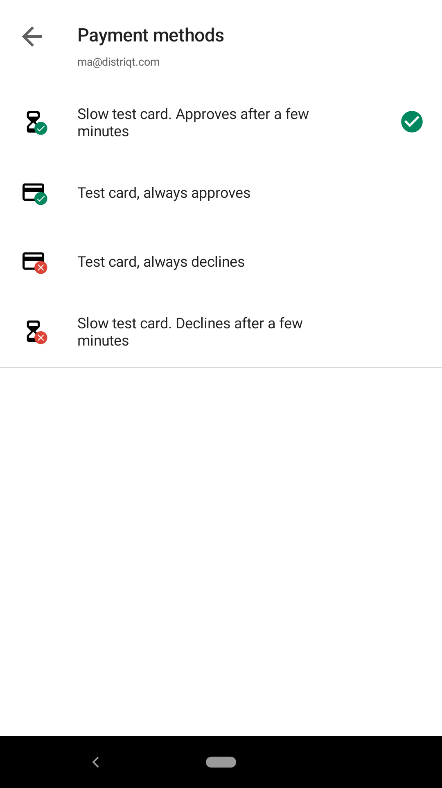
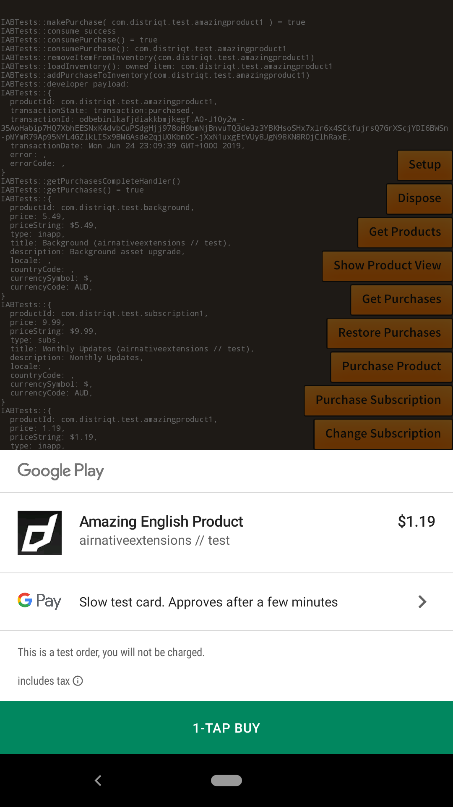

Test each part of your code to verify that you’ve implemented it correctly.

You should try and test as many scenarios as possible to make sure a purchase 
won't be left in an invalid state. 

The following is a list of some common ones that you should test.

### Test a Payment Request

Make a call to `makePurchase` using a valid product identifier that you have already tested. 
Set a breakpoint and confirm that the purchase success event handler is called.

During testing, it’s OK to finish the transaction immediately without providing the content. 
However, even during testing, failing to finish the purchase can cause problems, unfinished 
purchases can remain in the queue indefinitely, which could interfere with later testing.

### Test a Successful Purchase

Use a test user account, and make a purchase in your app. 

Set a breakpoint at the point in your code that adds the purchase to your users inventory, 
and confirm that this code is called in response to a successful purchase.

### Cancelation

Check that when a user cancels the purchase that your application correctly handles the response
and returns your application to the normal state.

You will need to handle several scenarios here, including a cancelled purchase and a cancelled error.

See [Handling User Cancellations](make-a-purchase#handling-user-cancellations) for implementation details.

### Testing Deferred Purchases

#### Google Play Billing

You will need to target api 28 or higher for deferred purchases. 

When you go to make a purchase ensure you have deployed at least one version to the a test channel (alpha/beta) and are signed in on your device using a test user.

Then when the purchase UI is displayed select the payment methods and you should see 4 available options:

Select the "Slow test card" and proceed with your test purchase:

The purchase will return as deferred and in a few minutes another event will trigger when the purchase succeeds. On the second event you should deliver the product and call finish purchase to acknowledge the purchase.

### Test an Interrupted Purchase

On some services, purchases can be interrupted, it is important, particularly on iOS that
you can handle interrupted transactions.

Set a breakpoint in your code that adds the purchase to your users inventory so you 
can control whether it delivers the product. 

Then make a purchase as usual in the test environment, and use the breakpoint to 
temporarily ignore the transaction—for example, by returning from the method immediately. 
Do not call `finishPurchase`.

Terminate and relaunch your app. 

The extension should dispatch the `PURCHASES_UPDATED` event when you call `setup` the service 
again shortly after launch; this time, let your app respond normally. 

Verify that your app correctly delivers the product and completes the transaction.

> This is only applicable for services that require calling `finishPurchase`, mainly the Apple's In-App Purchases.

### Verify That Purchases Are Finished

Locate where your app calls the `finishPurchase` method. You should call this whether or not
the service you are using requires it.

Verify that all work related to the transaction has been completed before the method 
is called and that the method is called for every transaction, whether it succeeded or failed.

---

## Common problems

The following are some common problems encountered with an incorrectly configured application:

- You did not complete all the financial requirements (see ["Managing Agreements, Tax, and Banking"](https://developer.apple.com/library/content/documentation/LanguagesUtilities/Conceptual/iTunesConnect_Guide/Chapters/ManagingContractsandBanking.html#//apple_ref/doc/uid/TP40011225-CH21-SW1)).
- You did not use the Provisioning Profile associated with your explicit App ID.
- You did not use the correct product identifier in your code. See Technical Q&A, QA1329, 'In App Purchase Product Identifiers' for more information about product identifiers.
- You did not clear your In App Purchase products for sale in iTunes Connect.
- You might have modified your products, but these changes are not yet available to all the App Store servers.
- If you or App Review rejected your most recent binary in iTunes Connect. 
  Change the status to "Waiting for Upload" by clicking "Ready to Upload Binary" in iTunes Connect 
  and the problem should be resolved after about 10 minutes.

The correct order for purchasing a product is as follows:

- Select item to purchase
- Purchase confirmation
- User taps "buy"
- iTunes Account Login Alert is displayed

>
> Note: You should be aware that any process that causes the iTunes login without 
> user interaction will most likely result in your application failing to pass the review guidelines.
>

