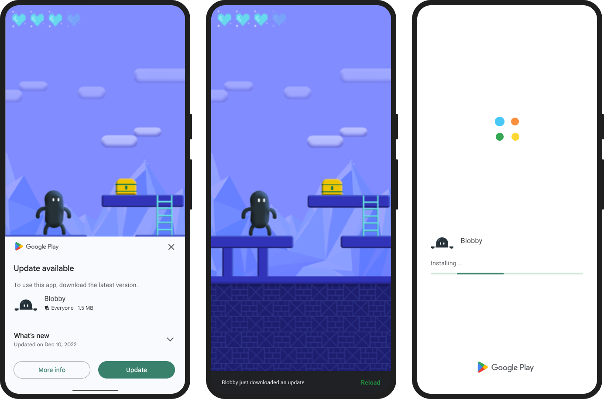
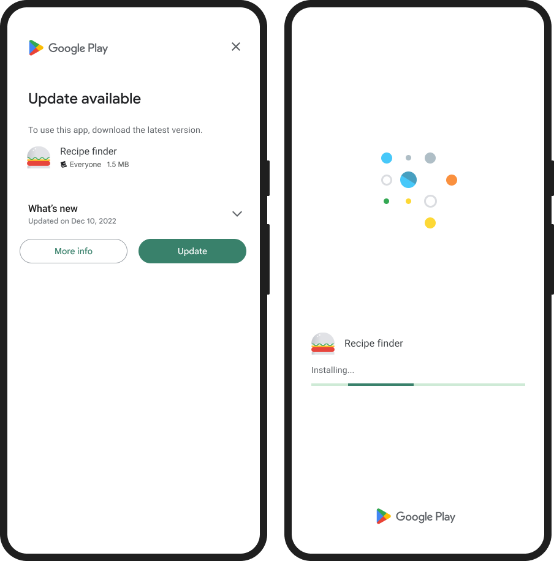

## Check for update availability

Before requesting an update, check if there is an update available for your app. Use `getAppUpdateInfo()` to retrieve the available update information:


```actionscript
InAppUpdates.instance.getAppUpdateInfo(
        function ( appUpdateInfo:AppUpdateInfo ):void
        {
            // Process the AppUpdateInfo
        }
);
```

The returned `AppUpdateInfo` instance contains the update availability status. Depending on the status of the update, the instance also contains the following:

- If an update is available and the update is allowed, the instance also contains information to start an update.
- If an in-app update is already in progress, the instance also reports the status of the in-progress update (bytes downloaded etc).


The most important flag here is the `updateAvailability` state, which contains a value from `UpdateAvailability` indicating whether an update is available for the app.

```actionscript
if (appUpdateInfo.updateAvailability == UpdateAvailability.UPDATE_AVAILABLE)
{
    // An update is available
}
```


### Check update staleness

In addition to checking whether an update is available, you might also want to check how much time has passed since the user was last notified of an update through the Play Store. This can help you decide whether you should initiate a flexible update or an immediate update. For example, you might wait a few days before notifying the user with a flexible update, and a few days after that before requiring an immediate update.

Use `clientVersionStalenessDays` to check the number of days since the update became available on the Play Store.


### Check update priority

The Google Play Developer API allows you to set the priority of each update. This allows your app to decide how strongly to recommend an update to the user. For example, consider the following strategy for setting update priority:

- Minor UI improvements: Low-priority update; request neither a flexible update nor an immediate update. Update only when the user isn't interacting with your app.
- Performance improvements: Medium-priority update; request a flexible update.
- Critical security update: High-priority update; request an immediate update.

To determine priority, Google Play uses an integer value between 0 and 5, with 0 being the default and 5 being the highest priority. To set the priority for an update, use the inAppUpdatePriority field under Edits.tracks.releases in the Google Play Developer API. All newly-added versions in the release are considered to be the same priority as the release. Priority can only be set when rolling out a new release and cannot be changed later.


## Start an update

After you confirm that an update is available, you can request an update using the `startUpdateFlowForResult()` method.

```actionscript
var options:AppUpdateOptions = new AppUpdateOptions( AppUpdateType.IMMEDIATE );

InAppUpdates.instance.startUpdateFlowForResult(
        options
);
```

This process will dispatch events based on the user interaction and any errors that occur:

- `InAppUpdatesEvent.IN_APP_UPDATE_STARTED`: Dispatched when the update process starts - generally this involves presenting UI to the user that asks whether they wish to update;
- `InAppUpdatesEvent.IN_APP_UPDATE_CANCELLED`: Dispatched if the user cancels the update process;
- `InAppUpdatesEvent.IN_APP_UPDATE_FAILED`: Dispatched if an error occurred during the update process;
- `InAppUpdatesEvent.IN_APP_UPDATE_COMPLETE`: Dispatched when the update process completes (will only occur during a flexible update);


```actionscript
InAppUpdates.instance.addEventListener( InAppUpdatesEvent.IN_APP_UPDATE_STARTED, inAppUpdatesHandler );
InAppUpdates.instance.addEventListener( InAppUpdatesEvent.IN_APP_UPDATE_COMPLETE, inAppUpdatesHandler );
InAppUpdates.instance.addEventListener( InAppUpdatesEvent.IN_APP_UPDATE_CANCELLED, errorHandler );
InAppUpdates.instance.addEventListener( InAppUpdatesEvent.IN_APP_UPDATE_FAILED, errorHandler );

function inAppUpdatesHandler( event:InAppUpdatesEvent ):void
{
    trace( "inAppUpdatesHandler: " + event.type );

    if (event.appUpdateInfo == null) return;

    trace( "inAppUpdatesHandler: " + JSON.stringify( event.appUpdateInfo.toObject() ) );
}


function errorHandler( event:InAppUpdatesEvent ):void
{
    trace( "errorHandler: " + event.type + " :: " + event.error.message );
}
```


### Configure an update with AppUpdateOptions

`AppUpdateOptions` contains a field that defines whether the update is allowed to clear asset packs in case of limited device storage. This field is set to false by default, but you can use the `setAllowAssetPackDeletion()` method to set it to true instead:

```actionscript
var options:AppUpdateOptions = new AppUpdateOptions( AppUpdateType.IMMEDIATE )
        .setAllowAssetPackDeletion( true );
```


## Handle a flexible update

When you start a flexible update, a dialog first appears to the user to request consent. If the user consents, then the download starts in the background, and the user can continue to interact with your app. This section describes how to monitor and complete a flexible in-app update.




### Monitor the flexible update state

After starting an update, you will receive `StateUpdatedEvent` events indicating the status of the update:

```actionscript
InAppUpdates.instance.addEventListener( StateUpdatedEvent.UPDATED, stateUpdatedHandler );

function stateUpdatedHandler( event:StateUpdatedEvent ):void
{
}
```

The `StateUpdatedEvent` contains a `state` object being an instance of the `InstallState` class. This instance contains information about the current `installStatus` (from the `InstallStatus` class) and the bytes downloaded and bytes total.  

You will find the `installStatus` will go through a series of changes: `DOWNLOADING` -> `DOWNLOADED` 


### Install a flexible update

When you detect the `InstallStatus.DOWNLOADED` state, you need to restart the app to install the update.

Unlike with immediate updates, Google Play does not automatically trigger an app restart for a flexible update. This is because during a flexible update, the user has an expectation to continue interacting with the app until they decide that they want to install the update.

It is recommended that you provide a notification (or some other UI indication) to inform the user that the update is ready to install and request confirmation before restarting the app.

When you call `completeUpdate()` in the foreground, the platform displays a full-screen UI that restarts the app in the background. After the platform installs the update, your app restarts into its main activity.

If you instead call `completeUpdate()` when your app is in the background, the update is installed silently without obscuring the device UI.

Whenever the user brings your app to the foreground, check whether your app has an update waiting to be installed. If your app has an update in the `DOWNLOADED` state, prompt the user to install the update. Otherwise, the update data continues to occupy the user's device storage.


```actionscript
InAppUpdates.instance.getAppUpdateInfo(
        function ( appUpdateInfo:AppUpdateInfo ):void
        {
            if (appUpdateInfo.installStatus == InstallStatus.DOWNLOADED) 
            {
                popupSnackbarForCompleteUpdate();
            }
        }
);
```


## Handle an immediate update

When you start an immediate update and the user consents to begin the update, Google Play displays the update progress on top of your app's UI throughout the entire duration of the update. 



If the user closes or terminates your app during the update, the update should continue to download and install in the background without additional user confirmation.

However, when your app returns to the foreground, you should confirm that the update is not stalled in the `UpdateAvailability.DEVELOPER_TRIGGERED_UPDATE_IN_PROGRESS` state. If the update is stalled in this state, resume the update:

```actionscript
InAppUpdates.instance.getAppUpdateInfo(
        function ( appUpdateInfo:AppUpdateInfo ):void
        {
            if (appUpdateInfo.installStatus == InstallStatus.DEVELOPER_TRIGGERED_UPDATE_IN_PROGRESS) 
            {
                // If an in-app update is already running, resume the update.
                InAppUpdates.instance.startUpdateFlowForResult( 
                    new AppUpdateOptions( AppUpdateType.IMMEDIATE )
                 );
            }
        }
);
```

If possible, let the user continue without the update and prompt them again later. If your app can't function without the update, consider displaying an informative message before restarting the update flow or prompting the user to close the app. That way, the user understands that they can relaunch your app when they're ready to install the required update.

