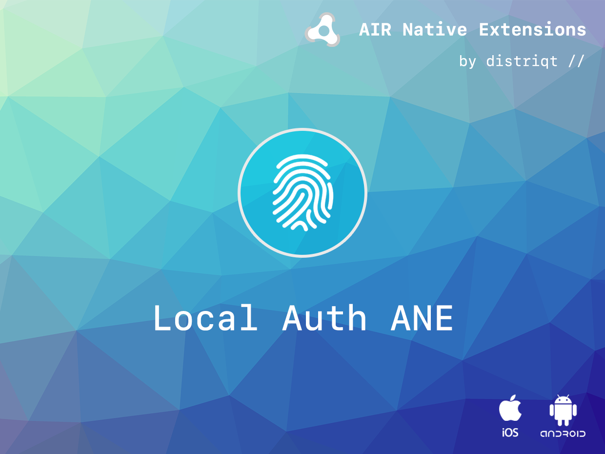
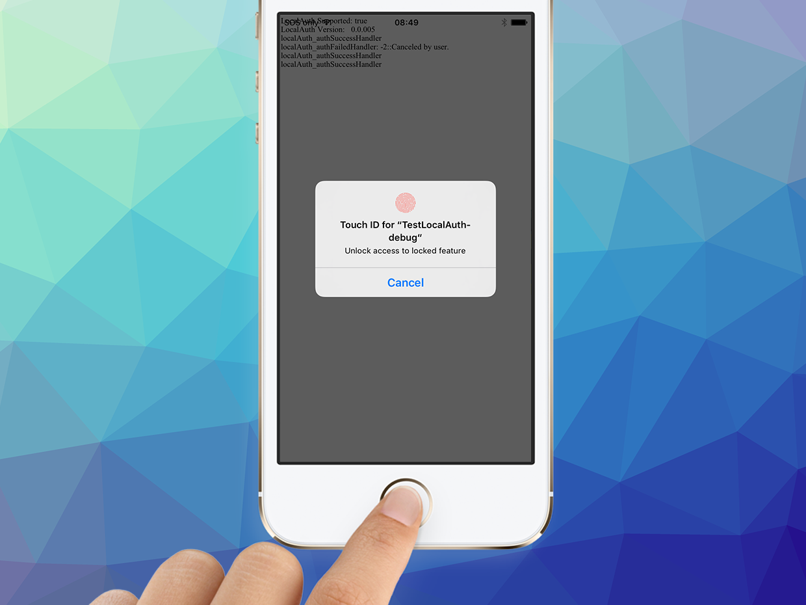

# LocalAuth

The [LocalAuth](https://airnativeextensions.com/extension/com.distriqt.LocalAuth) is an 
AIR Native Extension to enable authenticating users on their device using biometrics 
(fingerprints and face).

Using this extension you can ensure the user of the device and your application is the 
authorised user (owner) of the device. In this way you can secure aspects of your 
application ensuring that unauthorised users aren't gaining access to sensitive 
information.

The API is very simple and the underlying extension handles all of the authentication
and uses a universal UI that your users will be familiar with.


### Features

- Touch ID on iOS;
- Face ID on iOS;
- Fingerprint Manager on Android;
- Single API interface - your code works across supported platforms with no modifications
- Sample project code and ASDocs reference


### Support

- iOS v9+
- Android v23+ 


## Documentation

The [documentation site](https://docs.airnativeextensions.com/docs/localauth/) forms the best source of detailed documentation for the extension along with the [asdocs](https://docs.airnativeextensions.com/asdocs/localauth/). 

Quick Example: 

```as3
if (LocalAuth.service.canAuthenticateWithFingerprint())
{
	LocalAuth.service.addEventListener( LocalAuthEvent.AUTH_SUCCESS, authSuccessHandler );
	LocalAuth.service.addEventListener( LocalAuthEvent.AUTH_FAILED, authFailedHandler );
	LocalAuth.service.authenticateWithFingerprint( "Unlock access to locked feature" );
}
```

More information here: 

[com.distriqt.LocalAuth](https://airnativeextensions.com/extension/com.distriqt.LocalAuth)


## License

You can purchase a license for using this extension:

[airnativeextensions.com](https://airnativeextensions.com)

distriqt retains all copyright.


