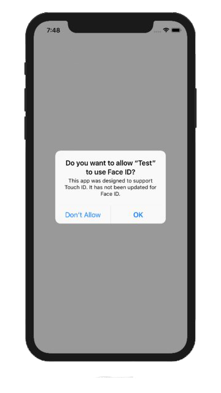

## Usage Description

On iOS when the first attempt to use biometric authorisation is performed the user will be presented an authorisation dialog. You can customise this dialog by setting the `NSFaceIDUsageDescription`. The image below is an example of the authorisation dialog:

You set these values through adding the usage description keys to your info additions or simply by setting up your configuration options in your `apm` project. 

:::caution
If you don't set this value your application may be terminated by the OS when you attempt to authenticate.
:::

