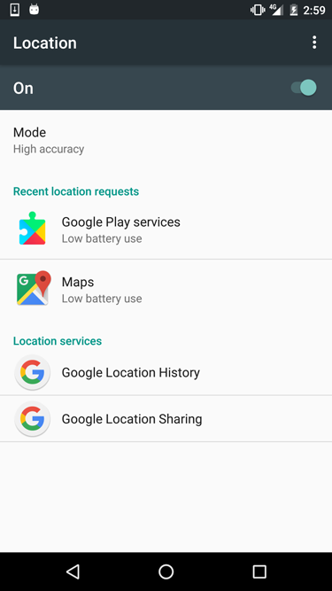
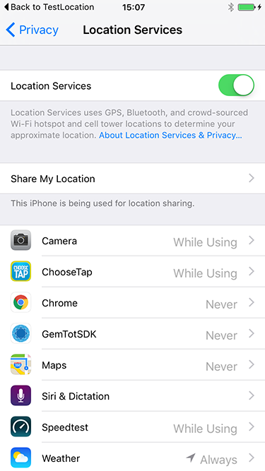
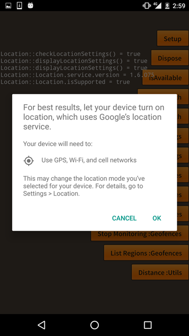

Device settings are separate from authorisation. While your application may be authorised to access the user's location they may have disabled their devices GPS or WiFi making receiving location updates difficult or impossible.

There are several utility functions in this extension to aid in this process.

- `isAvailable`: Checks to see if the GPS / WiFi services are enabled
- `displayLocationSettings`: Redirects the user to the location settings 
- `checkLocationSettings`: Android utility to enable services directly from your application


## Is Available

The available flag will check whether the location services are enabled on the device.

- iOS: This checks the `CLLocationManager locationServicesEnabled` flag. The user can enable or disable location services from the Settings app by toggling the Location Services switch in General.

- Android: This checks if GPS and WiFi are enabled and the state of the airplane mode on the device.


```actionscript
var available:Boolean = Location.service.isAvailable();
```


## Display Settings

If the services aren't available you can ask your user to enable them and then use the `displayLocationSettings` function to redirect them to the appropriate place in the settings. 


For example if the services aren't available:

```actionscript
if (Location.service.isAvailable()) 
{
    Location.service.displayLocationSettings(); 
}
```

This will redirect them to the following screens:

| Android | iOS |
| --- | --- |
|  |  |

>
> Note: From iOS 11 you can only get redirected to the application settings screen not the location settings
>


## Change Settings

On Android you have the ability to ask the user to change the location services directly from your application.  

Calling `checkLocationSettings` with your `LocationRequest` will check if the device currently has the correct services enabled to support the location request. 
The major factor here is the priority of the request which specifies which services will need to be enabled.

```actionscript
var request:LocationRequest = new LocationRequest();
request.priority = LocationRequest.PRIORITY_HIGH_ACCURACY;
				 
var success:Boolean = Location.service.checkLocationSettings( request );
```

The return value of this function indicates whether the current device platform and version supports the settings check. If it returns false you should not expect any changes to the settings automatically and you'll need to open the device settings as above.

If it returns true then you can expect one of two events:

- `LocationSettingsEvent.SUCCESS` : Location settings are now valid for the specified location request
- `LocationSettingsEvent.FAILED` : location settings check failed for the specified location request. The user probably denied enabling the services.


During this process there may be a dialog presented to the user to ask to enable the required services, if they currently are disabled:




For example: 

```actionscript
var request:LocationRequest = new LocationRequest();
request.priority = LocationRequest.PRIORITY_HIGH_ACCURACY;

Location.service.addEventListener( LocationSettingsEvent.SUCCESS, checkLocationSettingsHandler );
Location.service.addEventListener( LocationSettingsEvent.FAILED, checkLocationSettingsHandler );

var success:Boolean = Location.service.checkLocationSettings( request );
if (!success)
{
    Location.service.displayLocationSettings();
}

function checkLocationSettingsHandler( event:LocationSettingsEvent ):void
{
    trace( event.type );
}
```


