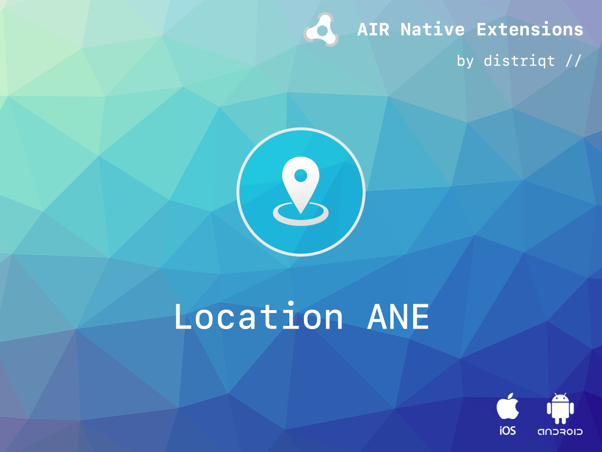
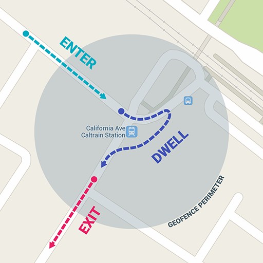

# Location

The [Location](https://airnativeextensions.com/extension/com.distriqt.Location) extension provides
functionality to get location information about a user's device using GPS and other location sources.
It extends the functionality of the AIR geolocation class.

The simple API allows you to quickly integrate location updates in your AIR application in just
a few lines of code. Identical code base can be used across all platforms allowing you to concentrate
on your application and not device specifics.
You can get location updates, specifying accuracy, priority and other location request details,
and receive location update events even when the device is in the background.
You can also set geofences, allowing your application to receive an event whenever the device
enters or exits a defined region.



We provide complete getting started guide to get you up and running with location quickly and easily.

### Features

- Set Geofences to get notified of region entry and exit events;
- Post information to your server on region entry and exits;
- Get background location update events ;
- Set location request settings, such as accuracy, and interval;
- Single API interface - your code works across iOS and Android with no modifications;
- Sample project code and ASDocs reference

As with all our extensions you get access to a year of support and updates as we are continually
improving and updating the extensions for OS updates and feature requests.

## Location Details

The position reported by this extension is a "fused location" i.e. uses all the potential positioning
methods on a device to give location information.

This includes position from wifi and gps.

The heading is not related to the device position, but the device travel. This is using the changes
in position of the device over time. If you need device position / orientation information have a
look at the [DeviceMotion](https://airnativeextensions.com/extension/com.distriqt.DeviceMotion) ANE.

The altitude is the most inaccurate coordinate. Due to the way GPS works the vertical accuracy
is the least precise (http://gpsinformation.net/main/altitude.htm)

Altitude is reported as the height above the WGS84 ellipsoid and not sea level which can change
around the world. You can read more on this here: http://www.gpspassion.com/forumsen/topic.asp?TOPIC_ID=10915

## Documentation

The [documentationn site](https://docs.airnativeextensions.com/docs/location) forms the best source of detailed documentation for the extension along with the [asdocs](https://docs.airnativeextensions.com/asdocs/location).

Quick Example:

```actionscript
var request:LocationRequest = new LocationRequest();
request.accuracy = LocationRequest.ACCURACY_NEAREST_TEN_METERS;
request.priority = LocationRequest.PRIORITY_BALANCED_POWER_ACCURACY;
request.interval = 5000;

var success:Boolean = Location.service.startLocationMonitoring( request );
```

More information here:

[com.distriqt.Location](https://airnativeextensions.com/extension/com.distriqt.Location)

## License

You can purchase a license for using this extension:

[airnativeextensions.com](https://airnativeextensions.com/)

distriqt retains all copyright.


