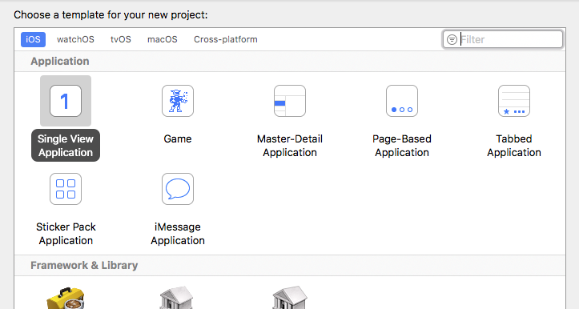
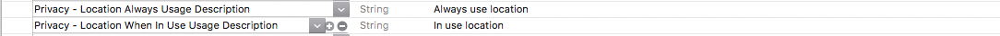
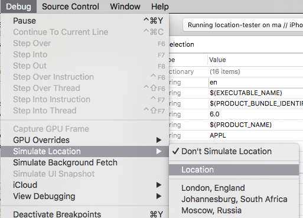

## iOS Location Simulation

In order to simulate a location on a real device you will need to create an iOS application 
using Xcode, and run this application alongside your AIR application. The application will 
use the Debug Location Simulation feature of Xcode to change the reported location of the 
device for all applications.


## Create the Application

To create a new iOS Xcode Application:

- Open Xcode
- Create a new single view application 
- Enter appropriate details, nothing is really important here, just name the application appropriately 




### Add code 

Here is some very basic code to request authorisation and to log the current location.
This code is for the `ViewController` class that should have been automatically created 
for you, just copy the following into the `ViewController.m` file. 

This code is very basic and just put together for testing purposes.

```objc
#import "ViewController.h"
#import <CoreLocation/CoreLocation.h>

@interface ViewController () <CLLocationManagerDelegate>
@end

@implementation ViewController
{
	CLLocationManager* _locationManager;
}

- (void)viewDidLoad {
	[super viewDidLoad];
	
	_locationManager = [[CLLocationManager alloc] init];
	_locationManager.delegate = self;
	_locationManager.pausesLocationUpdatesAutomatically = NO;
	
	if ([CLLocationManager authorizationStatus] == kCLAuthorizationStatusNotDetermined)
	{
		NSLog(@"Requesting authorisation" );
		[_locationManager requestAlwaysAuthorization];
	}
	
	[_locationManager startUpdatingLocation];

}

- (void)didReceiveMemoryWarning {
	[super didReceiveMemoryWarning];
	// Dispose of any resources that can be recreated.
}

#pragma mark CLLocationManagerDelegate

-(void)locationManager:(CLLocationManager *)manager didChangeAuthorizationStatus:(CLAuthorizationStatus)status
{
	NSLog( @"didChangeAuthorizationStatus: %d", status );
}

- (void)locationManager:(CLLocationManager *)manager didUpdateLocations:(NSArray *)locations
{
	CLLocation* location = [locations lastObject];
	NSLog( @"location: %f, %f", location.coordinate.latitude, location.coordinate.longitude );
}

@end
```


### Add a GPX file 

A GPX file allows you to set the location simulated on the device. This file can use
waypoints to change the reported location over time. 

```xml
<?xml version="1.0"?>
<gpx version="1.1" creator="Xcode">
    
    <!--
     Provide one or more waypoints containing a latitude/longitude pair. If you provide one
     waypoint, Xcode will simulate that specific location. If you provide multiple waypoints,
     Xcode will simulate a route visiting each waypoint.
     -->
    <wpt lat="37.331705" lon="-122.030237">
        <name>Cupertino</name>
        
        <!--
         Optionally provide a time element for each waypoint. Xcode will interpolate movement
         at a rate of speed based on the time elapsed between each waypoint. If you do not provide
         a time element, then Xcode will use a fixed rate of speed.
         
         Waypoints must be sorted by time in ascending order.
         -->
        <time>2014-09-24T14:55:37Z</time>
    </wpt>
    
</gpx>
```

To add a GPX file, select `File / New / File ...`, then under `Resources` select the `GPX` file and
name it appropriately for your usage.


### Add Usage Descriptions

You will need to add the Usage Description strings similarly to how we do with the Info Additions
in your AIR application.

Just open the `Info.plist` file in a text editor and add the following:

```
<key>NSLocationWhenInUseUsageDescription</key>
<string>In Use Usage Description</string>
<key>NSLocationAlwaysUsageDescription</key>
<string>Always Usage Description</string>
```

Or you can add them through Xcode:




## Simulating the Location

Now run the application on your device:


It should start the application on your device showing a blank white screen.
The first run will ask you for permission to access location, make sure you select **Allow** 
and relaunch the application. If you don't get the permission dialog on first launch
check that you added the usage descriptions correctly.

Now once the application is running in debug mode on the device you can simulate 
the location on the device. 

Go to: `Debug / Simulate Location` and you can either select the GPX file you added or one 
of the predefined default locations. 




If you switch to your AIR application now you should find it reporting this new location.

>
> Note: this may time out after a minute or so as we haven't set up the test application
> for background operation, however we find this enough for testing most situations.
> 
> If it stops reporting, just switch back to the test application and select the debug 
> location simlation again. 
>
