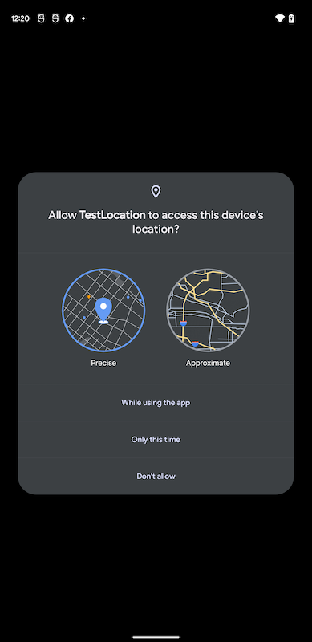
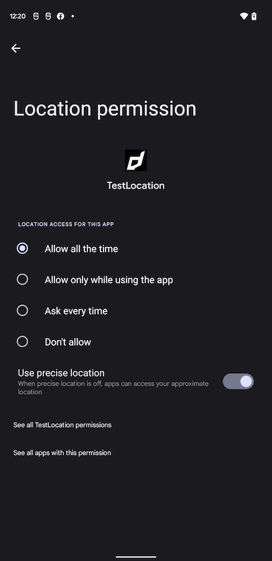

When you are going to be accessing the user's location you must check that your 
application has been allowed access. To this end the extension provides several 
helpers to check and request access to the location services.

On Android these permissions are listed through the manifest additions. 
On older versions of Android these permissions are accepted when the user installs 
the application. More modern versions (Marshmallow 6 [v23]+) require that you 
request the permissions similar to iOS. You will still need to list them in your
manifest and then follow the same code below as for iOS, except that on Android 
you will be able to ask multiple times. You should respect the `SHOULD_EXPLAIN`
status by displaying additional information to your user about why you require 
this functionality. You can either request coarse or fine location based on your 
application need

On iOS the user must be asked at runtime, which you only get one chance to ask, 
after which you must direct the user to manually change the permissions in the settings.

The following code will work across both platforms:

```actionscript
Location.service.addEventListener( AuthorisationEvent.CHANGED, authorisationChangedHandler );
switch (Location.service.authorisationStatus())
{
	case AuthorisationStatus.ALWAYS:
	case AuthorisationStatus.IN_USE:
		trace( "User allowed access: " + Location.service.authorisationStatus() );
		break;
	
	case AuthorisationStatus.NOT_DETERMINED:
	case AuthorisationStatus.SHOULD_EXPLAIN:
		Location.service.requestAuthorisation( AuthorisationStatus.ALWAYS );
		break;
	
	case AuthorisationStatus.RESTRICTED:
	case AuthorisationStatus.DENIED:
	case AuthorisationStatus.UNKNOWN:
		trace( "User denied access" );
		break;
}

function authorisationChangedHandler( event:AuthorisationEvent ):void
{
	//
}
```


>
> When requesting authorisation you can either request `AuthorisationStatus.ALWAYS` 
> or `AuthorisationStatus.IN_USE` access. If you want to be able to receive notifications 
> in the background you must use `ALWAYS` otherwise you will only receive updates when 
> the application is in use.
>


## Usage Description

> This applies to the iOS implementation 

You can customise the usage description messages as you see fit to suit your application. These messages are displayed in the main body area of the iOS authorisation dialog with the title and buttons being standard (and not customisable).

The image below is an example of the authorisation dialog. The content *"Access to photo library is required to save images."* is the usage description message you can set.


You set these values through adding the usage description keys to your application descriptor's info additions or simply by setting up your configuration options in your `apm` project. 


## Background Authorisation 

> This applies to the Android implementation 

Requesting "always" or "background" location access on Android has changed with recent releases of Android. 

When requesting permission your user will firstly be presented with the "in use" permission request, which will allow the user to select the accuracy of your location requests and allow or deny the request:




If you have included the background permission in your manifest and request the "always" permission then an additional step is required where the user will need to manually change the location permission to be "Allow all the time":




You should step through this process for your user, firstly requesting the "in use" permission and then explaining the need for the background permission before requesting the "always" permission.

If you simply request the "always" permission to start with, then the extension will firstly show the "in use" dialog and then, if granted, will display the settings for the user to change to the "always" permission.


:::info
It is worth noting that if a user removes a location permission your Android application will likely be restarted by the system to ensure these decreased permission levels are applied.
:::
