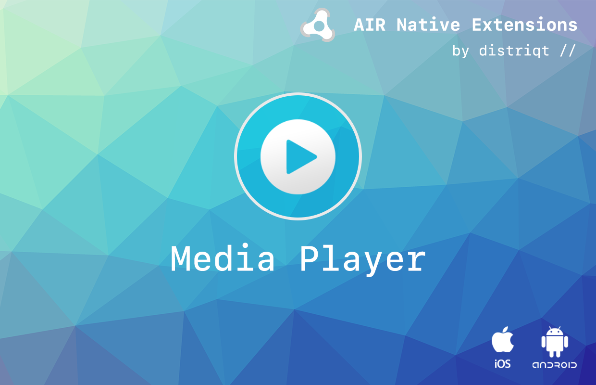
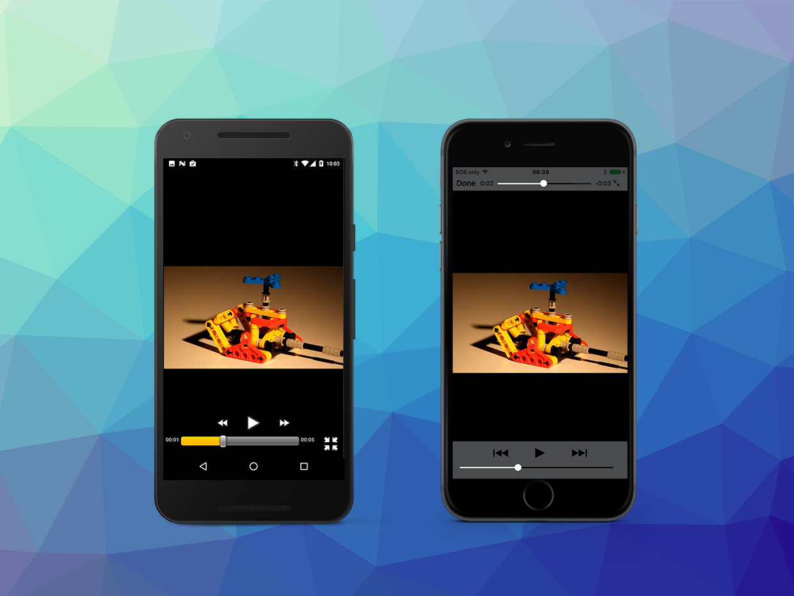

# Media Player 

The [MediaPlayer](https://airnativeextensions.com/extension/com.distriqt.MediaPlayer) 
extension allows developers to display a native video player in your application.

This extension provides functionality to display and control the native media player. 
Using the native media player gives you native performance and standard controls for 
playback of device supported media. The simple API allows you to quickly integrate 
video and audio playback in your AIR application in just a few lines of code. 
Identical code base can be used across all platforms allowing you to concentrate on 
your application and not device specifics.

The extension provides the ability to create, position, resize and control playback 
of media. It supports all formats that the native video player supports, which does 
vary slightly between platforms. Using native functionality to playback video will 
significantly increase the performance of the playback.

It provides both a media/video player with UI and an audio player (without UI).

We provide complete guides to get you up and running with dialogs quickly and easily.

>
> This ANE can be used to alleviate the ANR issues with Adobe AIR on Android. Using a 
> combination of the audio player for longer sounds such as music and the sound pool
> for shorter sound effects. 
>

### Features

- Allows control of native media (video and audio) players
- Media Player for video playback:
  - Controls: Playback controls including: play, pause, stop and seek
  - Position: Ability to position and size the player
  - Autoscaling of media content
  - Fullscreen ability on iOS and Android
- Audio Player:
  - Native audio player with no user interface
  - Used to play game music or other sounds 
  - Can be used to create a background audio player and utilise system controls and notifications 
- Sound Pool (Android only) allows quick playback of short sound effects
- Performance: Native video playback performance
- System Control: Dispatch system events to control other media players

- Standard UI: Ability to display and hide standard UI controls
- Sample project code and ASDocs reference

As with all our extensions you get access to a year of support and updates as we are 
continually improving and updating the extensions for OS updates and feature requests.

## Documentation

The documentation [site](https://docs.airnativeextensions.com/docs/mediaplayer/) forms the best source of detailed documentation for the extension along with the [asdocs](https://docs.airnativeextensions.com/asdocs/mediaplayer/). 

More information here: 

[com.distriqt.MediaPlayer](https://airnativeextensions.com/extension/com.distriqt.MediaPlayer)

## License

You can purchase a license for using this extension:

[airnativeextensions.com](https://airnativeextensions.com/)

distriqt retains all copyright.

