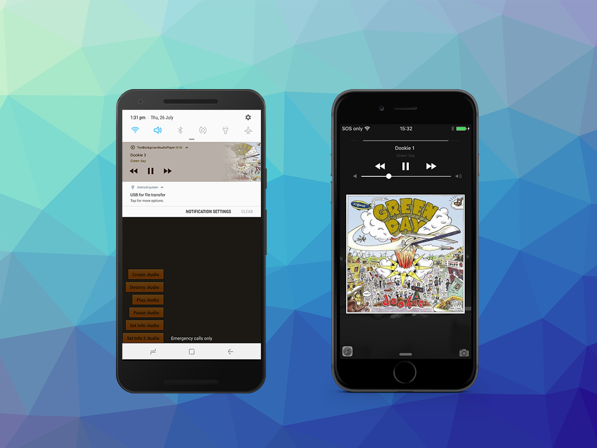
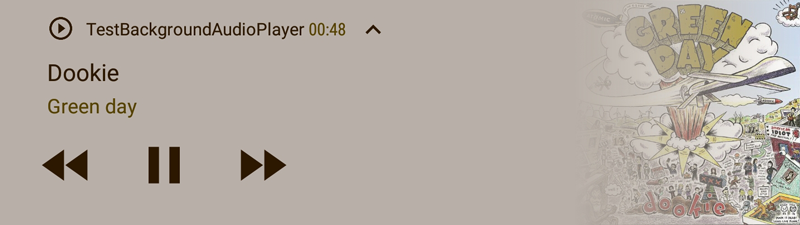

The Remote Command Center represents a common interface to access areas of the operating system that display information about the currently playing media and access to the playback controls.  

This object provides the ability to set the media information displayed to the user and for your application to receive events from the controls in these areas.


With iOS this is represented by an area in the control panel and on the lock screen called the "Remote Command Center".
On Android it is represented by an ongoing media notification in the notification panel and lock screen. 





The functionality of the Remote Command Center is available through the `MediaPlayer.service.remoteCommandCenter` property.


## Media Information

The lock screen, control center and notification areas can contain information about the currently playing media. This should be used when you are using background audio to inform the user outside of your application about the media that your application is currently playing.

In order to update this information you use the `setNowPlayingInfo` function passing an instance of the `MediaInfo` class specifying the current state of the media.

```actionscript
var info:MediaInfo = new MediaInfo()
    .setTitle( "Australian National Anthem" )
    .setArtwork( artworkImageBitmapData )
    .setCurrentTime( 1 )
    .setDuration( 155 );

MediaPlayer.service.remoteCommandCenter.setNowPlayingInfo( info );
```

The artwork can be any `BitmapData` and will be scaled to fit appropriately but it is recommended to be a minimum of 600x600 pixels to best present on all devices.  

>
> Note: Android automatically syncs the duration and time with the playing media so values passed in the 
> media info will be ignored on Android. Title, artist and artwork are all still available.
>


### Android Icon

On Android the notification has an icon displayed in the status bar. By default this is a play arrow icon, which is the default icon for Android media notifications. 



This can be customised by packaging a custom resource notification icon with your application (in a custom resources ANE) and specifying the name of the resource in the media info.

```actionscript
info.setIcon( "ic_custom_resource_icon_name" )
```

If you don't provide a value the default icon will be used.

> 
> For information on creating a custom resources ANE see the script available here:
> https://github.com/distriqt/ANE-CustomResources
>


## Remote Control Events

The lock screen, control center and notification areas can contain buttons to control the media playback.

Generally these are only appropriate for when you are background playing media. 
In these cases you should listen for these control events and appropriately pause / play your media. 

You listen for `RemoteCommandCenterEvent`s on the `MediaPlayer.service.remoteCommandCenter` property, however they will only be dispatched after you call `registerForControlEvents()`. This registration process makes your application the registered receiver for these control events.

```actionscript
MediaPlayer.service.remoteCommandCenter.registerForControlEvents();
```

You can similarly stop the events by calling `unregisterForControlEvents()`.


### Example

For example if we are using an `AudioPlayer` to background play music:

```actionscript
var options:AudioPlayerOptions = new AudioPlayerOptions()
    .enableBackgroundAudio();

var player:AudioPlayer = MediaPlayer.service.createAudioPlayer( options );
player.play();
```


We can then listen for control events and appropriately change the state of the player:

```actionscript
MediaPlayer.service.remoteCommandCenter.addEventListener( RemoteCommandCenterEvent.PAUSE, remoteCommandCenter_pauseHandler );
MediaPlayer.service.remoteCommandCenter.addEventListener( RemoteCommandCenterEvent.PLAY, remoteCommandCenter_playHandler );

MediaPlayer.service.remoteCommandCenter.registerForControlEvents();

function remoteCommandCenter_pauseHandler( event:RemoteCommandCenterEvent ):void
{
    player.pause();
}

function remoteCommandCenter_playHandler( event:RemoteCommandCenterEvent ):void
{
    player.play();
}
```


### Notes

- You should have enabled background audio in your application for control center events to work correctly;
- Your player must have enabled the background mode;
- You must ensure you call `registerForControlEvents`;

