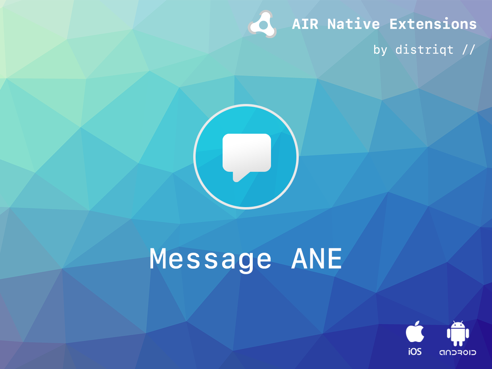
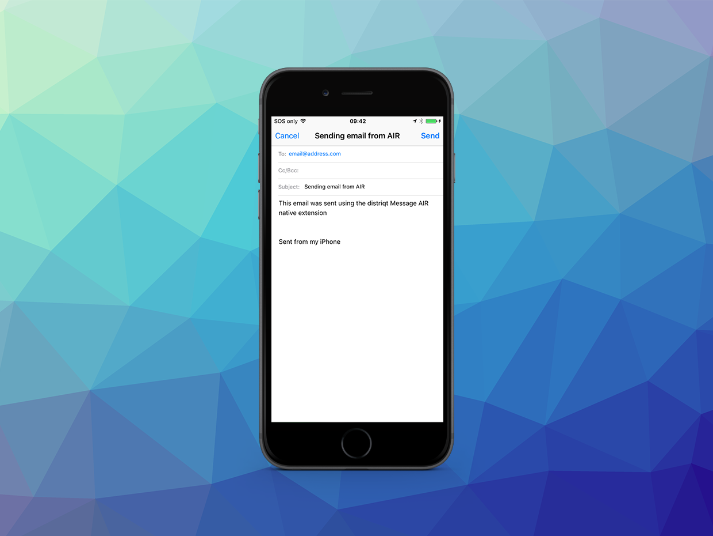

# Message

The [Message](https://airnativeextensions.com/extension/com.distriqt.Message) 
extension provides functionality to send an email with attachments and to send SMS.

The simple API allows you to quickly integrate sending emails and sms in your AIR 
application in just a few lines of code. Identical code base can be used across 
all supported platforms allowing you to concentrate on your application and not 
device specifics.

We provide complete guides to get you up and running with messaging quickly and easily.

### Features

- Email
  - Provides ability to compose an email using the native UI
  - Multiple To, CC and BCC Addresses
  - Multiple Attachments using a file path reference
  - Default implementation using a "mailto" link
  - Send preformatted HTML emails on iOS and Android;
- SMS
  - Create an SMS and send with the native UI
  - Send an SMS without UI on Android
- Sample project code and ASDocs reference


As with all our extensions you get access to a year of support and updates as we are 
continually improving and updating the extensions for OS updates and feature requests.

```actionscript
if (Message.isMailSupported)
{
	Message.service.sendMailWithOptions(
		"Subject",
		"Body of email",
		"test@distriqt.com" );
}
```


