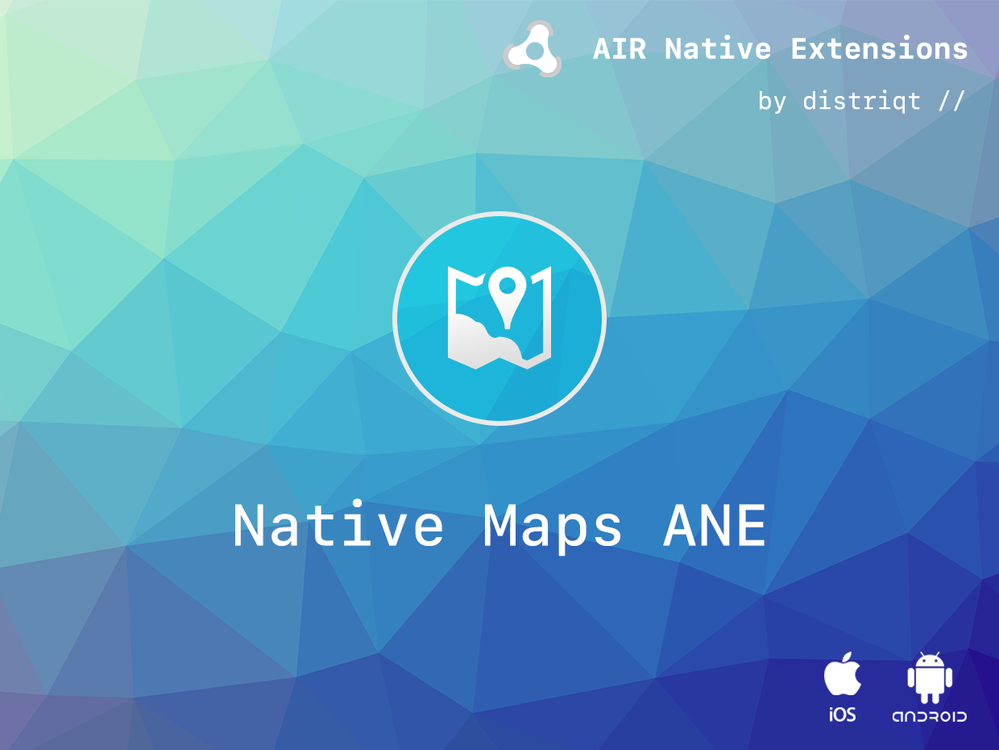
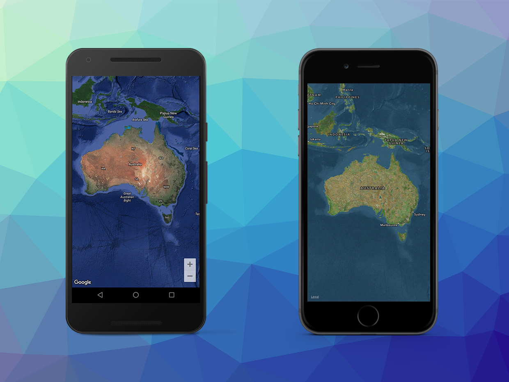

# Native Maps

The [Native Maps](https://airnativeextensions.com/extension/com.distriqt.NativeMaps) allows you to display native iOS Apple maps and Android Google maps with interactivity and overlays in your applications. 

This allows you to provide high performance mapping applications well integrated with your AIR application. Select between normal, hybrid and satellite map types and control the view setting positions, bounds, zoom and tilt.

You can add markers and draw custom overlays using polylines etc and you can draw the map to a bitmap if you require to animate the map in AIR.

The simple API allows you to quickly integrate high performance mapping solution in your AIR application in just a few lines of code. 
Identical code base can be used across all platforms allowing you to concentrate on your application and not device specifics.

We provide complete guides to get you up and running with dialogs quickly and easily.

As with all our extensions you get access to a year of support and updates as we are continually improving and updating the extensions for OS updates and feature requests.
Identical code base can be used across all supported platforms allowing you to concentrate on your application and not device specifics.

### Features

- Seamlessly integrate native OS maps in your app
    - Access Apple Maps on iOS;
    - Access Google Maps on Android;
- Enable or disable normal user touch interaction
- Controls: Control map movement, panning and zooming via code
- Layers: Enable traffic overlays, indoor and 3D views, tilt and bearing on Android
- Markers: Add and remove markers with info windows
- Enable draggable markers and receive touch and drag marker events
- Drawing: Custom Polyline and Polygon overlay drawing
- User location updates and follow modes on iOS
- Sample project code and ASDocs reference

## Documentation

The [wiki](https://github.com/distriqt/ANE-NativeMaps/wiki) forms the best source of detailed documentation for the extension along with the [asdocs](https://docs.airnativeextensions.com/asdocs/nativemaps). 

More information here: 

[com.distriqt.NativeMaps](https://airnativeextensions.com/extension/com.distriqt.NativeMaps)

## License

You can purchase a license for using this extension:

[airnativeextensions.com](https://airnativeextensions.com/)

distriqt retains all copyright.

