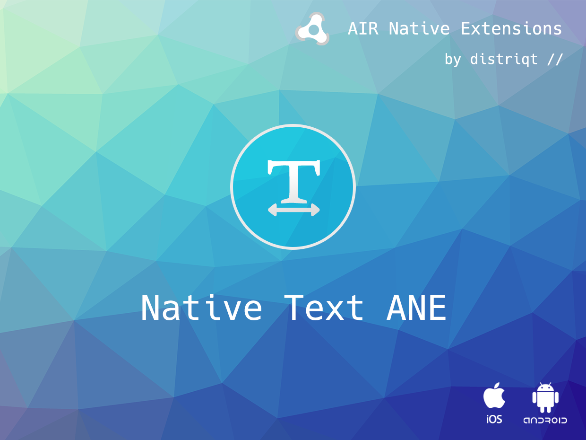

This extension was built by distriqt // 

# NativeText

Display native text fields in your AIR application

Features

- Allows display of the keyboard with a native text field displayed above the keyboard for input
- Allows display of native text fields for better control of input and display options

## Documentation

Latest documentation can be found on the [documentation site](https://docs.airnativeextensions.com/docs/nativetext/). More information here:

https://airnativeextensions.com/extension/com.distriqt.NativeText

## License

You can purchase a license for using this extension:

https://airnativeextensions.com

distriqt retains all copyright.

