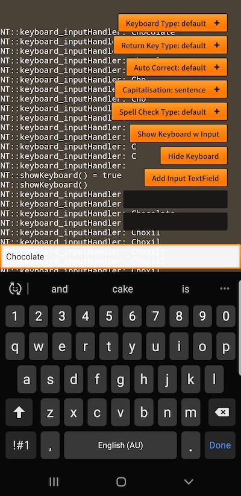
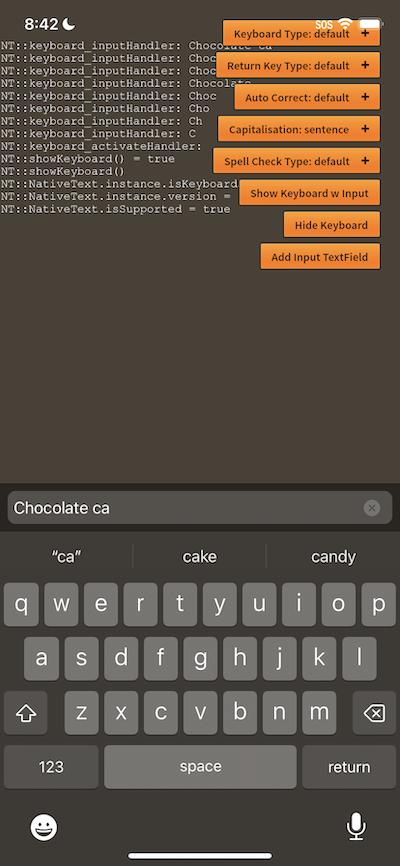

This extension provides the ability to show a text field input that displays directly above the keyboard over your application content and is presented with the keyboard. This gives you a simple way for your users to input some text for your application to use.

It also gives you the ability to use all the different keyboard types, auto correct and spell checking functionality built into the native OS. 

| Android | iOS |
| --- | --- |
|  |  |


## Support 

Firstly you should check whether the device supports the native keyboard functionality by checking the `isKeyboardSupported` property:

```actionscript
if (NativeText.instance.isKeyboardSupported)
{
    // Keyboard is supported
}
```

If it isn't supported you should provide an alternative interface for input.


## Display

To display the default keyboard input call the `showKeyboardWithInput()` method.

```actionscript
var success:Boolean = 
    NativeText.instance.showKeyboardWithInput();
```

This method will return a Boolean value indicating whether the keyboard will be shown.

There are several events dispatched from the keyboard:
- `NativeKeyboardEvent.ACTIVATE`: Dispatched when the keyboard is shown to the user;
- `NativeKeyboardEvent.DEACTIVATE`: Dispatched when the user dismisses the keyboard;
- `NativeKeyboardEvent.INPUT`: Dispatched when the user inputs characters into the text field;
- `NativeKeyboardEvent.ENTER`: Dispatched when the enter or return key was pressed;


## Options

There are two parameters to the `showKeyboardWithInput()` method, the first specifies options for the keyboard and the second specifies options for the text input. Together they control the operation of the keyboard and text input field.

The default with no parameters is equivalent to:

```actionscript
NativeText.instance.showKeyboardWithInput(
    new KeyboardOptions(),
    new InputOptions()
);
```


### Keyboard Options

The keyboard options controls things like the keyboard type (layout and type of keys displayed) and the return key type (value or symbol displayed on the enter key).

You construct an instance of the `KeyboardOptions` class and then set the parameters on the instance:

```actionscript
var keyboardOptions:KeyboardOptions = new KeyboardOptions()
    .setKeyboardType( KeyboardType.NUMBER_PAD )
    .setReturnKeyType( ReturnKeyType.CONTINUE );
```

This should be passed as the first parameter to the `showKeyboardWithInput()` method. If you pass `null` then the default parameters will be used.


### Input Options 

The input options controls the way text is handled in the text input, including auto-correct, capitalisation and spell checking. 

Create an instance of the `InputOptions` class and then set the parameters on the instance:

```actionscript
var inputOptions:InputOptions = new InputOptions()
    .setAutoCorrect( AutoCorrectType.YES )
    .setCapitalisation( AutoCapitalize.WORD )
    .setSpellCheckType( SpellCheckType.YES );
```

This should be passed as the second parameter to the `showKeyboardWithInput()` method. If you pass `null` then the default parameters will be used.


## Setup

There are some settings you should apply to your application to get best results from displaying the keyboard, particularly on Android.

Set the `softKeyboardBehavior` in your app descriptor to be `none`. This allows the extension to better control the display of the keyboard over the top of your application content.

Set `fullScreen` in your app descriptor to be `false` and use the [Application](https://airnativeextensions.com/extension/com.distriqt.Application) extension to change the display mode. This is important, particularly for Android. Using this process allows us to correctly get the size of the keyboard and position the text field. If you don't do this you may see some display issues and misalignment with the keyboard and text field. 


To summarise, have the following in your application descriptor:

```xml
  <initialWindow>
    <fullScreen>false</fullScreen>
    <softKeyboardBehavior>none</softKeyboardBehavior>
  </initialWindow>
```

Set your display mode using the Application extension: 


```actionscript
Application.service.display.setDisplayMode( DisplayMode.FULLSCREEN );
```


